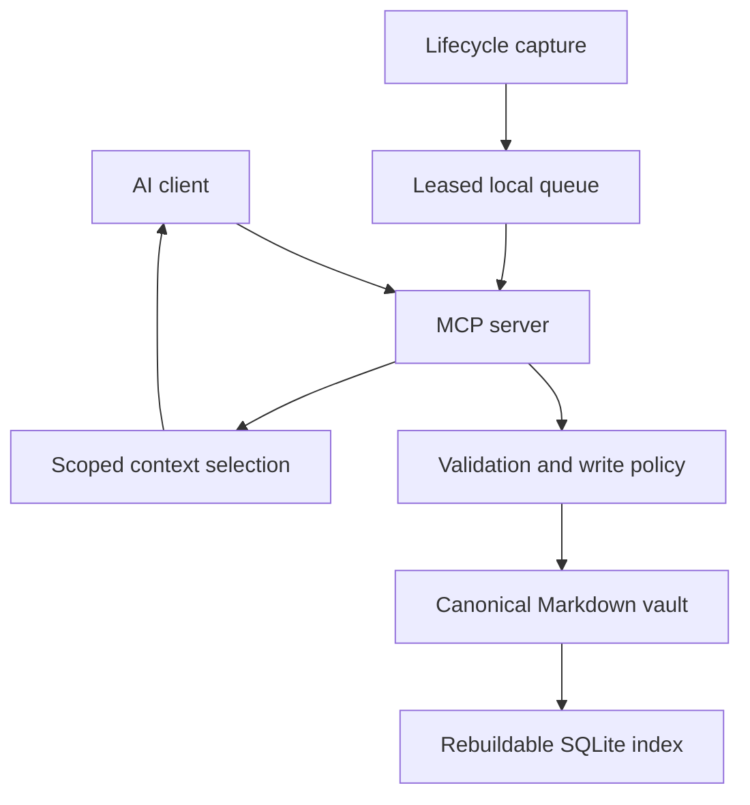

# Architecture

AI Memory Hub separates accepted Markdown memories from the tools, indexes and
operational queues used to create and retrieve them.

[README](README.md) · [Configuration](docs/CONFIGURATION.md) ·
[Developer guide](CONTRIBUTING.md) · [Roadmap](docs/local-memory-plan.md)

## Repository map

~~~text
memory_hub/
  mcp_server.py       Public AI-client interface
  manager.py         Validation, proposal policy and memory operations
  vault.py           Markdown parsing, routing and file operations
  index.py           SQLite search, embeddings and review queue
  models.py          Memory types, writers and tags
  security.py        Text validation and probable-secret checks
  utils.py           Paths, locks, hashing and atomic file replacement
  entities.py        Shared-file subject aliases
  patterns.py        Pattern configuration
  capture.py         Generic observation receiver and local queue
  consolidator.py    Optional local-model summaries and fallback
  session_capture.py Queue-to-summary bridge
  worker.py          Optional supervised threshold/time/event checkpoint worker
  history.py         Opt-in Git history
  extractor.py       Transcript-to-candidate extraction
  hooks.py           Client hook configuration helpers
  cli.py             Administrative command line
  dashboard.py       Shared local HTTP server, host/token guards and routes
  dashboard_data.py  Canonical full-record reads and organization metadata
  static/            Bundled HTML, CSS and JavaScript; no frontend build required
  app.py             Single owner of browser dashboard and optional tray
  tray.py            Compatibility entry point and tray artwork

client-prompts/       Instructions installed into AI clients
vault_template/       Files copied when a vault is initialized
hermes/skills/        Hermes-specific behavioral integration
scripts/             Import, migration, backfill and benchmarks
tests/               Automated checks
docs/                User guides and separately governed plans
~~~

The Windows setup and connection scripts live at the repository root. They configure
the optional worker's reversible startup entry; the worker itself remains a local
process that never blocks capture.

## Runtime data flow

~~~text
Connected AI client
    |
    v
Public MCP tools ---> MemoryManager
                           |
                   validate and classify
                     /             \
              review proposal    accepted write
                     |                 |
              SQLite queue          Markdown
                     |                 |
                approval ----------> index update
                                       |
                             keyword / optional vector search
~~~

A separate capture path currently stops short of unattended operation:

~~~text
Client hook -> generic receiver -> observation SQLite
                                         |
                              explicit session_consolidate call
                                         |
                          local summary or deterministic fallback
                                         |
                               session proposal policy
~~~

> [!IMPORTANT]
> The generic receiver recognizes normalized event names. Claude Code and Codex CLI
> now have separate managed lifecycle capture and SessionStart handoff installers;
> other hosts remain provider/version dependent. See
> [the continuity design](docs/automatic-session-continuity.md). A successful
> hook-config write is not an end-to-end capture test.

## Storage and recovery

| Data | Location | Recovery meaning |
| --- | --- | --- |
| Accepted memories | Markdown vault | Canonical durable content; back it up |
| Dashboard tags and links | Vault dashboard-metadata.md | Canonical ID-based organization; survives reindexing |
| Instruction and index files | Vault `AI_INSTRUCTIONS.md`, `MEMORY.md` | Trusted navigation/guidance, not arbitrary proposal targets |
| Search rows and vectors | Vault `.memory_index.sqlite3` | Rebuild from accepted Markdown |
| Pending review payloads | Tables in the same SQLite file | Not reconstructible from accepted Markdown |
| Unprocessed observations | `MEMORY_CAPTURE_DB` or user-home `.ai-memory-hub/observations.sqlite3` | Durable operational evidence; not a disposable index |
| Undo history | Optional vault Git repository | Covers committed files, not every queue or process state |

Deleting the entire SQLite index file also discards pending review data. Reindexing
accepted memories and deleting an operational database are different operations.

### Memory routing

| Kind | Canonical layout |
| --- | --- |
| profile | `/profile.md` |
| preference | `/preferences.md` |
| project | `/projects/<subject>.md` |
| topic | `/topics/<subject>.md` |
| person | `/people/<subject>.md` |
| decision | `/decisions/<subject>.md` |
| session with project | `/sessions/<project>/<writer>.md` |
| session without project | `/sessions/<writer>.md` |

Ordinary records occupy one tracked line with a stable memory ID and provenance.
Sessions use a multi-line heading block with a session-ID marker and four sections:
Investigated, Learned, Completed and Next Steps. Reindexing parses those stored records.

Initialization copies missing template files; it does not upgrade existing instructions
by replacing the vault's content.

## Interfaces and write policy

AI clients and client-facing scripts that propose new memory use the public MCP
boundary. Internal package code may call the manager. A migration that only relocates
existing blocks is different from proposing new memory
([#21](https://github.com/vib28/ai-memory-hub/issues/21)).

The administrative CLI currently calls manager operations directly. Its proposal,
supersede and ingestion commands do not inherit MCP review mode. Do not use them
as review-safe substitutes for MCP tools.

| Interface group | Public MCP tools |
| --- | --- |
| Read and orient | `memory_policy`, `memory_search`, `memory_read`, `memory_context` |
| Propose or replace | `memory_propose`, `memory_supersede` |
| Sessions | `session_write`, `session_consolidate` |
| Patterns | `propose_pattern_match` |
| Audit and identity | `memory_audit`, `project_audit`, `subject_audit`, `project_link`, `entity_alias_link` |
| Maintenance | `memory_reindex`, `memory_forget` |

MCP proposal paths use `MEMORY_WRITE_MODE`, read at server startup. Review queues a
proposal; auto attempts storage after validation. This does not make destructive or
explicit maintenance operations approval-queued.

> [!WARNING]
> Setup helpers choose review, but the MCP module falls back to auto for an unset or
> invalid mode. Configure the mode explicitly. No separate session-only auto setting
> exists yet; that separation is part of the future continuity design.

### Results are part of the contract

| Result | Meaning |
| --- | --- |
| `stored` | New content was written |
| `stored_without_project_link` | Session exists; its project cross-link was not written |
| `queued` | Awaiting review, not accepted Markdown |
| `queued_as_update` | Queued with a proposed replacement relationship |
| `possible_update` | Possible replacement identified; no new write |
| `duplicate` | Existing content matched; no new write |
| `rejected` | Validation or policy rejected the operation |

Read the actual result. A successful transport call alone does not mean a memory was
saved. Session and pattern tools surface application rejection through MCP
`ToolError`; tests must cover the registered tool path, not just the Python function.

Pattern writes prevalidate both halves, then perform sequential proposals. This is
not a crash-atomic transaction across two Markdown files; a later-half failure can
return partial-work details. Preserve those details.

## Identity and duplicate handling

Project, topic, person and decision files carry entity IDs and aliases in frontmatter.
Profile and preference subjects share files, so their aliases live in
`entity-aliases.md`. Writer identity is provenance, not a separate memory namespace.

Routing uses explicit identity and recorded aliases, not fuzzy title-prefix merging.
`project_link` and `entity_alias_link` have preview/apply workflows.
Audit candidates do not authorize unattended merging or deletion.

Write matching uses normalized hashes and lexical similarity. The current thresholds
are 0.985 for duplicate suppression and 0.85 for the update-review band. Embeddings
remain advisory for search/audit; they do not decide write-time removal.

Session retry detection is scoped to the canonical project session path
([#55](https://github.com/vib28/ai-memory-hub/issues/55)); identical prose in distinct
projects remains distinct. Do not infer that identical session prose always represents
the same session.

## Retrieval and local models

The index supports SQLite FTS keyword search with a LIKE fallback. If an embedding
provider is configured, search combines lexical and vector ranking. Stored embeddings
include kind/subject context. A failed embedding request falls back to lexical results.

The provider calls a configured HTTP endpoint. Local-first behavior therefore depends
on choosing a local endpoint; code does not make an arbitrary URL local or private.
Consolidation can use a local language model or an evidence-only fallback.
Transcript extraction separately requires a configured model.

`memory_context` currently selects bounded search results on demand. Canonical project
and session paths, plus separately labeled global preference/profile paths, are
filtered before lexical or vector ranking; superseded records are excluded. The
complete serialized `{"memories": [...]}` payload is bounded by `max_chars`, and the
newest canonical project session is deterministically prepended. The separate local
handoff reader restores the latest checkpoint at supported SessionStart hooks without
requiring this retrieval path or an embedding service.

The optional `memory_hub.worker` process is a supervised local consumer of the durable
capture queue. It uses deterministic evidence-only fallback when no local chat model is
available, records estimated token provenance, retries failed batches with the queue's
backoff, and writes a per-vault health file consumed by the dashboard. Capture does not
wait for the worker, model, or GitHub. A stop/idle checkpoint is provisional; explicit
session-end evidence is required for a final entry.

## Security and consistency boundaries

The [dashboard](docs/DASHBOARD.md) uses one shared server factory for every launch
path, per-server tokens and request serialization. It rejects non-loopback binding.
Organization edits use a file lock, atomic replacement and a revision check.
This metadata is separate from memory classifications and source wiki-links.
Browser storage holds only appearance preferences, never the memory records.
The Python assets are packaged directly; the dashboard needs no JavaScript build
runtime or model service.

- Text checks reject empty/oversized content and recognizable secrets. They are
  defense in depth, not a guarantee that all sensitive data is detected.
- Candidate target paths cannot plant content in reserved instruction/index files.
- File locks and atomic replacement protect individual file operations. They do not
  create a transaction covering Markdown, SQLite, Git and an external service.
- The dashboard binds locally by default and checks requests. Do not expose it as an
  internet service or assume local storage is encrypted.
- The capture queue bounds native evidence, preserves host event identity, filters
  sensitive paths/text and uses owner/lease claims; the supervised worker consumes it
  only after explicit setup.
- Review, rejected and failed states must remain distinguishable from accepted data.

## Opt-in history

`history-init` initializes local Git history when needed and configures a local Git
identity. A new repository receives a baseline commit and ignore rules for SQLite,
lock and temporary files. Use a dedicated vault outside another Git worktree:
the current repository check also recognizes a parent repository.

With `MEMORY_VAULT_HISTORY=true`, successful MCP consolidation attempts to commit
the session/project paths it reports. It refuses to mix with already staged changes.
The write occurs before the commit; a Git failure is not a rollback of the memory write.
Ordinary proposals are not all automatically committed.

## Planned extension

[Roadmap #61](https://github.com/vib28/ai-memory-hub/issues/61) is the continuity
closeout parent; follow the canonical [issue priority order](docs/issue-priority-order.md):
local queue/context/metadata/worker, Claude/Codex startup context, sanitized GitHub
publication and the no-paid-call replay harness are complete; live benchmark
certification remains.
Graph retrieval and embedding upgrades are not prerequisites.

The required [paired benchmark](docs/session-handoff-benchmark.md) measures both token
overhead and task quality. The versioned [replay report](docs/benchmark-results/handoff-replay-v1.md)
is regression evidence only; no live implementation or universal savings percentage is
implied by this architecture document.
