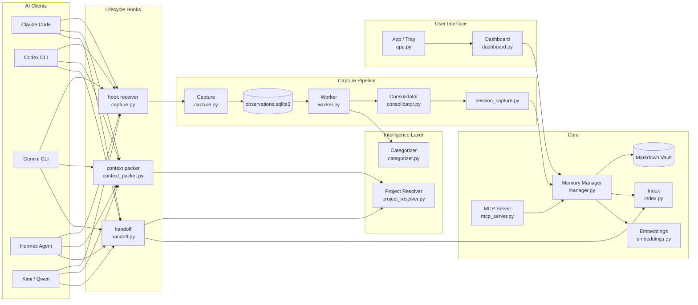
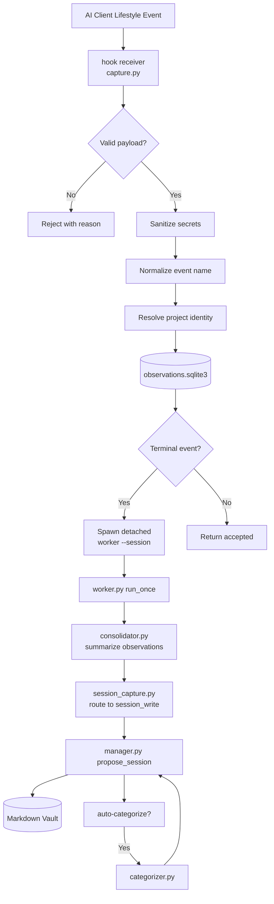
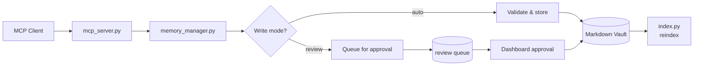
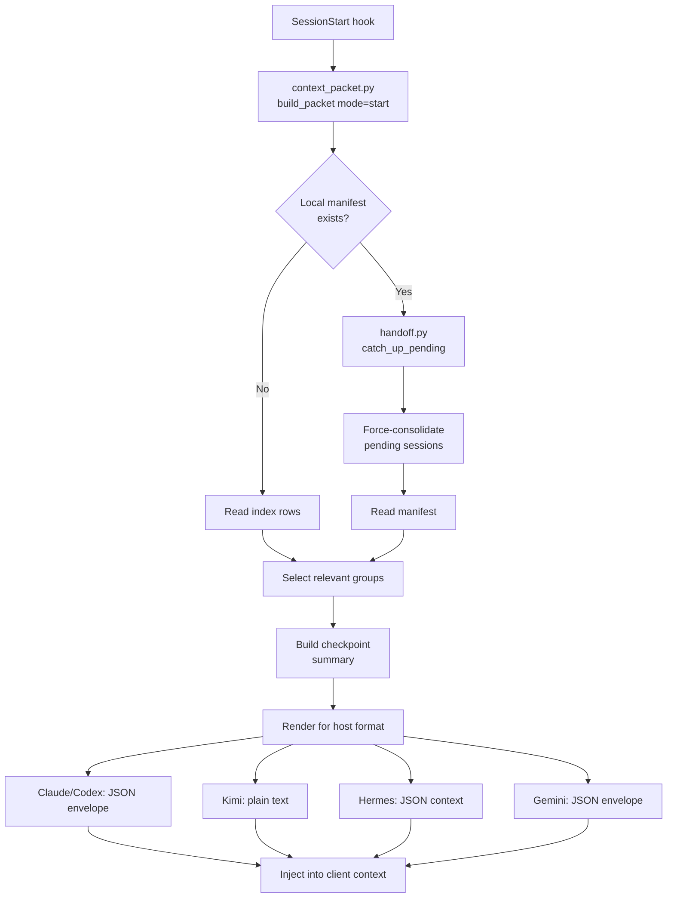

# Architecture

AI Memory Hub separates accepted Markdown memories from the tools, indexes, and
operational queues used to create and retrieve them.

[README](README.md) · [Configuration](docs/CONFIGURATION.md) ·
[Developer guide](CONTRIBUTING.md) · [Roadmap](docs/local-memory-plan.md)

---

## Module Diagram



---

## Data Flow

### 1. Automatic Capture Flow (Hook Path)

This path runs without a resident worker. It captures raw lifecycle events
from AI clients and turns them into durable session memories.



**What happens:**
1. An AI client fires a lifecycle hook (e.g., `user-prompt-submit`, `post-tool-use`, `stop`).
2. The `hook receiver` (`capture.py`) normalizes the event, sanitizes secrets, resolves the project identity, and appends the observation to `observations.sqlite3`.
3. On terminal events (`stop`, `session-end`, `interrupt`), a detached worker is spawned to consolidate the session immediately.
4. The worker calls the `consolidator` to summarize observations into the four-section session format (Investigated, Learned, Completed, Next Steps).
5. `session_capture.py` routes the summary through `MemoryManager.propose_session`, which writes to the Markdown vault.
6. The `categorizer` optionally extracts durable memories (preferences, decisions, project facts) from the same observations.

### 2. MCP Client Flow (Propose / Read / Search)

Connected AI clients use the MCP boundary to propose, read, or search memories.



### 3. Context Injection Flow (SessionStart / Per-Turn)

On session start or per-turn, a bounded context packet is injected into the AI client.



---

## Module Documentation

### `capture.py` — Generic Observation Receiver

**Purpose:** Receives lifecycle events from AI clients and stores them durably.

**Key responsibilities:**
- Normalizes diverse event name spellings to a canonical set (kebab-case)
- Sanitizes secrets from payloads before any persistence
- Resolves project identity from `cwd`
- Appends observations to `observations.sqlite3` (idempotent via `observation_id`)
- On terminal events, spawns a detached consolidation worker

**Key types:**
- `Observation` — frozen dataclass representing a single lifecycle event
- `ObservationBuffer` — SQLite-backed queue with claim/mark/prune operations

**Events handled:**
`session-start`, `user-prompt-submit`, `pre-tool-use`, `post-tool-use`,
`post-tool-use-failure`, `stop`, `stop-failure`, `session-end`, `pre-compact`,
`post-compaction`, `session-heartbeat`, `subagent-stop`, `interrupt`

---

### `worker.py` — Supervised Checkpoint Worker

**Purpose:** Consolidates buffered observations into session checkpoints.

**Key responsibilities:**
- Runs as a resident process (`run_forever`) or one-shot (`run_once`)
- Triggers consolidation based on: token budget, idle time, turn boundaries, finalization events
- Writes a per-vault health file (`worker-health.json`)
- Optionally renders transcripts

**Trigger logic:**
| Condition | Result |
|-----------|--------|
| `session-end` event | Final checkpoint (accepted) |
| `stop-failure` / `interrupt` | Provisional final |
| Token budget exceeded | Checkpoint (accepted) |
| Turn event (`stop`, `post-tool-use-failure`) | Checkpoint (provisional/accepted) |
| Idle timeout (default 300s) | Provisional checkpoint |
| Flush interval (default 60s) | Accepted checkpoint |

---

### `consolidator.py` — Session Summarizer

**Purpose:** Turns a list of observations into the four-section session contract.

**Two modes:**
1. **Local LLM** — calls an OpenAI-compatible endpoint with a JSON system prompt
2. **Fallback** — deterministic, model-free summarization based on evidence fields

**Output format:**
```json
{
  "title": "...",
  "project": "...",
  "investigated": ["..."],
  "learned": ["..."],
  "completed": ["..."],
  "next_steps": ["..."]
}
```

---

### `context_packet.py` — Bounded Context Packets

**Purpose:** Builds host-neutral context packets for SessionStart and per-turn injection.

**Modes:**
- `start` — latest checkpoint + project facts + global preferences/profile
- `turn` — only new memories since last injection + prompt-related facts

**Host rendering:**
| Host | Start channel | Turn channel |
|------|--------------|--------------|
| Claude / Codex / Qwen | `hookSpecificOutput.additionalContext` (SessionStart) | `hookSpecificOutput.additionalContext` (UserPromptSubmit) |
| Gemini | JSON envelope (SessionStart) | JSON envelope (BeforeAgent) |
| Kimi | Plain text on stdout | Plain text on stdout |
| Hermes | `{"context": "..."}` (pre_llm_call) | same |

---

### `categorizer.py` — Model-Free Memory Categorizer

**Purpose:** Extracts typed memory candidates from observations after each checkpoint.

**Rules (conservative, high precision):**
- **Preferences** — detected from phrases like "always", "never", "prefer", "don't"
- **Decisions** — detected from "decided", "we'll go with", "chose"
- **Project facts** — git actions, test results, successful commands

**Key property:** Deterministic and idempotent. Re-running on the same evidence is a no-op due to exact-hash dedup.

---

### `project_resolver.py` — Deterministic Project Identity

**Purpose:** Every stage of the pipeline must agree on which project a piece of evidence belongs to.

**Resolution order (first hit wins):**
1. `<vault>/.ai-memory-hub/projects.json` — explicit path-to-slug map (longest prefix match)
2. `.ai-memory-project` file — in-tree pin
3. Nearest `.git` ancestor — directory name (worktrees share main repo identity)
4. Nearest build/package marker (e.g., `pyproject.toml`, `package.json`)
5. `cwd` leaf directory

System directories (home, root, OS) resolve to `unscoped`.

---

### `hooks.py` — Hook Installation

**Purpose:** Manages lifecycle hook installation in AI client config files.

**Supported clients:**
| Client | Config format |
|--------|--------------|
| Claude Code | Nested matcher JSON |
| Codex CLI | Documented handler JSON |
| Gemini CLI | Nested JSON |
| Kimi Code | TOML (`[[hooks]]`) |
| Qwen Code | Nested JSON |
| Hermes Agent | YAML (`config.yaml`) |

All installs are marker-fenced, backup existing config, and are idempotent.

---

### `handoff.py` — Startup Handoff

**Purpose:** Provides a model-free startup handoff from the local checkpoint manifest.

**Key responsibilities:**
- Reads the session manifest (`sessions/session-manifest.json`)
- Selects relevant session groups by project identity or worktree match
- Renders bounded checkpoint evidence for the destination client
- Runs a bounded catch-up pass to consolidate pending sessions before reading

**Wire format:** Wrapped in `<ai-memory-handoff>` tags; rendered per host requirements.

---

### `mcp_server.py` — Public MCP Interface

**Purpose:** The canonical persistent-memory interface for connected AI clients.

**Tools exposed:**
| Tool | Purpose |
|------|---------|
| `memory_policy` | Return retention policy and write mode |
| `memory_search` | Search the vault (keyword + optional vector) |
| `memory_context` | Bounded context packet for a new session |
| `memory_read` | Read one memory Markdown file |
| `memory_propose` | Validate and store/queue a durable memory |
| `memory_supersede` | Replace an existing memory |
| `memory_forget` | Delete one memory by stable ID |
| `memory_audit` | Integrity check (no writes) |
| `project_audit` | Report identity collisions |
| `subject_audit` | Report duplicates and variants |
| `project_link` | Preview/apply reversible project-file link |
| `entity_alias_link` | Preview/apply subject alias linking |
| `memory_reindex` | Rebuild SQLite index from Markdown |
| `session_write` | Write a four-section session summary |
| `session_consolidate` | Consolidate hook observations into session_write |
| `propose_pattern_match` | Propose linked project fact + preference rule |

**Write policy:** `MEMORY_WRITE_MODE` (read at server startup):
- `auto` — store immediately after validation
- `review` — queue for dashboard approval

---

### `dashboard.py` — Local HTTP Dashboard

**Purpose:** Shared local HTTP server for browsing memories, approving proposals, and configuring the vault.

**Security:**
- Binds to loopback only (`127.0.0.1`)
- Per-launch random token (must be echoed on state-changing requests)
- Host header validation (DNS rebinding protection)
- CSP headers, no external resources

**API endpoints:**
| Endpoint | Purpose |
|----------|---------|
| `GET /api/memories` | List memory rows with search/pagination |
| `GET /api/memory/{id}` | Memory detail |
| `GET /api/pending` | Pending review queue |
| `POST /api/pending/{id}/approve` | Approve a proposal |
| `POST /api/pending/{id}/reject` | Reject a proposal |
| `POST /api/memory/{id}/forget` | Delete a memory |
| `POST /api/memory/{id}/edit` | Edit memory text |
| `GET /api/conflicts` | Report identity conflicts |
| `POST /api/conflict/resolve` | Resolve a conflict |
| `GET /api/audit` | Vault integrity audit |
| `GET /api/worker-health` | Worker status |
| `GET /api/config` | Current configuration |
| `POST /api/config` | Save configuration |

---

## Module Dependency Table

| Module | Depends On |
|--------|-----------|
| `capture.py` | `events.py`, `project_resolver.py`, `security.py`, `utils.py`, `app_config.py` |
| `worker.py` | `capture.py`, `manager.py`, `session_capture.py`, `consolidator.py`, `categorizer.py` |
| `consolidator.py` | `capture.py`, `utils.py` |
| `session_capture.py` | `capture.py`, `consolidator.py`, `manager.py` |
| `context_packet.py` | `project_resolver.py`, `handoff.py`, `utils.py`, `app_config.py` |
| `categorizer.py` | `models.py`, `security.py`, `utils.py` |
| `project_resolver.py` | `utils.py` |
| `hooks.py` | `utils.py` |
| `handoff.py` | `project_resolver.py`, `manager.py`, `capture.py`, `worker.py` |
| `mcp_server.py` | `manager.py`, `models.py`, `capture.py`, `session_capture.py`, `history.py` |
| `dashboard.py` | `manager.py`, `vault.py`, `entities.py`, `dashboard_data.py` |
| `manager.py` | `index.py`, `embeddings.py`, `models.py`, `vault.py`, `security.py`, `utils.py`, `entities.py`, `patterns.py`, `transcript.py` |

---

## Storage and Recovery

| Data | Location | Recovery Meaning |
|------|----------|-----------------|
| Accepted memories | Markdown vault | Canonical durable content; back it up |
| Dashboard tags and links | Vault `dashboard-metadata.md` | Canonical ID-based organization; survives reindexing |
| Instruction and index files | Vault `AI_INSTRUCTIONS.md`, `MEMORY.md` | Trusted navigation/guidance, not arbitrary proposal targets |
| Search rows and vectors | Vault `.memory_index.sqlite3` | Rebuild from accepted Markdown |
| Pending review payloads | Tables in the same SQLite file | Not reconstructible from accepted Markdown |
| Unprocessed observations | `MEMORY_CAPTURE_DB` or `~/.ai-memory-hub/observations.sqlite3` | Durable operational evidence; not a disposable index |
| Undo history | Optional vault Git repository | Covers committed files, not every queue or process state |

---

## Memory Routing

| Kind | Canonical Layout |
|------|-----------------|
| profile | `/profile.md` |
| preference | `/preferences.md` |
| project | `/projects/<subject>.md` |
| topic | `/topics/<subject>.md` |
| person | `/people/<subject>.md` |
| decision | `/decisions/<subject>.md` |
| session with project | `/sessions/<project>/<writer>.md` |
| session without project | `/sessions/<writer>.md` |

---

## Interfaces and Write Policy

AI clients and client-facing scripts that propose new memory use the public MCP
boundary. Internal package code may call the manager directly.

MCP proposal paths use `MEMORY_WRITE_MODE`, read at server startup. Review queues
a proposal; auto attempts storage after validation. This does not make destructive
or explicit maintenance operations approval-queued.

### Results are Part of the Contract

| Result | Meaning |
|--------|---------|
| `stored` | New content was written |
| `stored_without_project_link` | Session exists; its project cross-link was not written |
| `queued` | Awaiting review, not accepted Markdown |
| `queued_as_update` | Queued with a proposed replacement relationship |
| `possible_update` | Possible replacement identified; no new write |
| `duplicate` | Existing content matched; no new write |
| `rejected` | Validation or policy rejected the operation |

Read the actual result. A successful transport call alone does not mean a memory
was saved.

---

## Identity and Duplicate Handling

Write matching uses normalized hashes and lexical similarity. Current thresholds:
- **0.985** for duplicate suppression
- **0.85** for the update-review band

Embeddings remain advisory for search/audit; they do not decide write-time removal.

---

## Opt-in History

With `MEMORY_VAULT_HISTORY=true`, successful MCP consolidation attempts to commit
the session/project paths it reports to a local Git repository. It refuses to
mix with already staged changes.

---

## Security and Consistency Boundaries

- Text checks reject empty/oversized content and recognizable secrets. They are
  defense in depth, not a guarantee that all sensitive data is detected.
- Candidate target paths cannot plant content in reserved instruction/index files.
- File locks and atomic replacement protect individual file operations.
- The dashboard binds locally by default and checks requests.
- The capture queue bounds native evidence, preserves host event identity,
  filters sensitive paths/text, and uses owner/lease claims.

---

## Planned Extension

[Roadmap #61](https://github.com/vib28/ai-memory-hub/issues/61) is the continuity
closeout parent. See the [issue priority order](docs/issue-priority-order.md) for
the canonical sequencing.
