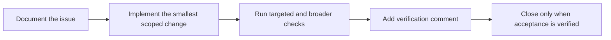

# Contributing to AI Memory Hub

Thanks for helping improve this project. This guide explains how to set up your environment, report issues, and submit changes.

[Architecture](ARCHITECTURE.md) · [Installation](../docs/INSTALLATION.md) · [Configuration](../docs/CONFIGURATION.md) · [Issue priority order](../docs/issue-priority-order.md)

---

## What you need before starting

- Python 3.10 or newer (CI tests 3.10, 3.11, 3.12)
- [uv](https://docs.astral.sh/uv/getting-started/installation/) for dependency management
- Git for cloning and branching
- A writable test vault (a disposable folder is fine)
- PowerShell if you run the Windows setup scripts

---

## Development setup

### 1. Clone and install

```powershell
git clone https://github.com/vib28/ai-memory-hub.git
cd ai-memory-hub
uv sync --locked --extra dev
```

This creates a virtual environment under `.venv` with the project, runtime dependencies, and dev tools (pytest, ruff, ty).

### 2. Run the checks

From the repository root:

```powershell
# Run all tests
uv run pytest -q

# Lint
uv run ruff check .

# Type check (advisory)
uv run ty check
```

Or use the full paths directly:

```powershell
.\.venv\Scripts\python.exe -m pytest -q
.\.venv\Scripts\ruff.exe check .
.\.venv\Scripts\ty.exe check
```

### 3. Verify with a disposable vault

Most tests create their own temporary vault. If the default pytest temporary directory is inaccessible on your machine, set a custom root:

```powershell
$env:TMPDIR = "C:\Users\vibm\tmp_pytest"
uv run pytest -q
```

See [troubleshooting](../docs/TROUBLESHOOTING.md#tests-cannot-create-a-temporary-directory) if you hit path-related test failures.

### 4. CI workflow

CI runs on pushes to `master` and on pull requests. It does **not** run on every enhancement-branch push.

| Check | Status |
|---|---|
| `ruff check .` | Required to pass |
| `ty check` | Advisory (failure does not block merge) |
| `pytest -v` | Required to pass on Ubuntu and Windows, Python 3.10-3.12 |

---

## Repository structure

```
ai-memory-hub/
├── memory_hub/        # Main package: MCP server, manager, vault, index, capture, worker, etc.
│   ├── mcp_server.py      # Public AI-client interface
│   ├── manager.py         # Validation, proposal policy, memory operations
│   ├── vault.py           # Markdown parsing, routing, file operations
│   ├── index.py           # SQLite search, embeddings, review queue
│   ├── capture.py         # Generic observation receiver and local queue
│   ├── worker.py          # Optional supervised checkpoint worker
│   ├── context_packet.py  # Bounded quoted-evidence context builder
│   └── ...
├── client-prompts/    # Instructions installed into AI clients
├── vault_template/    # Files copied when a vault is initialized
├── scripts/           # Import, migration, backfill, benchmark helpers
├── tests/             # Automated checks
├── docs/              # User guides and planning documents
└── hermes/            # Hermes-specific behavioral integration
```

---

## Issue workflow

Every bug or feature request follows this seven-step format. Use it in GitHub issues, roadmap entries, and planning documents.

### The seven sections

1. **Where the problem exists** — file, module, or workflow
2. **Why it matters** — user impact or risk
3. **How the fix works** — approach and scope
4. **Reproduction steps** — exact commands or conditions to trigger the bug
5. **Acceptance criteria** — what must be true for the issue to close
6. **Implementation details** — code changes, new files, config flags
7. **Verification results** — test output, CI status, manual checks performed

### Workflow steps



1. **Create or update a GitHub issue** before implementing a fix. Link it in your commit message and PR description.
2. **Fill all seven sections** above. If evidence is unavailable, say so explicitly. Do not infer a past test result or close an issue because a design document exists.
3. **Implement the smallest scoped change** that addresses the issue. Do not bundle unrelated cleanups into the same commit.
4. **Test locally** with synthetic data before pushing. Run at least the targeted test file, plus `uv run pytest -q` for the full suite.
5. **Add a detailed verification comment** in the issue with the actual output (CI link, test result, manual check screenshot).
6. **Close the issue only after acceptance criteria are verified**. A merged PR does not automatically close an issue unless the criteria are met.

---

## Code standards

### Python style

- **Formatter**: Ruff (`ruff check .`). No separate formatter configured; Ruff's lint rules enforce the baseline.
- **Target**: Python 3.10. Code must run on 3.10, 3.11, and 3.12.
- **Line length**: 100 characters.
- **Imports**: Use absolute imports within `memory_hub`. Group stdlib, third-party, and local imports.

```python
# Good
from memory_hub.manager import MemoryManager
from memory_hub.vault import Vault

# Avoid
from .manager import MemoryManager
```

### Type checking

- Type annotations are encouraged on public functions and MCP tool handlers.
- `ty check` runs in CI but is advisory. Do not add `# type: ignore` comments to silence real issues — fix the type instead.

### Testing

- Tests live in `tests/`. Name files `test_<module>.py`.
- Use `pytest` fixtures and temporary directories. Never hardcode paths to a developer's home directory.
- MCP tool handlers must be tested through the registered tool path, not only the direct Python function. Read the actual result — a successful transport call does not mean a memory was saved.
- Deterministic, model-free tests are preferred. Do not rely on external API services or local models for CI.

```python
# Good: tests the MCP tool path
def test_propose_queues_in_review_mode(client):
    result = client.call_tool("memory_propose", {"kind": "preference", "subject": "test", "content": "x"})
    assert result["status"] == "queued"

# Avoid: tests only the Python function
def test_manager_propose():
    mgr = MemoryManager(...)
    assert mgr.propose(...)  # bypasses MCP contract
```

### Commit messages

Use the imperative mood and reference the issue number:

```
Fix duplicate detection for singleton-fact kinds (#85)

The lexical_candidates tier was omitted from subject_audit output
when fewer than four records existed. Add a guard to skip the tier
only when the corpus has fewer than four records, not when the
candidates list is empty.

Verified: tests/test_index.py passes, CI green.
```

### Pull requests

- One issue per PR. If a change addresses multiple issues, split it.
- Keep PRs focused. Reviewers should be able to read the diff in a few minutes.
- Ensure `ruff check .` passes and `pytest -q` is green before requesting review.
- Link the issue in the PR description with `Closes #N` only when the acceptance criteria are met.

---

## Safety boundaries

These rules apply to all contributions. Violations may result in a closed PR.

- **No real secrets or personal vault content** in issues, fixtures, commits, or test data. Use synthetic data only.
- **Preserve unrelated worktree changes** and client settings. Do not modify files outside your change's scope.
- **Client-facing memory proposals use the public MCP policy boundary.** Internal code may call the manager directly, but anything that originates from an AI client must go through MCP tools and respect `MEMORY_WRITE_MODE`.
- **Do not add fuzzy automatic merges.** Identity linking and project resolution are deterministic. Audit candidates remain reviewable.
- **Treat multi-file operations as recoverable workflows, not atomic transactions.** Markdown writes, SQLite updates, Git commits, and external services can fail independently. Design for partial failure.
- **Do not restyle historical documents, client prompts, vault templates, or planning files** as a side effect of editing user guides.

---

## Documentation changes

When you update documentation:

1. Start with the README, then the architecture guide, then the document that owns the specific workflow.
2. Use [GitHub Markdown guidance](https://docs.github.com/en/get-started/writing-on-github/getting-started-with-writing-and-formatting-on-github) and check the [documentation map](../docs/README.md).
3. Separate executable commands from example output. A reader should be able to copy-paste the command without also copying the output.
4. Validate documented flags against current source. Run the command yourself before writing about it.
5. Check relative file links and heading anchors. Broken links in documentation are bugs.
6. Do not use a static test-count badge as a substitute for current CI results.

---

## Code of conduct

Be direct and specific. Disagree because an idea has a problem, not because of who said it. Provide evidence — test output, code references, or reproduction steps — rather than adjectives.

---

## License

By contributing to AI Memory Hub, you agree that your contributions will be licensed under the [Apache License 2.0](LICENSE).
