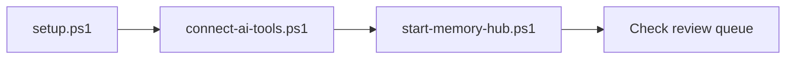

# Quick start

For Windows users with a repository checkout and Python, Git and uv already installed.

[Full installation](docs/INSTALLATION.md) · [Troubleshooting](docs/TROUBLESHOOTING.md)

## Set up and connect

Run from the repository directory:

~~~powershell
$memoryVault = Join-Path $env:USERPROFILE "Documents\Obsidian\AI-Memory"
.\setup.ps1 -VaultPath $memoryVault
.\connect-ai-tools.ps1 -VaultPath $memoryVault -WriteMode review
.\start-memory-hub.ps1 -VaultPath $memoryVault
~~~

Keep the dashboard terminal open. Start a new AI-client session, check memory_policy
reports review, and verify a harmless proposal appears in the review queue.

This quick start intentionally enables only the shared MCP memory path. It does not
install lifecycle capture, start the session worker, install startup handoff or approve
GitHub publication. Enable those capabilities separately after reading
[configuration](docs/CONFIGURATION.md) and [client limitations](docs/CLIENTS.md).

## Before enabling more

- Use [client setup](docs/CLIENTS.md) if a client is skipped or already registered.
- Read [configuration](docs/CONFIGURATION.md) before choosing auto mode.
- Keep the vault outside the source checkout and back it up.

> [!IMPORTANT]
> This connects shared memory tools. Automatic linked session saves and cross-client
> restoration are available as separate opt-in setup steps; they are not installed by
> these commands. Start with [session continuity](docs/automatic-session-continuity.md)
> and [the configuration reference](docs/CONFIGURATION.md) before enabling them.
