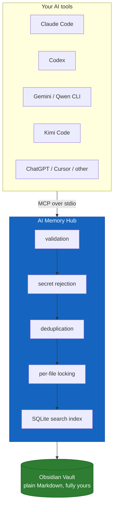
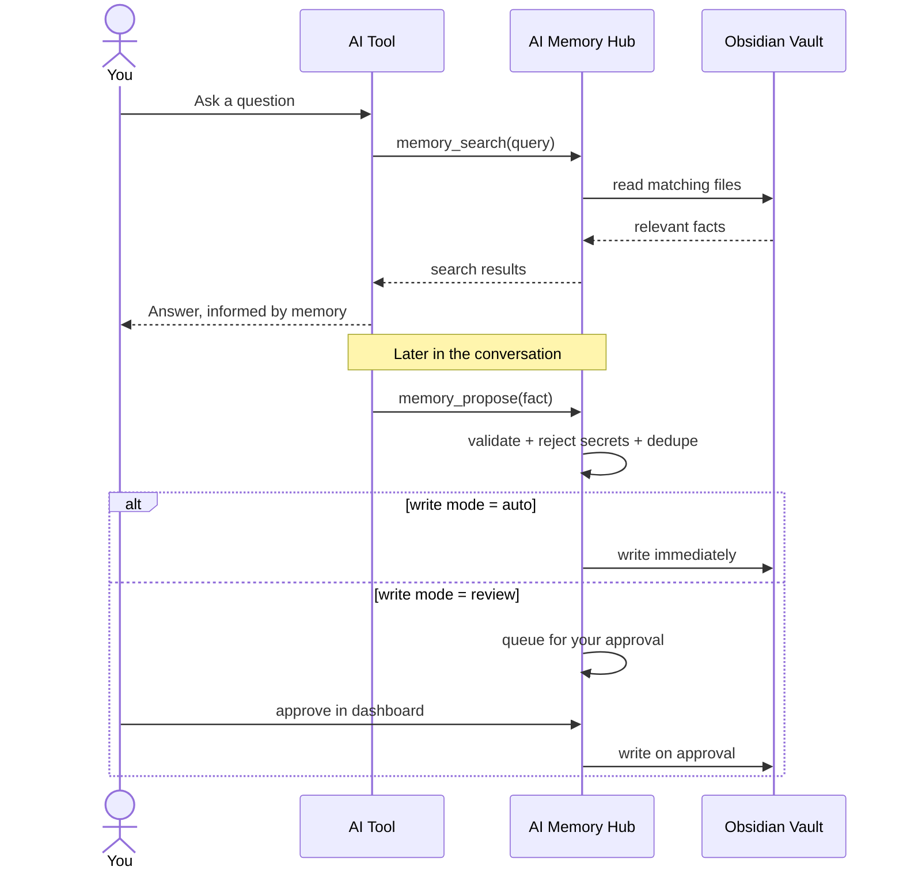
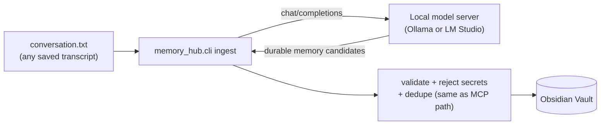
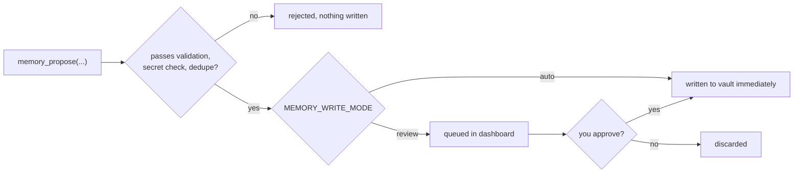

# AI Memory Hub

**One shared, persistent memory for every AI tool you use — Claude, ChatGPT, Gemini, Qwen, Kimi, Codex, Cursor, and anything else that speaks MCP.**

Stop re-explaining who you are to every AI assistant. AI Memory Hub gives them one governed, human-readable memory store that lives in a plain Obsidian vault on your own machine — no cloud account, no vendor lock-in, nothing leaves your computer unless you connect a remote model yourself.


---

## Contents

- [Why this exists](#why-this-exists)
- [How it works](#how-it-works)
- [Features](#features)
- [Requirements](#requirements)
- [Quick start](#quick-start)
- [Connect your AI tools](#connect-your-ai-tools)
- [Connect any other MCP tool](#connect-any-other-mcp-tool)
- [Connect Ollama or LM Studio](#connect-ollama-or-lm-studio)
- [Write modes: review vs. auto](#write-modes-review-vs-auto)
- [The dashboard](#the-dashboard)
- [MCP tools exposed](#mcp-tools-exposed)
- [Memory format & routing](#memory-format--routing)
- [Safety](#safety)
- [CLI reference](#cli-reference)
- [Project layout](#project-layout)
- [Troubleshooting](#troubleshooting)
- [Contributing](#contributing)
- [License](#license)

---

## Why this exists

Every AI tool you use today remembers you differently — or not at all. Tell Claude you're a Python developer on Windows, and ChatGPT still asks the next day. AI Memory Hub fixes that by giving every MCP-capable AI tool read/write access to **one shared memory**, governed by a single set of rules:

- **You own the data.** It's plain Markdown in a folder you control — open it in Obsidian, edit it in Notepad, back it up however you like.
- **No AI gets unrestricted write access.** Every proposed memory passes through validation, secret-rejection, and deduplication before it touches disk.
- **You decide how automatic it is.** Start in `review` mode and approve everything by hand; graduate to `auto` once you trust it.

## How it works



The Obsidian vault is always the source of truth. The SQLite index is disposable — delete `.memory_index.sqlite3` any time and rebuild it from the Markdown with one command.

A typical turn — an AI checking memory before answering, then proposing a new fact afterward — looks like this:



## Features

- 🔌 **MCP server** — `memory_search`, `memory_read`, `memory_propose`, `memory_forget`, `memory_supersede`, `memory_audit`, `memory_reindex`, `memory_policy`
- 🗂️ **Obsidian vault** as the canonical, human-readable store
- 🛡️ **Secret rejection** — blocks probable passwords, API keys, private keys, seed phrases, card numbers
- 🔁 **Deduplication & conflict detection** by subject, with one-click supersede
- 🖥️ **Local dashboard** (`127.0.0.1` only) — browse, search, edit, approve/reject, resolve conflicts, run audits
- 🧰 **System-tray launcher** for Windows
- 🤖 **One script to connect every AI tool** you have installed
- 📜 **Optional transcript ingestion** for clients that can't call MCP tools directly, via any OpenAI-compatible endpoint (local models supported — nothing has to leave your machine)
- ✅ **7 unit tests** covering the manager, dashboard workflows, and conflict resolution

## Requirements

- Windows 10/11 (macOS/Linux work via `setup.sh`, but the automation scripts here target Windows)
- Python 3.10+ (3.12 recommended)
- PowerShell
- An Obsidian vault, or any plain folder you're willing to treat as one
- The official Python MCP SDK v2 (`mcp>=2,<3`, installed automatically)

## Quick start

```powershell
# 1. Clone
git clone https://github.com/vib28/ai-memory-hub.git
cd ai-memory-hub

# 2. Install — creates a virtual environment and initializes your vault
.\setup.ps1 -VaultPath "C:\Users\YOU\Documents\Obsidian\AI-Memory"

# 3. Connect every AI tool this machine has installed
.\connect-ai-tools.ps1 -VaultPath "C:\Users\YOU\Documents\Obsidian\AI-Memory"

# 4. Open the dashboard
.\start-dashboard.ps1 -VaultPath "C:\Users\YOU\Documents\Obsidian\AI-Memory"
```

That's it — start a new conversation in Claude Code, Codex, Qwen Code, or Kimi Code and mention a durable fact about yourself. It'll show up in the dashboard's review queue.

Want the click-by-click version, including installing Python and Obsidian from scratch? See [`INSTALLATION_GUIDE.md`](INSTALLATION_GUIDE.md) or the 5-minute [`QUICK_START.md`](QUICK_START.md).

## Connect your AI tools

`connect-ai-tools.ps1` is the one-shot setup script. Run it after `setup.ps1` and it will:

1. **Detect** which supported AI CLIs are installed on the machine.
2. **Register** `ai-memory-hub` as an MCP server for each one it finds (user/global scope — works from any project directory).
3. **Install** the matching behavioral prompt from [`client-prompts/`](client-prompts/) into that tool's global instructions file, so it knows to search and propose memories on its own.

```powershell
.\connect-ai-tools.ps1 -VaultPath "C:\Users\YOU\Documents\Obsidian\AI-Memory"

# Or start in fully automatic mode instead of review:
.\connect-ai-tools.ps1 -VaultPath "C:\Users\YOU\Documents\Obsidian\AI-Memory" -WriteMode auto
```

| Tool | Auto-connected by the script? | Instructions file written |
|---|---|---|
| **Claude Code** | ✅ | `~/.claude/CLAUDE.md` |
| **Codex CLI** | ✅ | `~/.codex/AGENTS.md` |
| **Qwen Code** | ✅ | `~/.qwen/QWEN.md` |
| **Gemini CLI** | ✅ (if installed) | `~/.gemini/GEMINI.md` |
| **Kimi Code** | ✅ (edits `~/.kimi-code/mcp.json` directly — Kimi has no `mcp add` CLI command yet) | `~/.kimi-code/AGENTS.md` |
| **ChatGPT** (desktop app) | ❌ manual — no CLI to script against | Use [`client-prompts/chatgpt.md`](client-prompts/chatgpt.md) |
| **Cursor** and anything else MCP-capable | ❌ manual | Use [`client-prompts/generic.md`](client-prompts/generic.md) and [`examples/mcp-host-config.example.json`](examples/mcp-host-config.example.json) |

Every tool the script skips is one you either don't have installed or that only exposes MCP configuration through its own GUI — see the next two sections for those.

## Connect any other MCP tool

Anything that can launch an MCP server over stdio can join the same shared memory — Cursor, Windsurf, VS Code extensions, JetBrains AI Assistant, your own agent, whatever comes next. There's no CLI automation for these (each has its own settings UI/file), but the setup is always the same three steps:

1. **Point it at the server.** In that tool's MCP settings, add a server with:

   ```json
   {
     "mcpServers": {
       "ai-memory-hub": {
         "command": "<this-repo>\\.venv\\Scripts\\python.exe",
         "args": ["-m", "memory_hub.mcp_server"],
         "env": {
           "AI_MEMORY_VAULT": "<absolute path to your vault>",
           "MEMORY_WRITER": "<a short id for this tool, e.g. cursor>",
           "MEMORY_WRITE_MODE": "review"
         }
       }
     }
   }
   ```

   A ready-to-copy version of this is at [`examples/mcp-host-config.example.json`](examples/mcp-host-config.example.json).

2. **Give it the behavior prompt.** Paste [`client-prompts/generic.md`](client-prompts/generic.md) into that tool's system/custom-instructions field, and swap the `MEMORY_WRITER` value at the bottom to match what you set above. If the tool is one already listed in `client-prompts/` (Claude, Codex, Qwen, Gemini, Kimi, ChatGPT), use its dedicated file instead — it's identical except for the writer identity.

3. **Restart the tool** so it picks up the new MCP server, then ask it something a durable memory would help with.

## Connect Ollama or LM Studio

Ollama and LM Studio aren't AI *agents* — they're local model servers, so they don't call MCP tools on their own. What they're for here is powering the **optional transcript extractor**, which lets a tool that can't call MCP directly (a chat UI you just copy/paste from, for example) still get memories out of a conversation — entirely on your machine, with nothing sent anywhere.

The extractor talks to any OpenAI-compatible `/chat/completions` endpoint, which both Ollama and LM Studio expose locally:



**Ollama:**

```powershell
$env:MEMORY_LLM_BASE_URL = "http://localhost:11434/v1"
$env:MEMORY_LLM_MODEL    = "llama3.1"          # any model you've pulled with `ollama pull`
$env:MEMORY_LLM_API_KEY  = ""                   # Ollama ignores this; leave it blank

python -m memory_hub.cli --vault "<vault>" ingest .\conversation.txt --writer chatgpt
```

**LM Studio:**

```powershell
$env:MEMORY_LLM_BASE_URL = "http://localhost:1234/v1"
$env:MEMORY_LLM_MODEL    = "<the model name shown in LM Studio's local server tab>"
$env:MEMORY_LLM_API_KEY  = "lm-studio"          # any non-empty string works

python -m memory_hub.cli --vault "<vault>" ingest .\conversation.txt --writer chatgpt
```

Make sure the server is actually running first — Ollama via `ollama serve` (or it's already running if you've used `ollama run`), LM Studio via its "Local Server" tab. The extractor asks the model to return only durable-memory candidates; those still pass through the same validation, secret-rejection, and deduplication as anything proposed over MCP — a local model gets no more trust than a remote one.

**Local models are recommended here specifically when privacy matters** — the transcript never leaves your machine.

## Write modes: review vs. auto

**`review`** (recommended to start): AI-proposed memories wait in the dashboard's review queue. You approve or reject with one click. Nothing reaches your vault without your say-so.

**`auto`**: valid proposals are written to the vault immediately.



Run with `review` for a week or two, watch what each AI actually tries to remember, then flip to `auto` once you trust the pattern:

```powershell
.\connect-ai-tools.ps1 -VaultPath "<vault>" -WriteMode auto
```

## The dashboard

```powershell
.\start-dashboard.ps1 -VaultPath "C:\Users\YOU\Documents\Obsidian\AI-Memory"
```

Opens `http://127.0.0.1:8765` — bound to localhost only, never exposed to your network. From there you can:

- browse and search everything stored
- edit a stored fact in place
- one-click forget
- review and approve/reject queued proposals
- see likely conflicts (same subject, competing facts) and resolve them by choosing the current version
- run a vault/index audit or force a reindex

Prefer a system-tray icon instead of a browser tab left open?

```powershell
.\start-tray.ps1 -VaultPath "C:\Users\YOU\Documents\Obsidian\AI-Memory"
```

## MCP tools exposed

| Tool | Purpose |
|---|---|
| `memory_search(query, limit=10)` | Search the vault without reading everything |
| `memory_read(path)` | Read one indexed memory file |
| `memory_propose(...)` | Propose a durable memory; written immediately or queued, depending on write mode |
| `memory_forget(memory_id)` | Delete a specific memory by its stable ID |
| `memory_supersede(old_memory_id, ...)` | Mark an old memory superseded and record the new fact |
| `memory_audit()` | Check for duplicate IDs, missing index entries, malformed entries, index drift |
| `memory_reindex()` | Rebuild the disposable SQLite index from Markdown |
| `memory_policy()` | Return the automatic-retention rules to the host model |

Every write acquires a per-file lock, re-reads the current file, applies a surgical line-level change, atomically replaces the file, and refreshes the index — so multiple AI tools can share the vault without stepping on each other.

## Memory format & routing

Each stored fact carries a stable ID and provenance so any tool can later update or forget the exact entry without relying on fuzzy text matching:

```markdown
- [preference] Prefers detailed financial analysis with explicit valuation comparisons. <!-- mem:9f831ab2c7e1 source:chatgpt date:2026-09-04 -->
```

Facts are routed to one canonical home by kind:

| Kind | File |
|---|---|
| profile / identity | `/profile.md` |
| preferences | `/preferences.md` |
| person | `/people/<subject>.md` |
| project | `/projects/<subject>.md` |
| topic | `/topics/<subject>.md` |
| decision | `/decisions/<subject>.md` |

A caller may request a custom `target_path`, but it's validated to stay inside the vault.

## Safety

The manager rejects probable:

- passwords
- API keys / tokens
- private keys
- seed phrases
- card numbers
- government/account identifiers, when obvious

This is defense-in-depth, not a certified DLP system. **Don't use the vault as a secret manager.**

## CLI reference

```powershell
# Activate the environment first
.\.venv\Scripts\Activate.ps1

# Initialize a vault
python -m memory_hub.cli --vault "<vault>" init

# Add a fact by hand
python -m memory_hub.cli --vault "<vault>" propose `
  --writer chatgpt --kind preference --tag preference `
  --subject response-style `
  --text "Prefers concise answers first, followed by optional technical detail."

# Search
python -m memory_hub.cli --vault "<vault>" search "response style"

# Audit / reindex
python -m memory_hub.cli --vault "<vault>" audit
python -m memory_hub.cli --vault "<vault>" reindex

# Optional: extract memories from a saved transcript via a local/OpenAI-compatible model
$env:MEMORY_LLM_BASE_URL = "http://localhost:11434/v1"
$env:MEMORY_LLM_MODEL    = "your-model-name"
python -m memory_hub.cli --vault "<vault>" ingest .\conversation.txt --writer chatgpt
```

Run the MCP server directly (normally your AI host launches this for you):

```powershell
$env:AI_MEMORY_VAULT = "<vault>"
$env:MEMORY_WRITER   = "claude"
python -m memory_hub.mcp_server
```

## Project layout

```text
ai-memory-hub/
├─ memory_hub/              # manager, vault, index, security, MCP server, dashboard, tray, CLI
├─ vault_template/          # the Markdown skeleton a fresh vault is seeded with
├─ client-prompts/          # per-tool behavioral instructions (claude, codex, qwen, gemini, kimi, chatgpt, generic)
├─ examples/                # sample transcript + generic MCP host config
├─ tests/                   # unit tests (unittest)
├─ setup.ps1 / setup.sh     # create venv, install deps, initialize the vault
├─ connect-ai-tools.ps1     # detect installed AI CLIs and wire them all up at once
├─ start-dashboard.ps1      # launch the local review dashboard
├─ start-tray.ps1           # launch the Windows system-tray version
├─ INSTALLATION_GUIDE.md    # full guided walkthrough
└─ QUICK_START.md           # 5-minute version
```

## Troubleshooting

**"running scripts is disabled on this system"** — allow locally created scripts for your account:
```powershell
Set-ExecutionPolicy -Scope CurrentUser RemoteSigned
```

**A CLI wasn't picked up by `connect-ai-tools.ps1`** — the script only wires up a tool it can find on `PATH`. Install/open a fresh terminal so `PATH` refreshes, then re-run the script — it's safe to run repeatedly.

**Index looks wrong / out of sync** — delete `.memory_index.sqlite3` inside your vault and run:
```powershell
python -m memory_hub.cli --vault "<vault>" reindex
```

**Want to verify the install** — run the test suite:
```powershell
.\.venv\Scripts\Activate.ps1
python -m unittest discover -s tests -v
```

## Contributing

Issues and pull requests are welcome. Please don't include real personal data, credentials, or vault contents in any issue, PR, or test fixture — use the placeholder conventions already in `examples/` and `client-prompts/`.

## License

[MIT](LICENSE)
