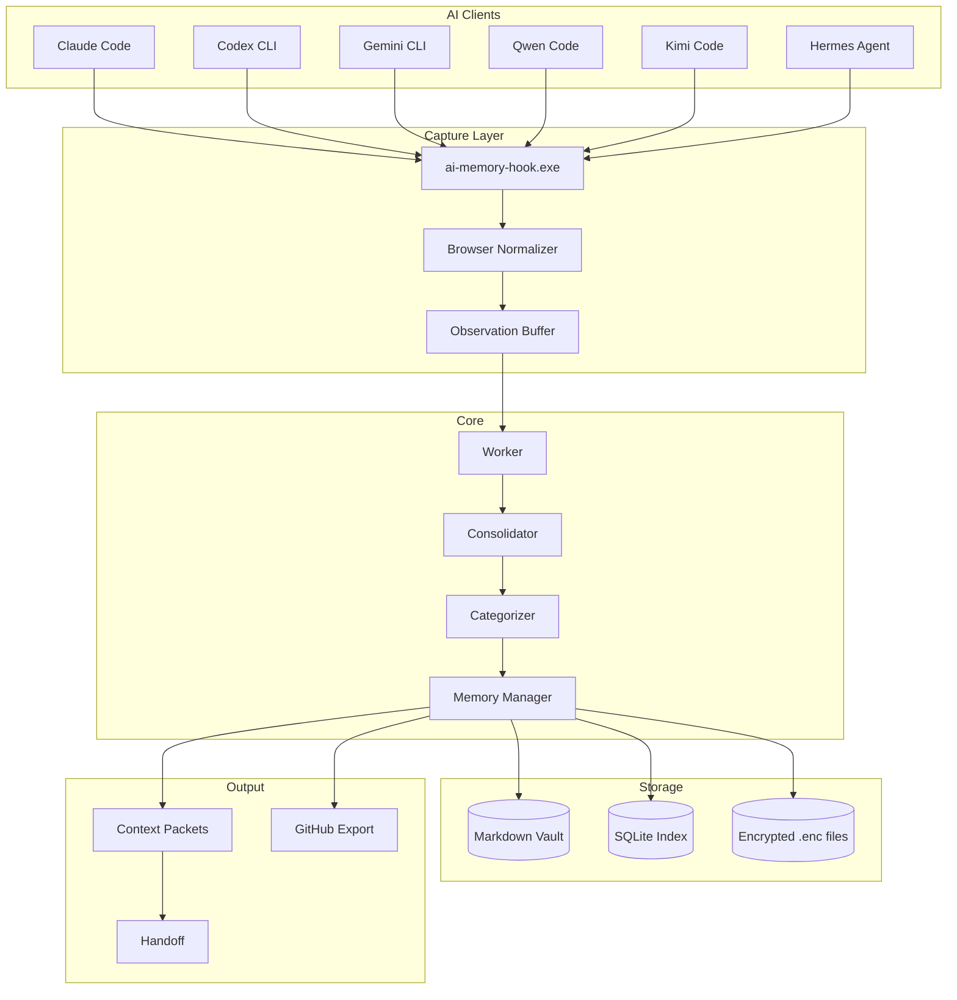

# AI Memory Hub

> **Shared, local-first memory for AI tools.** Store preferences, decisions, and project notes as readable Markdown — then retrieve them through one MCP server.

[](https://github.com/vib28/ai-memory-hub/actions/workflows/ci.yml)
[](https://github.com/vib28/ai-memory-hub/actions/workflows/ci.yml)
[](https://www.python.org/)
[](LICENSE)
[](#supported-clients)
[](#)

---

## What It Does

AI Memory Hub gives your AI tools a shared memory. Instead of each tool starting from scratch, they read and write to one local Markdown vault. That vault is just a folder — you can open it in Obsidian, back it up, or edit it by hand.

**How it works in practice:**

1. **Search first** — A connected AI checks existing memory before asking you something it should already know.
2. **Propose** — When it learns something worth keeping, it proposes a new memory.
3. **Review or auto-accept** — Depending on your settings, proposals are either queued for your review or written automatically.
4. **Store** — Accepted memories become plain Markdown files that are searchable and rebuildable.
5. **Inject context** — At startup, the latest relevant checkpoint is handed to your AI so it remembers where you left off.

---

## ✨ Key Features

| Feature | Description |
|---|---|
| **Shared Memory** | Preferences, decisions, project facts, people, topics, and session summaries stored as Markdown |
| **Review Dashboard** | Local web UI (`http://127.0.0.1:8765`) for approving, rejecting, and organizing proposed memories |
| **Semantic Search** | Keyword (FTS) + optional vector search with local embeddings |
| **Session Continuity** | Capture, checkpoint, and inject context across AI sessions |
| **Browser Tool Normalizer** | Automatically parses Hermes browser tool payloads into human-readable summaries |
| **Auto-Fix System** | Detects and repairs malformed memory lines, orphan session blocks, duplicate IDs |
| **Encryption at Rest** | AES-256-GCM vault encryption via `VAULT_ENCRYPTION_KEY` |
| **GitHub Export** | Optional sanitized session summaries pushed to a repository |
| **Git History** | Optional local version control for your vault |
| **Full Transcripts** | Optional raw session capture for local auditing |
| **Native Acceleration** | Rust extensions for hot-path operations (tokenization, embeddings, SQLite) |
| **Privacy-First** | All data stays local unless you explicitly enable export |

---

## 🚀 Quick Start

You need **Python 3.10+**, **Git**, and **[uv](https://docs.astral.sh/uv/)** installed.

```powershell
# 1. Clone and enter the repository
git clone https://github.com/vib28/ai-memory-hub.git
cd ai-memory-hub

# 2. Set up the environment and vault
.\setup.ps1 -VaultPath "C:\Users\vibm\OneDrive\Documents\Memory"

# 3. Connect your AI tools (auto-detects installed clients)
.\connect-ai-tools.ps1 -VaultPath "C:\Users\vibm\OneDrive\Documents\Memory" -WriteMode review

# 4. Start the dashboard
.\start-memory-hub.ps1 -VaultPath "C:\Users\vibm\OneDrive\Documents\Memory"
```

Then open [http://127.0.0.1:8765](http://127.0.0.1:8765) in your browser.

---

## 🔌 Supported Clients

| Client | Version | Capture | Handoff | MCP |
|--------|---------|---------|---------|-----|
| **Claude Code** | 2.1.276 | ✅ | ✅ | ✅ |
| **Codex CLI** | 0.155.0 | ✅ | ✅ | ✅ |
| **Gemini CLI** | 0.58.0 | ✅ | ✅ | ✅ |
| **Qwen Code** | 0.22.0 | ✅ | ✅ | ✅ |
| **Kimi Code** | 2.0.1 | ✅ | ✅ | ✅ |
| **Hermes Agent** | current | ✅ | ✅ | ✅ |

> Other stdio MCP clients can use the **manual hook system**.

---

## 📋 Opt-In Permissions

| Permission | Flag | Effect | Default |
|---|---|---|---|
| Client connection | `connect-ai-tools.ps1` | Lets a client call the memory server | Not connected |
| Lifecycle capture | `-InstallHooks` | Buffers session events locally | Off |
| Full transcript | `MEMORY_TRANSCRIPT_ENABLED=true` | Keeps raw events for auditing | Off |
| Session worker | `-EnableSessionAuto` | Auto-processes captured sessions | Off |
| Startup handoff | `-InstallHandoff` | Injects context at session start | Off |
| GitHub export | `-EnableGitHubExport` | Publishes sanitized summaries | Off |
| Encryption | `VAULT_ENCRYPTION_KEY` | Encrypts vault files at rest | Off |
| Manual hooks | `-InstallManualHook <name>` | Adds hooks for any stdio client | Off |

Each has a matching removal flag (`-RemoveHooks`, `-DisableSessionAuto`, etc.) that does not touch your vault.

---

## 🛡️ Security

- **Path traversal protection** via `safe_join`
- **Parameterized SQL** throughout
- **Atomic writes** with PID-based lock stealing
- **Timing-safe comparison** via `secrets.compare_digest`
- **SHA-256** for all hashing
- **DNS rebinding protection** via Host-header validation
- **Luhn-validated** card detection
- **Multi-pattern secret detection**
- **CSP + X-Frame-Options** on dashboard

---

## 📊 Current State

| Metric | Value |
|--------|-------|
| **Tests** | 445+ passing |
| **GitHub Issues** | 0 open (all 16 closed) |
| **Rust Extensions** | Built and loaded |
| **Clients Supported** | 6 (5 with hooks installed) |
| **Documentation** | Complete with diagrams |

---

## 📚 Documentation

| Document | When to Read |
|----------|-------------|
| [Installation](docs/INSTALLATION.md) | First-time setup and environment |
| [Client Connections](docs/CLIENTS.md) | Connecting AI tools and limitations |
| [Configuration](docs/CONFIGURATION.md) | Write modes, endpoints, environment variables |
| [Usage](docs/USAGE.md) | Review, search, sessions, imports, undo |
| [Dashboard](docs/DASHBOARD.md) | UI walkthrough, tags, links, color modes |
| [Architecture](ARCHITECTURE.md) | Deep dive into modules and data flow |
| [Troubleshooting](docs/TROUBLESHOOTING.md) | Symptoms, checks, and recovery |
| [FAQ](docs/FAQ.md) | Short answers and known limits |
| [FIXLOG](FIXLOG.md) | Complete fix history |
| [Release Notes](RELEASE_NOTES_v0.2.md) | Feature list |

---

## 🏗️ Architecture



---

## 📄 License

[Apache License 2.0](LICENSE)
