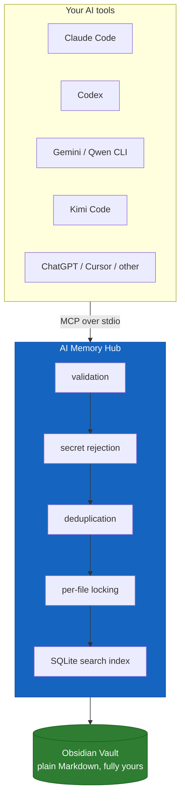
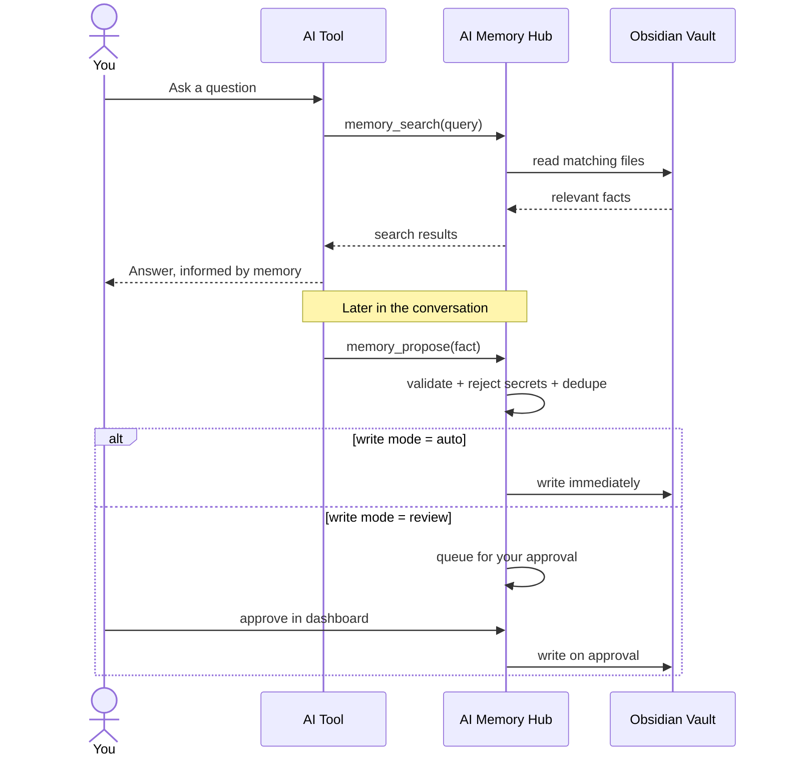
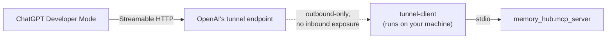
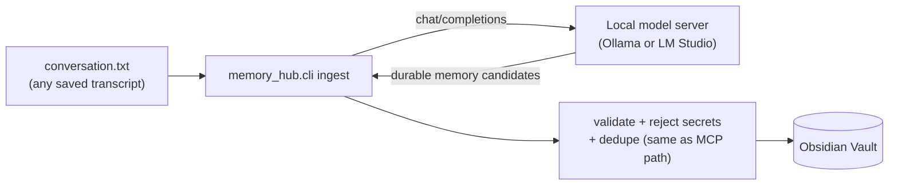
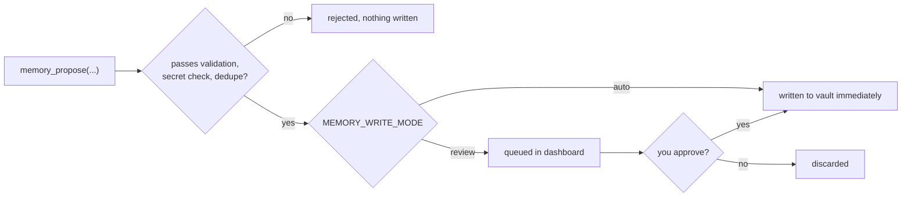
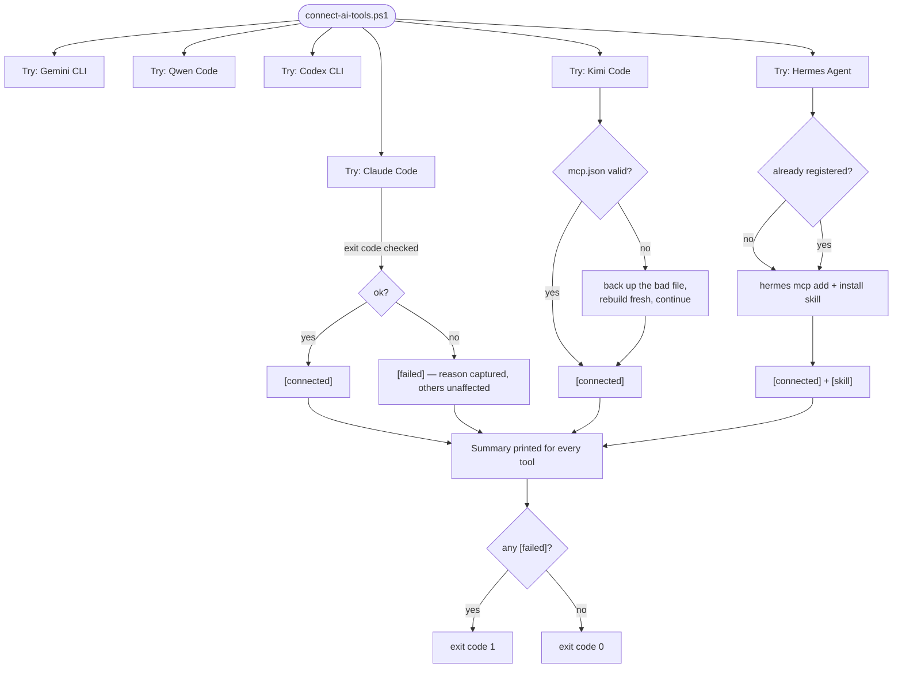

<div align="center">

# AI Memory Hub

### One governed memory layer for every AI tool you use

Local-first, human-readable, and MCP-native. Keep durable context in one Obsidian vault and make every write pass through validation, review, and policy.

[](https://github.com/vib28/ai-memory-hub/actions/workflows/ci.yml)


[Quick start](#quick-start) · [How it works](#how-it-works) · [Connect your tools](#connect-your-ai-tools) · [Roadmap](#roadmap-and-planning)

</div>

> **The promise:** one memory store, many AI clients, and you remain in control of what gets saved.

---

## Supported AI tools at a glance

| Tool | Transport | Connected by | Notes |
|---|---|---|---|
| Claude Code | stdio | [`connect-ai-tools.ps1`](#claude-code) | |
| Codex CLI | stdio | [`connect-ai-tools.ps1`](#codex-cli) | |
| Qwen Code | stdio | [`connect-ai-tools.ps1`](#qwen-code) | |
| Gemini CLI | stdio | [`connect-ai-tools.ps1`](#gemini-cli) | if installed |
| Kimi Code | stdio | [`connect-ai-tools.ps1`](#kimi-code) | edits `mcp.json` directly — no CLI command for this yet |
| Hermes Agent | stdio | [`connect-ai-tools.ps1`](#hermes-agent) | registers the MCP server **and** installs the behavioral skill |
| ChatGPT (desktop app) | Streamable HTTP, via OpenAI's Secure MCP Tunnel | [`connect-chatgpt-tunnel.ps1`](#chatgpt-desktop-app) | needs a one-time OpenAI account setup first |
| Cursor, Windsurf, JetBrains AI, or anything else MCP-capable | stdio | [manual, 3 steps](#connect-any-other-mcp-tool) | |
| ChatGPT, or any tool without MCP access at all | — | [transcript ingestion](#transcript-ingestion-no-live-mcp-connection-needed) | fully local fallback, works with any tool |

---

## Contents

- [Supported AI tools at a glance](#supported-ai-tools-at-a-glance)
- [Why this exists](#why-this-exists)
- [How it works](#how-it-works)
- [Features](#features)
- [Requirements](#requirements)
- [Quick start](#quick-start)
- [Connect your AI tools](#connect-your-ai-tools)
  - [Overview](#overview)
  - [Claude Code](#claude-code)
  - [Gemini CLI](#gemini-cli)
  - [Qwen Code](#qwen-code)
  - [Codex CLI](#codex-cli)
  - [Kimi Code](#kimi-code)
  - [Hermes Agent](#hermes-agent)
  - [Already have a session open?](#already-have-a-session-open)
  - [ChatGPT (desktop app)](#chatgpt-desktop-app)
- [Connect any other MCP tool](#connect-any-other-mcp-tool)
- [Transcript ingestion (no live MCP connection needed)](#transcript-ingestion-no-live-mcp-connection-needed)
- [Generic local observation hooks](#generic-local-observation-hooks)
- [Connect Ollama or LM Studio](#connect-ollama-or-lm-studio)
- [Write modes: review vs. auto](#write-modes-review-vs-auto)
- [Session summaries](#session-summaries)
- [Issue tracking](#issue-tracking)
- [Roadmap and planning](#roadmap-and-planning)
- [The dashboard](#the-dashboard)
- [MCP tools exposed](#mcp-tools-exposed)
- [Memory format & routing](#memory-format--routing)
- [Safety](#safety)
- [CLI reference](#cli-reference)
- [Project layout](#project-layout)
- [Reliability: what happens when something goes wrong](#reliability-what-happens-when-something-goes-wrong)
- [Troubleshooting](#troubleshooting)
- [Contributing](#contributing)
- [License](#license)

---

## Why this exists

Every AI tool you use today remembers you differently — or not at all. Tell Claude you're a Python developer on Windows, and ChatGPT still asks the next day. AI Memory Hub fixes that by giving every MCP-capable AI tool read/write access to **one shared memory**, governed by a single set of rules:

- **You own the data.** It's plain Markdown in a folder you control — open it in Obsidian, edit it in Notepad, back it up however you like.
- **No AI gets unrestricted write access.** Every proposed memory passes through validation, secret-rejection, and deduplication before it touches disk.
- **You decide how automatic it is.** Start in `review` mode and approve everything by hand; graduate to `auto` once you trust it.

## How it works



The Obsidian vault is always the source of truth. The SQLite index is disposable — delete `.memory_index.sqlite3` any time and rebuild it from the Markdown with one command.

A typical turn — an AI checking memory before answering, then proposing a new fact afterward — looks like this:



## Features

- 🔌 **MCP server** — `memory_search`, `memory_read`, `memory_propose`, `memory_supersede`, `memory_forget`, `session_write`, `propose_pattern_match`, `memory_audit`, `memory_reindex`, `memory_policy`
- 📥 **Review history** — review queue shows open, rejected, and approved proposals, with filters for those three statuses
- 🗂️ **Obsidian vault** as the canonical, human-readable store
- 🛡️ **Secret rejection** — blocks probable passwords, API keys, private keys, seed phrases, card numbers
- 🔁 **Deduplication & conflict review** — duplicate text is rejected across the vault; conflict candidates are limited to singleton facts (`profile`, `preference`) with the same subject, while log-like kinds can accumulate distinct facts
- 🗃️ **Fragmentation-resistant project routing** — a new subject that's a hyphen-prefixed variant of an existing project file (e.g. `widget-app-ui` → `widget-app.md`) is folded into it instead of forking a new file
- 🕐 **Full local timestamps** on every entry's create/edit, not just the date (old date-only entries stay valid and parseable)
- 🖥️ **Redesigned local dashboard** (`127.0.0.1` only) — sidebar navigation with live counts, in-page modals, toast feedback, kind filters, subject-grouped lists with the newest entry first in each group and one most-recent marker per group, and a readable audit view
- 🔒 **Origin-protected dashboard API** — every state-changing request is checked against the `Host`/`Origin` headers and a random per-launch token, so binding to localhost isn't the only thing standing between the vault and a rogue page in your browser
- 🧰 **System-tray launcher** for Windows
- 🤖 **One script to connect every AI tool** you have installed, including Codex as a recognized writer identity
- 📜 **Optional transcript ingestion** for clients that can't call MCP tools directly, via any local server that exposes a standard chat-completions API — Ollama, LM Studio, llama.cpp, vLLM, and similar (nothing has to leave your machine)
- 🧺 **Generic local observation buffer** — lifecycle hooks can append bounded, retry-safe observations to a local SQLite queue without writing raw tool output into the vault
- ✅ **37 unit tests** covering the manager, dashboard workflows, session summaries, pattern-linked memories, conflict resolution, secret detection, and file-locking edge cases, run on every push/PR via GitHub Actions (Windows + Ubuntu, Python 3.10-3.12)

## Requirements

- Windows 10/11 (macOS/Linux work via `setup.sh`, but the automation scripts here target Windows)
- Python 3.10+ (3.12 recommended)
- [uv](https://docs.astral.sh/uv/getting-started/installation/) for creating the environment and installing dependencies
- PowerShell — either the Windows PowerShell 5.1 that ships with Windows, or PowerShell 7+; every `.ps1` script here is written to run on both
- An Obsidian vault, or any plain folder you're willing to treat as one
- The official Python MCP SDK v2 (`mcp>=2,<3`, installed automatically)
- For ChatGPT specifically: [`tunnel-client`](#chatgpt-desktop-app) and an OpenAI account with API access — optional, only needed for a live connection

## Quick start

### Choose your path

| If you want to… | Start here |
|---|---|
| Install from scratch | Run the one-line installer below |
| Install from a clone | Run `setup.ps1`, then `connect-ai-tools.ps1` |
| Use a custom vault | Pass `-VaultPath` to the setup and connection scripts |
| Preview writes safely | Use the default `review` mode, then approve entries in the dashboard |

**One line**, if you don't have a copy of the repo yet — downloads it (via `git clone` if you have git, otherwise a plain zip, no dependencies either way), then runs setup and connects every AI CLI it finds, using the default paths (`%USERPROFILE%\ai-memory-hub` and `%USERPROFILE%\Documents\Obsidian\AI-Memory`):

```powershell
irm https://raw.githubusercontent.com/vib28/ai-memory-hub/master/install.ps1 | iex
```

Want a custom install/vault path instead of the defaults? `| iex` alone can't take parameters — build a scriptblock from the downloaded script and invoke that instead:

```powershell
& ([scriptblock]::Create((irm https://raw.githubusercontent.com/vib28/ai-memory-hub/master/install.ps1))) `
    -InstallPath "C:\Tools\ai-memory-hub" -VaultPath "C:\Users\YOU\Documents\Obsidian\AI-Memory"
```

Or clone it yourself and run each step by hand:

```powershell
# 1. Clone
git clone https://github.com/vib28/ai-memory-hub.git
cd ai-memory-hub

# 2. Install — creates a virtual environment and initializes your vault
.\setup.ps1 -VaultPath "C:\Users\YOU\Documents\Obsidian\AI-Memory"

# 3. Connect every AI tool this machine has installed
.\connect-ai-tools.ps1 -VaultPath "C:\Users\YOU\Documents\Obsidian\AI-Memory"

# 4. Open the dashboard
.\start-dashboard.ps1 -VaultPath "C:\Users\YOU\Documents\Obsidian\AI-Memory"
```

Either way, that's it — start a new conversation in Claude Code, Codex, Qwen Code, or Kimi Code and mention a durable fact about yourself. It'll show up in the dashboard's review queue.

> **Recommended first run:** stay in `review` mode until you have confirmed that the clients are proposing the right memories. Switch to `auto` only when that behavior is trusted.

Already have a copy and just want the latest version? Re-run the one-liner (or `& ([scriptblock]::Create(...))` form) with the same `-InstallPath` — it updates a git-based install in place instead of re-downloading.

Want the click-by-click version, including installing Python and Obsidian from scratch? See [`INSTALLATION_GUIDE.md`](INSTALLATION_GUIDE.md) or the 5-minute [`QUICK_START.md`](QUICK_START.md).

## Connect your AI tools

### Overview

`connect-ai-tools.ps1` is the one-shot setup script. Run it after `setup.ps1` and it will:

1. **Detect** which supported AI CLIs are installed on the machine.
2. **Register** `ai-memory-hub` as an MCP server for each one it finds (user/global scope — works from any project directory).
3. **Install** the matching behavioral prompt from [`client-prompts/`](client-prompts/) into that tool's global instructions file, so it knows to search and propose memories on its own.

```powershell
.\connect-ai-tools.ps1 -VaultPath "C:\Users\YOU\Documents\Obsidian\AI-Memory"

# Or start in fully automatic mode instead of review:
.\connect-ai-tools.ps1 -VaultPath "C:\Users\YOU\Documents\Obsidian\AI-Memory" -WriteMode auto
```

The script is **idempotent** — re-running it never double-registers, and an already-registered server is reported as `[connected]`, not an error. Every supported tool is attempted independently, so one failure never blocks the rest.

| Tool | Auto-connected by the script? | Instructions file written |
|---|---|---|
| **Claude Code** | ✅ | `~/.claude/CLAUDE.md` |
| **Codex CLI** | ✅ | `~/.codex/AGENTS.md` |
| **Qwen Code** | ✅ | `~/.qwen/QWEN.md` |
| **Gemini CLI** | ✅ (if installed) | `~/.gemini/GEMINI.md` |
| **Kimi Code** | ✅ | `~/.kimi-code/AGENTS.md` |
| **Hermes Agent** | ✅ (if installed) — also installs a [skill](#hermes-agent) | `<Hermes-home>/skills/productivity/ai-memory-hub/SKILL.md` |

Most of these launch the server themselves as a **local stdio subprocess** — the script just tells each one what command to run. Their installs differ in a few small but real ways; the per-tool sections below call out what's unique to each. ChatGPT's desktop app is the one that works fundamentally differently (a network tunnel rather than a local subprocess); see [ChatGPT (desktop app)](#chatgpt-desktop-app).

### Claude Code

The standard stdio case. The script runs Claude Code's own `mcp add` with `-s user` (global scope) so the server is available from any directory, then appends the [`claude.md`](client-prompts/claude.md) instructions block to `~/.claude/CLAUDE.md` under a managed `AI_MEMORY_HUB_PROMPT` marker. Writer identity is `claude`.

If Claude Code is already registered, its CLI exits non-zero with "already exists" — the script recognizes that and reports `[connected]` rather than a failure. Nothing to do on your end beyond running the script and starting a new session.

### Gemini CLI

Gemini is wired up the same way as Claude Code — its `mcp add` is invoked and [`gemini.md`](client-prompts/gemini.md) is written to `~/.gemini/GEMINI.md`, writer identity `gemini`. One difference matters in practice:

> **Workspace trust.** Gemini disables *all* MCP servers — including user-level ones like this one — in any folder it doesn't yet trust, to prevent an untrusted project from silently running tools. The first time you launch `gemini` in a given folder, answer its workspace-trust prompt (or pass `--skip-trust` for a one-off session). Run `gemini mcp list` any time to check whether `ai-memory-hub` shows as enabled or disabled for the folder you're in.

### Qwen Code

Also the standard stdio path — `qwen mcp add` plus [`qwen.md`](client-prompts/qwen.md) written to `~/.qwen/QWEN.md`, writer identity `qwen`. No tool-specific quirks.

### Codex CLI

Codex accepts its environment differently from the other CLIs, so the script invokes it with repeated `--env KEY=VALUE` flags rather than `-e`, and it locates the `codex.exe` binary explicitly (the bare `codex` command on Windows is a `.ps1` wrapper that mangles a literal `--`). [`codex.md`](client-prompts/codex.md) is written to `~/.codex/AGENTS.md`, writer identity `codex`.

### Kimi Code

Kimi is the outlier: it has **no `mcp add` CLI command yet**, so the script edits `~/.kimi-code/mcp.json` directly — inserting an `ai-memory-hub` entry with the Python command, args, and env. Because it edits a config file rather than calling a command, re-running simply overwrites that one entry. [`kimi.md`](client-prompts/kimi.md) is written to `~/.kimi-code/AGENTS.md`, writer identity `kimi`. If an existing `mcp.json` isn't valid JSON, the script backs it up to a timestamped `.bak` before rebuilding, rather than crashing.

### Hermes Agent

[Hermes Agent](https://hermes-agent.nousresearch.com) (Nous Research's agent — CLI, desktop app, or messaging gateway) joins the same shared memory through its native MCP client. It's wired up by the same `connect-ai-tools.ps1` as the other CLIs — when the `hermes` CLI is on `PATH`, the script does two things for it:

1. **Registers `ai-memory-hub` as an MCP server** in Hermes' config, pointing at this repo's `.venv` and your vault. On Hermes' next session the tools appear as `mcp_ai_memory_hub_memory_search`, `mcp_ai_memory_hub_memory_propose`, etc.
2. **Installs a behavioral skill** — Hermes does not read `client-prompts/`; the equivalent mechanism is a **skill** (a `SKILL.md` under Hermes' `skills/` directory) that auto-loads into a session whenever the task involves durable user context. The skill encodes the same search/propose rules as [`client-prompts/hermes.md`](client-prompts/hermes.md), so Hermes searches the vault and proposes durable memories *without* being told "remember this" — matching the other clients.

So there's no separate command — just run the normal one, and Hermes is picked up alongside everything else if it's installed:

```powershell
.\connect-ai-tools.ps1 -VaultPath "C:\Users\YOU\Documents\Memory"

# Or fully automatic mode instead of review:
.\connect-ai-tools.ps1 -VaultPath "C:\Users\YOU\Documents\Memory" -WriteMode auto
```

Prerequisites: this repo's `.venv` (run `.\setup.ps1` first) and the `hermes` CLI on `PATH`. The script is **idempotent** — re-running it leaves an already-registered server alone and simply refreshes the installed skill to this repo's copy.

**How it works, concretely:**

- The MCP server is launched as a local stdio subprocess. Hermes deliberately filters the subprocess environment, so the script passes the vault path, writer identity, and write mode explicitly via `--env` (which must appear *before* `--args`, or the flags are swallowed into the args list and the server silently loses its vault).
- Hermes prefixes MCP tools `mcp_{server}_{tool}`, so it's registered under the distinct server name `ai_memory_hub` (underscore) rather than the `ai-memory-hub` the other CLIs use — avoiding a hyphen-to-underscore collision in tool names.
- The skill is copied to `<Hermes-home>/skills/productivity/ai-memory-hub/SKILL.md`, where `<Hermes-home>` is resolved from `hermes config path`. Hermes discovers skills by scanning that directory; a new session auto-loads `ai-memory-hub` when relevant.
- Writer identity is `hermes` — a first-class `ALLOWED_WRITERS` value — so entries you approve carry a `hermes` source tag, exactly like `claude`, `codex`, etc.

Verify any time:

```powershell
hermes mcp list
hermes mcp test ai_memory_hub
```

> **Important:** Hermes reads its MCP server list once, at session start. If you have a Hermes session already open, close it and start a new one — it won't see `ai-memory-hub` until it does. Sessions started *after* the script pick it up automatically, and the skill auto-loads on its own.

### Already have a session open?

Every tool above reads its MCP server list once, when that session starts — none of them watch their config file for changes mid-session. So after running `connect-ai-tools.ps1` (or `connect-chatgpt-tunnel.ps1`), **any Claude Code, Gemini CLI, Qwen Code, Codex CLI, Kimi Code, or Hermes Agent session you already had open needs a new session** before it can see `ai-memory-hub` — close that chat and run the same command again to start a fresh one. This isn't reinstalling or restarting an application, just starting a new conversation; a session you open *after* running the script picks it up immediately, no action needed. ChatGPT is the exception — there's no "session" to restart, just enable the connector once in Settings as described above and the running tunnel stays connected.

### Refresh revised instructions

After updating this project, rerun `connect-ai-tools.ps1` — it replaces the managed AI Memory Hub instruction block in each detected CLI's global instructions file *and* refreshes Hermes' installed skill. Then start a new session in Claude Code, Codex, Qwen, Gemini, Kimi Code, or Hermes Agent. For ChatGPT, paste the current `client-prompts/chatgpt.md` into Custom Instructions and begin a new conversation. Manually configured MCP hosts likewise need their updated prompt saved and a new session or reload.

`vault_template/` is used only when a vault is initialized; it never overwrites existing vault files. To adopt a revised `AI_INSTRUCTIONS.md` in an existing vault, review the template and merge its guidance into your vault's copy without replacing your memory content.

### ChatGPT (desktop app)

ChatGPT's connector protocol itself only speaks Streamable HTTP — but OpenAI now ships an official, first-party bridge called **[Secure MCP Tunnel](https://developers.openai.com/api/docs/guides/secure-mcp-tunnels)** that connects Developer Mode directly to a local **stdio** server like this one, outbound-only, with nothing exposed to the public internet. That's the supported way to get ChatGPT calling `memory_search`/`memory_propose` live, and `connect-ai-tools.ps1` can't set it up on its own because the last mile — creating a tunnel ID and an API key — happens in your browser, against your OpenAI account.



#### One-time account setup (do this in your browser)

1. **Create a Runtime API key** — [platform.openai.com/settings/organization/api-keys](https://platform.openai.com/settings/organization/api-keys), with the Tunnels **Read** + **Use** permissions.
2. **Create a tunnel ID** — [platform.openai.com/settings/organization/tunnels](https://platform.openai.com/settings/organization/tunnels). It looks like `tunnel_` followed by 32 lowercase letters/digits — copy it exactly.
3. **Install `tunnel-client`** for Windows from the [openai/tunnel-client releases](https://github.com/openai/tunnel-client/releases) page (grab `tunnel-client-<version>-windows-amd64.zip`, or `-arm64` on ARM) and add its folder to `PATH`.

#### Connect it

```powershell
.\connect-chatgpt-tunnel.ps1 -VaultPath "C:\Users\YOU\Documents\Obsidian\AI-Memory" `
    -TunnelId "tunnel_0123456789abcdef0123456789abcd12" `
    -ApiKey (Read-Host "Runtime API key")
```

This configures a `tunnel-client` profile that launches `memory_hub.mcp_server` as a stdio subprocess (the same way the other tools do it), runs `doctor` to validate it, and starts the tunnel. Leave the window open — closing it disconnects ChatGPT. Re-running the script updates the same profile (`--force`), so it's safe to use again after changing your vault path or write mode. Then in ChatGPT: **Settings → Connectors → Advanced → Developer mode → + → Connection: Tunnel →** select `ai-memory-hub`.

Give it the behavior prompt the same way as any other tool: [`client-prompts/chatgpt.md`](client-prompts/chatgpt.md), pasted into ChatGPT's custom instructions. Start a new ChatGPT conversation afterward so the revised instructions are in its context.

> Verified against `tunnel-client` v0.0.14 on Windows. If OpenAI changes the CLI, re-check the flags with `tunnel-client init --help` / `doctor --help` / `run --help`.

No account access, or don't want a live connection? See [Transcript ingestion](#transcript-ingestion-no-live-mcp-connection-needed) below — it needs zero extra setup and stays fully local.

## Connect any other MCP tool

Anything that can launch an MCP server over stdio can join the same shared memory. There's no CLI automation for these (each has its own settings UI/file), but the setup is always the same three steps:

1. **Point it at the server.** Copy [`examples/mcp-host-config.example.json`](examples/mcp-host-config.example.json), then set only your Python path, vault path, writer identity, and write mode in the host's MCP settings. The configuration contains no credentials.

2. **Give it the behavior prompt.** Paste [`client-prompts/generic.md`](client-prompts/generic.md) into that tool's system/custom-instructions field, and swap the `MEMORY_WRITER` value at the bottom to match what you set above. If the tool is one already listed in `client-prompts/` (Claude, Codex, Qwen, Gemini, Kimi, Hermes), use its dedicated file instead — it's identical except for the writer identity.

3. **Restart the tool** so it picks up the new MCP server, then ask it something a durable memory would help with.

## Transcript ingestion (no live MCP connection needed)

For any tool that can't call MCP directly — ChatGPT without the tunnel set up, a chat UI you only ever copy/paste from, an old export you're archiving — transcript ingestion gets memories out of a conversation with zero extra setup. It's already built into the CLI and stays fully local.

```powershell
python -m memory_hub.cli --vault "<vault>" ingest .\conversation.txt --writer chatgpt
```

Copy a conversation into `conversation.txt`, point `MEMORY_LLM_BASE_URL` at a local model (see [Connect Ollama or LM Studio](#connect-ollama-or-lm-studio) below), and candidates get extracted and validated exactly like anything proposed over MCP — nothing leaves your machine.

`--writer` preserves the built-in client identities (`chatgpt`, `claude`, `codex`, `gemini`, `kimi`, `qwen`, `cursor`, `hermes`, `user`, or `other`) in the stored `source:` tag. Unknown values are recorded as `other`.

## Generic local observation hooks

The generic hook receiver accepts one observation, a JSON list, or an object with an `observations` array on stdin. It writes to a local SQLite buffer outside the vault and always exits successfully so a capture failure cannot block the host AI tool.

```json
{
  "observation_id": "optional-stable-id",
  "session_id": "host-session-123",
  "project": "ai-memory-hub",
  "cwd": "C:/work/ai-memory-hub",
  "tool": "Edit",
  "files": ["memory_hub/capture.py"],
  "input_summary": "Added the observation buffer",
  "output_summary": "Tests passed",
  "git_commit": "optional-commit-sha",
  "source": "my-client-hook"
}
```

Run it from any hook system that can execute a command and pipe JSON to stdin:

```powershell
'{"session_id":"demo","tool":"Read","files":["README.md"]}' |
  ai-memory-hook
```

Set `MEMORY_CAPTURE_DB` to choose the buffer location. The default is `%USERPROFILE%\\.ai-memory-hub\\observations.sqlite3`. Repeated observation IDs are idempotent, long text and file lists are bounded, and the buffer can later be consolidated by the local SLM through the existing `session_write` path.

## Connect Ollama or LM Studio

Ollama and LM Studio aren't AI *agents* — they're local model servers, so they don't call MCP tools on their own. What they're for here is powering the **optional transcript extractor**, which lets a tool that can't call MCP directly (a chat UI you just copy/paste from, for example) still get memories out of a conversation — entirely on your machine, with nothing sent anywhere.

The extractor is platform-agnostic: it just sends a POST request to `/chat/completions` with a `messages` array and reads back a `choices[0].message.content` reply — the same request/response shape used by Ollama, LM Studio, llama.cpp's server, vLLM, LocalAI, and most other local model runners. Point it at any server that speaks that shape:



**Ollama:**

```powershell
$env:MEMORY_LLM_BASE_URL = "http://localhost:11434/v1"
$env:MEMORY_LLM_MODEL    = "llama3.1"          # any model you've pulled with `ollama pull`

python -m memory_hub.cli --vault "<vault>" ingest .\conversation.txt --writer chatgpt
```

**LM Studio:**

```powershell
$env:MEMORY_LLM_BASE_URL = "http://localhost:1234/v1"
$env:MEMORY_LLM_MODEL    = "<the model name shown in LM Studio's local server tab>"

python -m memory_hub.cli --vault "<vault>" ingest .\conversation.txt --writer chatgpt
```

Make sure the server is actually running first — Ollama via `ollama serve` (or it's already running if you've used `ollama run`), LM Studio via its "Local Server" tab. The extractor asks the model to return only durable-memory candidates; those still pass through the same validation, secret-rejection, and deduplication as anything proposed over MCP — a local model gets no more trust than a remote one.

**Local models are recommended here specifically when privacy matters** — the transcript never leaves your machine.

## Write modes: review vs. auto

**`review`** (recommended to start): AI-proposed memories wait in the dashboard's review queue. You approve or reject with one click. Nothing reaches your vault without your say-so.

**`auto`**: valid proposals are written to the vault immediately.



Run with `review` for a week or two, watch what each AI actually tries to remember, then flip to `auto` once you trust the pattern:

```powershell
.\connect-ai-tools.ps1 -VaultPath "<vault>" -WriteMode auto
```

## Session summaries

Clients can write a four-section session summary with `session_write`: `Investigated`, `Learned`, `Completed`, and `Next Steps`. Empty individual sections are allowed; a summary is rejected only when all four sections are empty.

Session summaries are **project-major**: a summary naming a project is stored in `/sessions/<project>/<writer>.md`, and one naming no project stays at `/sessions/<writer>.md`. Both are searchable through the same SQLite-backed `memory_search` index. If a project is supplied, the summary also creates a linked project entry.

Vaults created before this change keep their old writer-major layout until migrated:

```powershell
python scripts/migrate_session_routing.py --vault "<vault>" --dry-run   # report only
python scripts/migrate_session_routing.py --vault "<vault>"             # apply
```

The migration preserves session IDs and frontmatter, is idempotent, and skips blocks that have lost their `<!-- session:... -->` marker rather than moving them.

Resubmitting an identical summary — the same writer, title and body — returns `status: duplicate` instead of writing a second block, so a client retry after a timeout cannot double-store a session. Distinct sessions that merely resemble each other are both kept.

Session writes follow the global write mode. In `review` mode, `session_write` returns `status: queued` and the summary must be approved in the dashboard before it appears in the vault. In `auto` mode, it returns `status: stored` and writes immediately. Always inspect the application-level status; a successful MCP transport call alone does not mean that memory was persisted. Rejected writes surface their reason as an MCP tool error, for both `session_write` and `propose_pattern_match`.

One status deserves attention: **`stored_without_project_link`** means the session was written but its project cross-link matched an existing entry closely enough to need a human decision, so the cross-link was *not* written. The response carries `project_link_supersedes`; pass it to `memory_supersede` to apply the link. Treating this as a plain success is how sessions quietly drift out of their project files.

## Issue tracking

GitHub issues [#2–#12](https://github.com/vib28/ai-memory-hub/issues) track the original bug-fix work. A later code review of the `enhancements/roadmap` branch found five further defects, filed as [#22–#25](https://github.com/vib28/ai-memory-hub/issues) and [#28](https://github.com/vib28/ai-memory-hub/issues/28).

Closed on `enhancements/roadmap`: [#12](https://github.com/vib28/ai-memory-hub/issues/12), [#19](https://github.com/vib28/ai-memory-hub/issues/19), [#20](https://github.com/vib28/ai-memory-hub/issues/20), [#21](https://github.com/vib28/ai-memory-hub/issues/21), [#22](https://github.com/vib28/ai-memory-hub/issues/22), [#23](https://github.com/vib28/ai-memory-hub/issues/23), [#24](https://github.com/vib28/ai-memory-hub/issues/24), [#25](https://github.com/vib28/ai-memory-hub/issues/25), [#26](https://github.com/vib28/ai-memory-hub/issues/26).

## Roadmap and planning

Work is ordered in tiers, labeled `tier-0` … `tier-5` on each issue. Tiers are sequential; within a tier, order is a suggestion. The full ordering with rationale lives in [roadmap #13](https://github.com/vib28/ai-memory-hub/issues/13).

| Tier | Focus | Issues |
|---|---|---|
| 0 | Decide before building | ✅ [#26](https://github.com/vib28/ai-memory-hub/issues/26), [#30](https://github.com/vib28/ai-memory-hub/issues/30) |
| 1 | Vault integrity before hook volume | ✅ [#20](https://github.com/vib28/ai-memory-hub/issues/20), [#24](https://github.com/vib28/ai-memory-hub/issues/24), [#25](https://github.com/vib28/ai-memory-hub/issues/25) |
| 2 | Write-path correctness | ✅ [#12](https://github.com/vib28/ai-memory-hub/issues/12), [#19](https://github.com/vib28/ai-memory-hub/issues/19), [#21](https://github.com/vib28/ai-memory-hub/issues/21), [#22](https://github.com/vib28/ai-memory-hub/issues/22), [#23](https://github.com/vib28/ai-memory-hub/issues/23) |
| 3 | Capture pipeline | [#29](https://github.com/vib28/ai-memory-hub/issues/29) → [#14](https://github.com/vib28/ai-memory-hub/issues/14) → [#15](https://github.com/vib28/ai-memory-hub/issues/15) |
| 4 | Patterns | [#16](https://github.com/vib28/ai-memory-hub/issues/16) → [#28](https://github.com/vib28/ai-memory-hub/issues/28) → [#18](https://github.com/vib28/ai-memory-hub/issues/18) |
| 5 | Scale and closeout | [#27](https://github.com/vib28/ai-memory-hub/issues/27), [#17](https://github.com/vib28/ai-memory-hub/issues/17), [#13](https://github.com/vib28/ai-memory-hub/issues/13) |

Tiers 0–2 are complete on `enhancements/roadmap`. The ordering is not arbitrary: session deletion and orphan detection ship *before* hook capture because hooks multiply session volume, and the vault undo in [#29](https://github.com/vib28/ai-memory-hub/issues/29) ships before anything writes automatically.

Use an issue for each independently testable improvement, and update the roadmap issue when implementation, tests, documentation, and a pull request are complete. Keep private planning notes out of public issue bodies.

Architectural boundaries — which methods clients may call, how write mode is enforced, what the six write outcomes mean, and which capture designs were rejected — are documented in [ARCHITECTURE.md](ARCHITECTURE.md). Read it before adding a new write path.

## The dashboard

```powershell
.\start-dashboard.ps1 -VaultPath "C:\Users\YOU\Documents\Obsidian\AI-Memory"
```

Opens `http://127.0.0.1:8765` — bound to localhost only, never exposed to your network. Every state-changing request also carries a random token generated at launch and is checked against the `Host`/`Origin` headers, so a malicious page you have open in another tab can't silently approve/reject/forget/edit entries just because the dashboard happens to be running. It's organized as a sidebar with live counts per section, and from there you can:

- browse everything stored, grouped by subject with the newest entry listed first within each group, and the clock marker only on that group's newest entry
- search across the vault
- edit a stored fact in place, via an in-page modal (no browser `prompt()`/`confirm()` popups)
- forget an entry after a confirmation, with toast feedback on success/failure
- filter by kind using the filter chips
- review and approve/reject queued proposals
- see likely conflicts (same subject, competing facts, flagged only for singleton-fact kinds like `profile`/`preference`) with a "🕐 Most recent" badge, and resolve them by choosing the current version
- run a vault/index audit, shown as a readable summary instead of raw JSON

Run a reindex through `memory_reindex()` or `python -m memory_hub.cli --vault "<vault>" reindex`.

`-VaultPath` is optional — omit it and the script defaults to `%USERPROFILE%\OneDrive\Documents\Memory`.

Prefer a system-tray icon instead of a browser tab left open?

```powershell
.\start-tray.ps1 -VaultPath "C:\Users\YOU\Documents\Obsidian\AI-Memory"
```

(Same default applies here if `-VaultPath` is omitted.)

### Troubleshooting: dashboard buttons fail with "Failed to fetch"

This means the browser could not reach the server at all — not a 403, not a bug in the
button you clicked. It almost always means the dashboard process is not actually running
at the moment you click, even if the page is still open and showing data from before.

1. **Check the server is actually up.** In a *different* terminal (don't touch the one
   running the dashboard):
   ```powershell
   netstat -ano | findstr :8765
   ```
   Nothing printed → the server is down. Restart it with `.\start-dashboard.ps1` and leave
   that window open; closing it, hitting Ctrl+C, or the terminal app crashing all stop the
   server the same way.

2. **More than one `LISTENING` line?** Two dashboard instances (or a leftover process from
   a previous run that didn't exit cleanly) are fighting over the port. Find the offending
   PID and stop it:
   ```powershell
   netstat -ano | findstr :8765
   Get-Process -Id <PID>          # confirm what it is before stopping it
   Stop-Process -Id <PID> -Force
   ```

3. **Server is up, but the page still fails?** The launch token embedded in the page is
   generated fresh every time the server starts (`serve()` in `memory_hub/dashboard.py`).
   A browser tab left open from a previous server instance is carrying a stale token, and
   every state-changing request (`Approve`, `Reject`, `Forget`, `Edit`) will be rejected
   once the server restarts. Reload the page — don't reuse an old tab.

4. **Confirm the server actually responds**, independent of the browser:
   ```powershell
   Invoke-WebRequest -Uri "http://127.0.0.1:8765/" -UseBasicParsing
   ```
   `StatusCode 200` means the server is healthy and the problem is browser-side (stale
   tab, cache — try a hard refresh). A connection error confirms the server is down.

## MCP tools exposed

| Tool | Purpose |
|---|---|
| `memory_search(query, limit=10)` | Search the vault without reading everything |
| `memory_read(path)` | Read one indexed memory file |
| `memory_propose(...)` | Propose a durable memory; written immediately or queued, depending on write mode |
| `session_write(...)` | Write a four-section session summary; stored immediately or queued, depending on write mode |
| `session_consolidate(session_id)` | Consolidate buffered local observations and submit them through the session write policy |
| `propose_pattern_match(...)` | Propose a linked project fact and global preference rule for a configured pattern |
| `memory_forget(memory_id)` | Delete a specific memory by its stable ID, including session summary blocks |
| `memory_supersede(old_memory_id, ...)` | Mark an old memory superseded and record the new fact |
| `memory_audit()` | Check for duplicate IDs, missing index entries, malformed entries, orphaned session blocks, index drift |
| `memory_reindex()` | Rebuild the disposable SQLite index from Markdown |
| `memory_policy()` | Return the automatic-retention rules to the host model |

Every write acquires a per-file lock, re-reads the current file, applies a surgical line-level change, atomically replaces the file, and refreshes the index — so multiple AI tools can share the vault without stepping on each other. If a writer is killed mid-write, the lock it left behind is detected as stale (its PID is no longer running) and stolen by the next writer instead of blocking every future write on that file forever.

## Memory format & routing

Each stored fact carries a stable ID and provenance so any tool can later update or forget the exact entry without relying on fuzzy text matching:

```markdown
- [preference] Prefers detailed financial analysis with explicit valuation comparisons. <!-- mem:9f831ab2c7e1 source:chatgpt subject:financial-analysis date:2026-09-04T14:30:00 -->
```

Facts are routed to one canonical home by kind:

| Kind | File |
|---|---|
| profile | `/profile.md` |
| preference | `/preferences.md` |
| person | `/people/<subject>.md` |
| project | `/projects/<subject>.md` |
| topic | `/topics/<subject>.md` |
| decision | `/decisions/<subject>.md` |
| session (with a project) | `/sessions/<project>/<writer>.md` |
| session (no project) | `/sessions/<writer>.md` |

New and edited entries receive local timestamps with second precision; date-only legacy entries remain readable. A project first uses an exact matching file. Otherwise, a hyphen-segment prefix match routes to the shortest existing project file (`widget-app-ui` routes to `widget-app.md`); unrelated shared-prefix projects stay separate. A caller may explicitly set `target_path`, which is validated to stay inside the vault and bypasses automatic routing. Existing fragmented files are not merged automatically.

## Safety

The manager rejects probable:

- passwords
- API keys / tokens
- private keys
- seed phrases
- card numbers (require card-shaped formatting *and* a Luhn checksum, so ordinary long IDs/number ranges aren't flagged)
- government/account identifiers, when obvious

`AI_INSTRUCTIONS.md` and `MEMORY.md` are reserved: no `target_path` can point a proposed memory at either, so no connected client can plant persistent instructions into the files every other tool reads as canon.

This is defense-in-depth, not a certified DLP system. **Don't use the vault as a secret manager.**

## CLI reference

```powershell
# Activate the environment first
.\.venv\Scripts\Activate.ps1

# Initialize a vault
python -m memory_hub.cli --vault "<vault>" init

# Add a fact by hand
python -m memory_hub.cli --vault "<vault>" propose `
  --writer chatgpt --kind preference --tag preference `
  --subject response-style `
  --text "Prefers concise answers first, followed by optional technical detail."

# Search
python -m memory_hub.cli --vault "<vault>" search "response style"

# Audit / reindex
python -m memory_hub.cli --vault "<vault>" audit
python -m memory_hub.cli --vault "<vault>" reindex

# Optional: extract memories from a saved transcript via a local chat-completions server
$env:MEMORY_LLM_BASE_URL = "http://localhost:11434/v1"
$env:MEMORY_LLM_MODEL    = "your-model-name"
python -m memory_hub.cli --vault "<vault>" ingest .\conversation.txt --writer chatgpt
```

Run the MCP server directly (normally your AI host launches this for you):

```powershell
$env:AI_MEMORY_VAULT = "<vault>"
$env:MEMORY_WRITER   = "claude"
python -m memory_hub.mcp_server
```

## Project layout

```text
ai-memory-hub/
├─ memory_hub/              # manager, vault, index, security, MCP server, dashboard, tray, CLI
├─ vault_template/          # the Markdown skeleton a fresh vault is seeded with
├─ client-prompts/          # per-tool behavioral instructions (claude, codex, qwen, gemini, kimi, hermes, chatgpt, generic)
├─ hermes/                  # Hermes Agent skill source (skills/ai-memory-hub/SKILL.md), installed by connect-ai-tools.ps1
├─ examples/                # sample transcript + generic MCP host config
├─ tests/                   # unit tests (unittest)
├─ .github/workflows/ci.yml # GitHub Actions: runs the test suite on push/PR (Windows + Ubuntu, Python 3.10-3.12)
├─ install.ps1              # one-line irm | iex bootstrap: download + setup + connect
├─ setup.ps1 / setup.sh     # create venv, install deps, initialize the vault
├─ connect-ai-tools.ps1     # detect installed AI CLIs and wire them all up at once
├─ connect-chatgpt-tunnel.ps1 # bridge to ChatGPT via OpenAI's Secure MCP Tunnel
├─ start-dashboard.ps1      # launch the local review dashboard
├─ start-tray.ps1           # launch the Windows system-tray version
├─ INSTALLATION_GUIDE.md    # full guided walkthrough
├─ QUICK_START.md           # 5-minute version
└─ FIXLOG.md                # dated log of bug/security fixes, most-to-least important
```

## Reliability: what happens when something goes wrong

The setup scripts are written so a failure is loud and specific, never silent — and so one tool's problem doesn't take the rest of the run down with it.



What that means in practice:

- **A failed native command is never mistaken for success.** `$ErrorActionPreference = "Stop"` only catches PowerShell's own errors — it does nothing for a `.exe`/`.cmd` that exits non-zero. Every script checks the actual exit code after calling Python, pip, or an AI tool's CLI, rather than assuming the next line means everything worked.
- **One tool's failure doesn't block the rest.** `connect-ai-tools.ps1` tries Claude, Gemini, Qwen, Codex, Kimi, and Hermes independently. If one genuinely fails, it's reported as `[failed]` with the reason, and the others still get attempted.
- **"Already connected" isn't treated as an error.** Some CLIs (Claude Code, for one) exit non-zero when the server is already registered. That's recognized and reported as `[connected]`, not `[failed]`.
- **A corrupted config gets backed up, not blown away.** If Kimi's `mcp.json` isn't valid JSON (hand-edited and broken, for instance), the script copies it to a timestamped `.bak` file next to it and rebuilds a fresh config, rather than crashing or silently overwriting something you might have wanted to recover.
- **Scripts are safe to run again.** Re-running `connect-ai-tools.ps1` after changing your vault path or write mode just re-registers everything. `connect-chatgpt-tunnel.ps1` passes `--force` to `tunnel-client init` for the same reason — without it, a second run fails outright with "profile already exists".
- **`connect-ai-tools.ps1` exits with code `1` if anything failed**, `0` if everything succeeded — safe to check in a script or CI job, not just by reading the summary.
- **Every fix here was verified against the real thing, not just written to look right** — including deliberately corrupting a config file to confirm the recovery path actually recovers, and running the ChatGPT tunnel script against the real `tunnel-client` binary, which caught a genuine bug: it parses `--mcp-command` with shell-word rules where `\` is an escape character, silently eating a Windows-style path. Fixed by passing that path with forward slashes instead, which Windows accepts natively.

## Troubleshooting

**"running scripts is disabled on this system"** — allow locally created scripts for your account:
```powershell
Set-ExecutionPolicy -Scope CurrentUser RemoteSigned
```

**A CLI wasn't picked up by `connect-ai-tools.ps1`** — the script only wires up a tool it can find on `PATH`. Install/open a fresh terminal so `PATH` refreshes, then re-run the script — it's safe to run repeatedly.

**Index looks wrong / out of sync** — delete `.memory_index.sqlite3` inside your vault and run:
```powershell
python -m memory_hub.cli --vault "<vault>" reindex
```

**Want to verify the install** — run the test suite:
```powershell
.\.venv\Scripts\Activate.ps1
uv run pytest -v
```

**Want to check code quality** — run linting and the advisory type checker:
```powershell
uv run ruff check .
uv run ty check
```

The project keeps dependencies in `pyproject.toml` and the committed `uv.lock` file. Use `uv sync --extra dev` for development dependencies; CI uses the lockfile for repeatable installs. `ty` is currently advisory while type coverage is introduced incrementally.

**uv reports an access-denied error inside `.venv`** — another process may be holding files open, especially when the repository is inside a OneDrive-synced folder. Pause or exit OneDrive, close IDE terminals using this environment, and rerun `uv sync`. The repository itself does not require OneDrive to be running.

## Contributing

Issues and pull requests are welcome. Please don't include real personal data, credentials, or vault contents in any issue, PR, or test fixture — use the placeholder conventions already in `examples/` and `client-prompts/`.

## License

[MIT](LICENSE)
