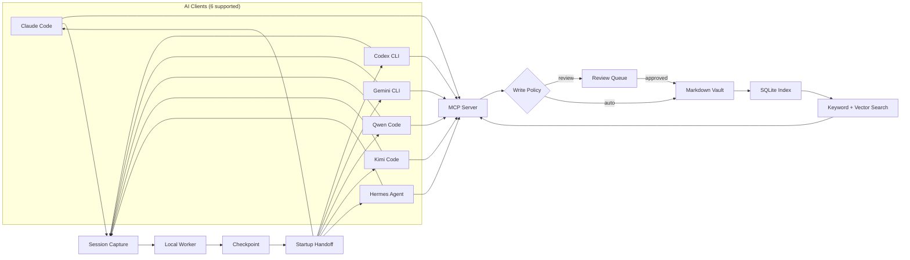

# AI Memory Hub

> Shared, local-first memory for AI tools. Store preferences, decisions, and project notes as readable Markdown — then retrieve them through one MCP server.

[](https://github.com/vib28/ai-memory-hub/actions/workflows/ci.yml)
[](https://github.com/vib28/ai-memory-hub/actions/workflows/ci.yml)
[](https://www.python.org/)
[](LICENSE)
[](#supported-clients)

---

## What It Does

AI Memory Hub gives your AI tools a shared memory. Instead of each tool starting from scratch, they read and write to one local Markdown vault. That vault is just a folder — you can open it in Obsidian, back it up, or edit it by hand.

**How it works in practice:**

1. **Search first** — A connected AI checks existing memory before asking you something it should already know.
2. **Propose** — When it learns something worth keeping, it proposes a new memory.
3. **Review or auto-accept** — Depending on your settings, proposals are either queued for your review or written automatically.
4. **Store** — Accepted memories become plain Markdown files that are searchable and rebuildable.
5. **Inject context** — At startup, the latest relevant checkpoint is handed to your AI so it remembers where you left off.

### Key Features

| Feature | Description |
|---|---|
| **Shared Memory** | Preferences, decisions, project facts, people, topics, and session summaries stored as Markdown |
| **Review Dashboard** | Local web UI for approving, rejecting, and organizing proposed memories |
| **Semantic Search** | Keyword (FTS) + optional vector search with local embeddings |
| **Session Continuity** | Capture, checkpoint, and inject context across AI sessions |
| **GitHub Export** | Optional sanitized session summaries pushed to a repository |
| **Git History** | Optional local version control for your vault |
| **Full Transcripts** | Optional raw session capture for local auditing |
| **Privacy-First** | All data stays local unless you explicitly enable export |

---

## Quick Start

You need **Python 3.10+**, **Git**, and **[uv](https://docs.astral.sh/uv/)** installed. Then:

```powershell
# 1. Clone and enter the repository
git clone https://github.com/vib28/ai-memory-hub.git
cd ai-memory-hub

# 2. Set up the environment
.\setup.ps1

# 3. Connect your AI tools (starts in review mode)
$vault = Join-Path $env:USERPROFILE "Documents\Obsidian\AI-Memory"
.\connect-ai-tools.ps1 -VaultPath $vault -WriteMode review

# 4. Launch the dashboard
.\start-memory-hub.ps1 -VaultPath $vault
```

The dashboard runs at [localhost:8765](http://127.0.0.1:8765). Start a new AI session after connecting — your tools will now share memory.

### Verify It Works

1. Open the dashboard and confirm the vault audit passes.
2. Ask a connected AI to propose a harmless preference.
3. See it appear as a pending proposal — read it, then approve.
4. Search for that memory from a second connected AI.

That's the shared-memory path working end-to-end.

> [!TIP]
> Start in **review mode** so you approve every write. Switch to `auto` only after you trust the pipeline.

---

## Architecture



**Two workflows, one vault:**

| Workflow | What happens |
|---|---|
| **Memory** | AI proposes → you review → accepted as Markdown → searchable |
| **Continuity** | Session captured → checkpoint created → injected at next startup |

---

## Supported Clients

| Client | Tested Version | Registration | Behavioral Instructions |
|---|---|---|---|
| Claude Code | 2.1.276 | `mcp add` command | `~/.claude/CLAUDE.md` |
| Codex CLI | 0.155.0 | `mcp add` with env | `~/.codex/AGENTS.md` |
| Gemini CLI | 0.58.0 | `mcp add` command | `~/.gemini/GEMINI.md` |
| Qwen Code | 0.22.0 | `mcp add` command | `~/.qwen/QWEN.md` |
| Kimi Code | 2.0.1 | `.kimi-code/mcp.json` | `AGENTS.md` in config dir |
| Hermes Agent | current | `mcp add` under `ai_memory_hub` | Skill in Hermes home |

All six clients support **full session capture** and **startup handoff**. Other stdio MCP hosts can be configured manually — see [client docs](docs/CLIENTS.md).

---

## Opt-In Permissions

The connection helper manages each permission independently. Nothing is enabled without your explicit action.

| Permission | Flag | What it does |
|---|---|---|
| Client connection | `connect-ai-tools.ps1` | Lets a client call the memory server |
| Lifecycle capture | `-InstallHooks` | Buffers session events locally |
| Full transcript | `MEMORY_TRANSCRIPT_ENABLED=true` | Keeps raw events for auditing |
| Session worker | `-EnableSessionAuto` | Auto-processes captured sessions into checkpoints |
| Startup handoff | `-InstallHandoff` | Injects context at session start (all 6 hosts) |
| GitHub export | `-EnableGitHubExport` | Publishes sanitized summaries to a repo |
| Encryption at rest | `VAULT_ENCRYPTION_KEY` | Encrypts vault files with AES-256-GCM |
| Manual hooks | `-InstallManualHook <name>` | Adds hooks for unsupported stdio clients |

Each has a matching removal flag (`-RemoveHooks`, `-DisableSessionAuto`, etc.) that does not touch your vault.

---

## Current Status

| Area | Status |
|---|---|
| **Shared memory** | ✅ Fully implemented |
| **Review dashboard** | ✅ Fully implemented |
| **Session continuity** | ✅ Fully implemented (all 6 hosts) |
| **Capture & hooks** | ✅ Fully implemented |
| **Context injection** | ✅ Fully implemented (SessionStart + per-turn) |
| **Project resolver** | ✅ Fully implemented |
| **Deterministic categorizer** | ✅ Fully implemented |
| **GitHub export** | ✅ Fully implemented |
| **Encryption at rest** | ✅ AES-256-GCM via `VAULT_ENCRYPTION_KEY` |
| **Manual hooks** | ✅ Generic hook system for any stdio client |
| **Capability health dashboard** | ✅ Per-client event support monitoring |
| **Tests** | ✅ **395+ passing** |

All pipeline features from the v0.2.x roadmap are complete. The live paired benchmark ([#62](https://github.com/vib28/ai-memory-hub/issues/62)) remains an open research question — the no-paid-call replay harness is available but does not claim live token savings. All 16 remaining quality/efficiency/correctness issues from the `enhancements/no-promises` branch are now resolved.

---

## What This Project Does Not Promise

- **No silent merging** — Exact duplicates are handled automatically; similar items stay in your review queue. Manual merge is available in the dashboard.
- **No guaranteed recovery** — Not every AI provider emits every event. The capability health dashboard shows exactly which events each client supports.

---

## Requirements

| Need | Detail |
|---|---|
| Python | 3.10+ (CI covers 3.10, 3.11, 3.12) |
| Package manager | [uv](https://docs.astral.sh/uv/) |
| Shell | PowerShell (Windows); Bash available for other platforms |
| Vault folder | Any writable directory. Obsidian is optional. |
| Git | For cloning, development, and optional vault history |
| AI client | Any MCP-capable tool |

No subscription required. Local language models are optional and run on your hardware.

---

## Documentation

| Document | When to read |
|---|---|
| [Installation](docs/INSTALLATION.md) | First-time setup and environment |
| [Client connections](docs/CLIENTS.md) | Connecting AI tools and limitations |
| [Configuration](docs/CONFIGURATION.md) | Write modes, endpoints, environment variables |
| [Usage](docs/USAGE.md) | Review, search, sessions, imports, undo |
| [Dashboard](docs/DASHBOARD.md) | UI walkthrough, tags, links, color modes |
| [Architecture](ARCHITECTURE.md) | Deep dive into modules and data flow |
| [Troubleshooting](docs/TROUBLESHOOTING.md) | Symptoms, checks, and recovery |
| [FAQ](docs/FAQ.md) | Short answers and known limits |

---

## License

[Apache License 2.0](LICENSE)
