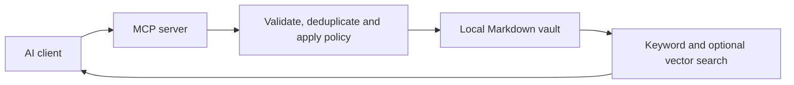

# AI Memory Hub

Shared, local-first memory for AI tools. Store accepted preferences, decisions and
project notes as readable Markdown, then retrieve them through one MCP server.

[Installation](docs/INSTALLATION.md) · [Connect a client](docs/CLIENTS.md) ·
[Usage](docs/USAGE.md) · [Architecture](ARCHITECTURE.md) · [Roadmap](docs/local-memory-plan.md) ·
[Issue priority order](docs/issue-priority-order.md)

## What this project does

AI clients can share durable context without maintaining separate memory stores.
The vault is an ordinary folder that can also be opened in Obsidian. MCP—the Model
Context Protocol—is the interface a connected AI uses to search or propose memories.

A preference written by Claude is available to Codex and other connected clients.
The writer records where it came from; it is not an access restriction.

- Save preferences, project facts, decisions, people, topics and session summaries.
- Read full memory sections in a local workspace with four light/dark color modes.
- Edit organization tags and memory links through lookup, with visible backlinks.
- Start dashboard and optional tray together with one launcher.
- Review proposed changes in a local dashboard before accepting them.
- Search with SQLite keyword search and optional local embeddings.
- Use separate local models for embeddings and chat-based consolidation/extraction.
- Inspect identity conflicts and possible duplicates without automatic merging.
- Keep optional Git history for accepted vault changes.

> [!IMPORTANT]
> The supervised local checkpoint worker is available behind explicit session-auto
> setup. Automatic Claude/Codex startup handoff remains the [next first-priority
> work](docs/automatic-session-continuity.md); hook buffering, worker summaries and
> prompt instructions still do not form a complete cross-client service.

## Current state

| Area | Available now | Limitation |
| --- | --- | --- |
| Shared memory | MCP tools and Markdown vault | Clients must connect to the same vault |
| Review | Dashboard approval and proposal history | Set the MCP write mode explicitly |
| Sessions | Four-section summaries, structured project links, checkpoint manifests and provisional/final worker entries | No automatic startup handoff yet |
| Capture | Native payload mapping, managed hook schemas, bounded leased queue and optional supervised worker | Client lifecycle injection remains #59 |
| Retrieval | Keyword search, optional vectors and bounded project-scoped context | No automatic startup handoff yet |
| Undo | Opt-in local Git history | Not a backup of pending capture or review data |
| Token savings | Component context-size benchmark | No measured cross-tool savings claim |

The core capture, hook, queue, session-identity, context-boundary and local-worker defects have
regression coverage. Remaining continuity work is tracked in
[the continuity plan](docs/automatic-session-continuity.md), especially linked
checkpoint metadata (#57), startup handoff (#59),
GitHub export (#60), and the paired benchmark (#62).
The required [two-tool benchmark](docs/session-handoff-benchmark.md) compares matched
sessions with context passing enabled and disabled.

## Quick start

Run these commands from an existing clone's repository directory. Install Python,
Git and [uv](https://docs.astral.sh/uv/getting-started/installation/) first.
For a fresh clone, follow [installation](docs/INSTALLATION.md).

~~~powershell
$memoryVault = Join-Path $env:USERPROFILE "Documents\Obsidian\AI-Memory"
.\setup.ps1 -VaultPath $memoryVault
.\connect-ai-tools.ps1 -VaultPath $memoryVault -WriteMode review
.\start-memory-hub.ps1 -VaultPath $memoryVault
~~~

The setup creates the environment and initializes missing vault files. The connection
script attempts supported installed clients. The dashboard runs locally, normally at
[localhost:8765](http://127.0.0.1:8765). Start a new client session after connecting.

> [!WARNING]
> The connection script defaults to review, but a directly started MCP server defaults
> to auto if its mode is missing or invalid. Always configure
> `MEMORY_WRITE_MODE=review` when you want approval before proposals are stored.
> Direct administrative CLI commands have different behavior; see [configuration](docs/CONFIGURATION.md).

## Connect your AI tools

The Windows connection script has setup paths for Claude Code, Codex CLI, Gemini CLI,
Qwen Code, Kimi Code and Hermes Agent. Other stdio MCP clients can be configured manually.
ChatGPT has a separate optional tunnel helper.

Connection support is not proof that every client version supports automatic hooks.
See [client setup and limitations](docs/CLIENTS.md) for what the scripts actually configure.

## How it works

~~~text
AI client -> MCP tools -> validation and write policy
                              |             |
                           review        accepted write
                              |             |
                           approval ----> Markdown vault
                                            |
                                      search index
~~~

Accepted Markdown memories are the durable record. Search data can be rebuilt.
Unprocessed capture observations and pending proposals cannot be recreated from
accepted Markdown alone; include them in your backup plan.

## Requirements

- Python 3.10 or newer; the CI matrix covers 3.10, 3.11 and 3.12.
- uv for the repository environment and dependency installation.
- PowerShell for the Windows setup helpers; a separate shell setup script exists.
- A writable vault folder. Obsidian is optional.
- Git for cloning, development and optional vault history.
- An MCP-capable client for live memory access.

No memory-service subscription is required. Your chosen AI clients may have their own
usage charges. Local language and embedding models are optional and use your hardware.

## Documentation

| Read this | When you need |
| --- | --- |
| [Documentation index](docs/README.md) | A map of all guides |
| [Installation](docs/INSTALLATION.md) | Environment, vault and first verification |
| [Client connections](docs/CLIENTS.md) | MCP registration and behavioral instructions |
| [Configuration](docs/CONFIGURATION.md) | Write modes, endpoints and environment variables |
| [Dashboard](docs/DASHBOARD.md) | Reading, color modes, tags, links and the single launcher |
| [Usage](docs/USAGE.md) | Review, search, sessions, imports and undo |
| [Troubleshooting](docs/TROUBLESHOOTING.md) | Symptoms, checks and safe recovery |
| [FAQ](docs/FAQ.md) | Short answers and limits |
| [Architecture](ARCHITECTURE.md) | Modules, data flow and boundaries |
| [Contributing](CONTRIBUTING.md) | Development checks and issue workflow |

## Roadmap and planning

[Roadmap #61](https://github.com/vib28/ai-memory-hub/issues/61) prioritizes linked session
checkpoints and automatic handoff. [Acceptance #62](https://github.com/vib28/ai-memory-hub/issues/62)
requires matched Claude/Codex token and task-quality measurements.

Use the [tracked roadmap](docs/local-memory-plan.md) for order and dependencies, and
the [open issue priority order](docs/issue-priority-order.md) for the recommended
implementation sequence. The [GitHub project](https://github.com/users/vib28/projects/1)
tracks open and closed work.
Issues and planning documents retain their prescribed seven-section format.

[FIXLOG](FIXLOG.md) and [release notes](RELEASE_NOTES_v0.2.md) are historical records;
the current capability table and roadmap above are authoritative.

## License

[Apache License 2.0](LICENSE).
