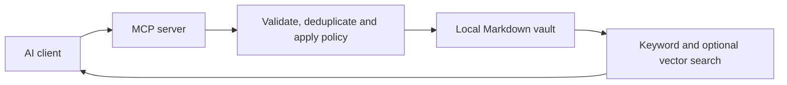
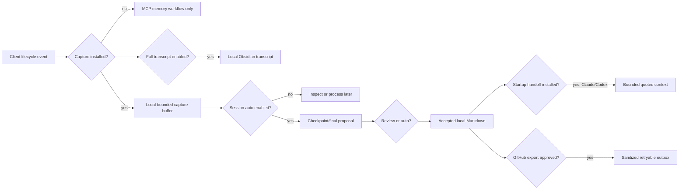
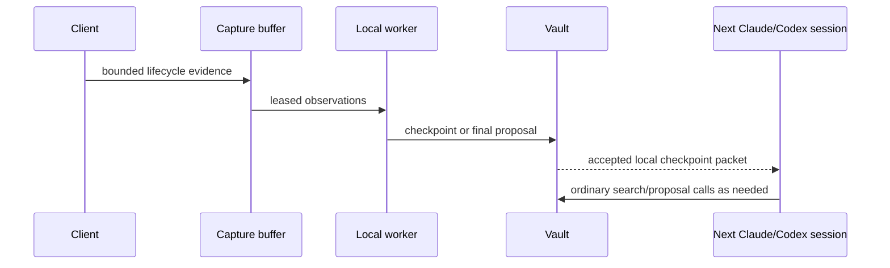

# AI Memory Hub

Shared, local-first memory for AI tools. Store accepted preferences, decisions and
project notes as readable Markdown, then retrieve them through one MCP server.

[Installation](docs/INSTALLATION.md) · [Connect a client](docs/CLIENTS.md) ·
[Usage](docs/USAGE.md) · [Architecture](ARCHITECTURE.md) · [Roadmap](docs/local-memory-plan.md) ·
[Issue priority order](docs/issue-priority-order.md) · [Full transcripts](docs/full-session-transcripts.md)

## What this project does

AI clients can share durable context without maintaining separate memory stores.
The vault is an ordinary folder that can also be opened in Obsidian. MCP—the Model
Context Protocol—is the interface a connected AI uses to search or propose memories.

A preference written by Claude is available to Codex and other connected clients.
The writer records where it came from; it is not an access restriction.

In practical terms, AI Memory Hub is a local memory boundary between AI clients:

1. A client searches before it repeats a known question or proposes a durable fact.
2. The server validates the proposal, checks identity and duplicates, and applies the
   selected `review` or `auto` write policy.
3. Accepted information is written as ordinary Markdown that a person can inspect,
   back up and edit carefully.
4. A rebuildable SQLite index makes that Markdown searchable; optional local models add
   semantic retrieval or structured session consolidation.

The project has two related workflows. The ordinary memory workflow stores durable
preferences, decisions, project facts and summaries. The continuity workflow captures
bounded session evidence, creates local checkpoints, and can inject the latest accepted
checkpoint into a supported Claude or Codex startup. Continuity is deliberately split
into permissions so installing a hook does not silently enable unattended writes or
external publication.

- Save preferences, project facts, decisions, people, topics and session summaries.
- Read full memory sections in a local workspace with four light/dark color modes.
- Edit organization tags and memory links through lookup, with visible backlinks.
- Start dashboard and optional tray together with one launcher.
- Review proposed changes in a local dashboard before accepting them.
- Search with SQLite keyword search and optional local embeddings.
- Use `MEMORY.md` as a selective map: its `Covers` descriptions summarize the active
  content in each file, while fixed profile/preference descriptions retain their known
  scopes.
- Use separate local models for embeddings and chat-based consolidation/extraction.
- Inspect identity conflicts and possible duplicates without automatic merging.
- Keep optional Git history for accepted vault changes.
- Optionally retain complete supported session events as a local, human-readable
  Obsidian transcript linked to each checkpoint/final summary.

## The important boundaries

The vault is the source of truth for accepted memories. Supporting databases make the
application useful, but they have different recovery properties:

| Data | Where it lives | What it contains | Can Markdown rebuild it? |
| --- | --- | --- | --- |
| Accepted memory | Vault `.md` files | Preferences, facts, decisions, people, topics and sessions | This is the canonical data |
| Search index | Vault `.memory_index.sqlite3` | FTS rows, embeddings and manager state | Accepted-memory rows only |
| Capture buffer | User-home capture SQLite | Raw bounded lifecycle evidence waiting for processing | No |
| Full transcript store | Vault `.ai-memory-hub/transcripts.sqlite3` plus `/transcripts/` Markdown | Opt-in verbatim provider envelopes and chronological Obsidian object | Markdown transcript is canonical; SQLite is operational |
| Review history | Index pending/history tables | Proposals and approval outcomes | No |
| Worker health | Per-vault health JSON | Last run, failures, retries and queue status | No |
| GitHub outbox | External/user-home SQLite path | Sanitized publication jobs and retry markers | No; it is a delivery queue |

Back up accepted Markdown together with pending-review data and the capture database if
you need to preserve work that has not yet become an accepted memory. Deleting the
search index is normally recoverable with `reindex`; deleting the capture or pending
databases is not equivalent to reindexing.

## Four separate opt-in permissions

The Windows connection helper manages these permissions independently:

| Permission | Setup switch | Effect | Default |
| --- | --- | --- | --- |
| Client MCP connection | `connect-ai-tools.ps1` | Lets a client call the memory server | Not connected until configured |
| Lifecycle capture | `-InstallHooks` | Buffers bounded provider events locally | Off |
| Full transcript | `MEMORY_TRANSCRIPT_ENABLED=true` | Retains supported raw events in a local transcript object | Off; sensitive opt-in |
| Automatic session worker | `-EnableSessionAuto` | Turns accepted capture evidence into checkpoint/final proposals | Off; worker defaults to review |
| Startup handoff | `-InstallHandoff` | Injects a bounded local checkpoint at supported `SessionStart` events | Off |
| GitHub publication | `-EnableGitHubExport` plus destination/visibility | Publishes accepted sanitized summaries through an outbox | Off |

Removal is equally scoped: `-RemoveHooks`, `-DisableSessionAuto`, `-RemoveHandoff` and
`-DisableGitHubExport` do not delete the vault. Disabling GitHub export retains queued
outbox jobs so an operator can decide whether to re-enable delivery later.

## What the project does not promise

- It does not guarantee that every provider exposes every event or that the opt-in
  transcript recovers transient content the source client never emitted.
- It does not make local storage encrypted. A connected client or configured remote
  model endpoint can receive the content it is asked to retrieve or process.
- It does not silently merge similar people, projects or memories. Exact duplicates are
  handled deterministically; semantic candidates remain reviewable.
- It does not claim startup hooks for every client. Claude Code and Codex CLI have
  process-level handoff fixtures; other clients may have MCP/capture support without a
  certified startup event.
- It does not claim live token savings from the replay report. The report is a no-paid-
  call regression harness; provider usage and live task outcomes remain the #62 gate.

## Choosing a setup

| Your goal | Minimum route |
| --- | --- |
| Shared durable memory | `setup.ps1`, `connect-ai-tools.ps1 -WriteMode review`, dashboard |
| Automatic local checkpoints | Shared memory plus `-InstallHooks -EnableSessionAuto` |
| Cross-client startup context | Checkpoints plus `-InstallHandoff` |
| Semantic search | Configure an OpenAI-compatible embedding endpoint; keep keyword fallback available |
| Human-readable session summaries | Configure a local chat model, or use the deterministic evidence-only fallback |
| Exact local session record | Set `MEMORY_TRANSCRIPT_ENABLED=true` before restarting hooks and worker; review the privacy warning |
| GitHub session record | Validate local continuity first, then explicitly approve `-EnableGitHubExport` |

Start with review mode and a disposable/test vault. Move to unattended session-auto
only after reading [configuration](docs/CONFIGURATION.md), checking worker health and
confirming that the resulting Markdown is appropriate for the vault.

> [!IMPORTANT]
> The supervised local checkpoint worker, model-free Claude/Codex startup handoff and
> sanitized GitHub session outbox are available behind explicit setup. Unsupported
> client coverage and live paired benchmark certification remain in the [continuity plan](docs/automatic-session-continuity.md);
> hook buffering, worker summaries and publication are still opt-in.

## Current state

| Area | Available now | Limitation |
| --- | --- | --- |
| Shared memory | MCP tools and Markdown vault | Clients must connect to the same vault |
| Review | Dashboard approval and proposal history | Set the MCP write mode explicitly |
| Sessions | Four-section summaries, structured project links, checkpoint manifests, provisional/final worker entries, optional linked transcripts and sanitized export | Full transcripts are off by default and unsupported clients have no claimed startup automation |
| Capture | Native payload mapping, managed lifecycle hook schemas, bounded leased queue and optional supervised worker | Raw transcript capture is a separate sensitive opt-in |
| Retrieval | Keyword search, optional vectors, bounded project-scoped context and local startup handoff | Paired measurement remains open |
| Undo | Opt-in local Git history | Not a backup of pending capture or review data |
| Token savings | CI-safe paired replay benchmark | Live provider usage/cost and cross-tool certification remain open |

The core capture, hook, queue, session-identity, context-boundary, local-worker and
supported startup-handoff defects have regression coverage. Remaining continuity work
is tracked in [the continuity plan](docs/automatic-session-continuity.md), especially
continuity closeout (#61), and the paired benchmark (#62).
The required [two-tool benchmark](docs/session-handoff-benchmark.md) compares matched
sessions with context passing enabled and disabled. The no-paid-call replay result is
versioned in [handoff-replay-v1](docs/benchmark-results/handoff-replay-v1.md); it does
not claim live provider-token savings.

The optional transcript path is intentionally easy to understand: bounded capture
supports continuity, while `MEMORY_TRANSCRIPT_ENABLED=true` adds an exact local
evidence object for auditing. It uses the same session group, checkpoint IDs and
Obsidian links, but it is not indexed as a memory and the GitHub exporter never
publishes its raw payloads. Read [full-session-transcripts](docs/full-session-transcripts.md)
before enabling it in a shared or unencrypted vault.

## Quick start

Run these commands from an existing clone's repository directory. Install Python,
Git and [uv](https://docs.astral.sh/uv/getting-started/installation/) first.
For a fresh clone, follow [installation](docs/INSTALLATION.md).

~~~powershell
$memoryVault = Join-Path $env:USERPROFILE "Documents\Obsidian\AI-Memory"
.\setup.ps1 -VaultPath $memoryVault
.\connect-ai-tools.ps1 -VaultPath $memoryVault -WriteMode review
.\start-memory-hub.ps1 -VaultPath $memoryVault
~~~

The setup creates the environment and initializes missing vault files. The connection
script attempts supported installed clients. The dashboard runs locally, normally at
[localhost:8765](http://127.0.0.1:8765) (configurable via `MEMORY_DASHBOARD_PORT`/
`MEMORY_DASHBOARD_HOST`). Start a new client session after connecting.

Verify the first run in this order:

1. Confirm the client is registered with the intended vault and
   `MEMORY_WRITE_MODE=review`.
2. Open the dashboard and check that the vault audit is healthy.
3. Ask the client to propose a harmless, non-sensitive preference.
4. Confirm it appears as a pending proposal; approve it only after reading its text,
   provenance and target path.
5. Search for the accepted memory from a second connected client.

This small test proves the shared-memory path without enabling capture, background
workers, startup injection or GitHub publication.

> [!WARNING]
> The connection script defaults to review, but a directly started MCP server defaults
> to auto if its mode is missing or invalid. Always configure
> `MEMORY_WRITE_MODE=review` when you want approval before proposals are stored.
> Direct administrative CLI commands have different behavior; see [configuration](docs/CONFIGURATION.md).

## Connect your AI tools

The Windows connection script has setup paths for Claude Code, Codex CLI, Gemini CLI,
Qwen Code, Kimi Code and Hermes Agent. Other stdio MCP clients can be configured manually.
ChatGPT has a separate optional tunnel helper.

Connection support is not proof that every client version supports automatic hooks.
See [client setup and limitations](docs/CLIENTS.md) for what the scripts actually configure.

## How it works

~~~text
AI client -> MCP tools -> validation and write policy
                              |             |
                           review        accepted write
                              |             |
                           approval ----> Markdown vault
                                            |
                                      search index
~~~

Accepted Markdown memories are the durable record. Search data can be rebuilt.
Unprocessed capture observations and pending proposals cannot be recreated from
accepted Markdown alone; include them in your backup plan.

For a session-enabled setup, the flow adds a second path:

The packet is a compact, quoted-evidence orientation. It contains the latest goal,
decisions, changed files, verified results and next action, plus checkpoint age and a
warning when the evidence is provisional. It is not an instruction to execute, not a
full transcript and not a replacement for verifying current files.

## Requirements

- Python 3.10 or newer; the CI matrix covers 3.10, 3.11 and 3.12.
- uv for the repository environment and dependency installation.
- PowerShell for the Windows setup helpers; a separate shell setup script exists.
- A writable vault folder. Obsidian is optional.
- Git for cloning, development and optional vault history.
- An MCP-capable client for live memory access.

No memory-service subscription is required. Your chosen AI clients may have their own
usage charges. Local language and embedding models are optional and use your hardware.

## Documentation

| Read this | When you need |
| --- | --- |
| [Documentation index](docs/README.md) | A map of all guides |
| [Installation](docs/INSTALLATION.md) | Environment, vault and first verification |
| [Client connections](docs/CLIENTS.md) | MCP registration and behavioral instructions |
| [Configuration](docs/CONFIGURATION.md) | Write modes, endpoints and environment variables |
| [Dashboard](docs/DASHBOARD.md) | Reading, color modes, tags, links and the single launcher |
| [Usage](docs/USAGE.md) | Review, search, sessions, imports and undo |
| [Troubleshooting](docs/TROUBLESHOOTING.md) | Symptoms, checks and safe recovery |
| [FAQ](docs/FAQ.md) | Short answers and limits |
| [Architecture](ARCHITECTURE.md) | Modules, data flow and boundaries |
| [Contributing](CONTRIBUTING.md) | Development checks and issue workflow |

For a guided explanation rather than a reference table, read [the documentation
index](docs/README.md). It groups the material by first setup, daily operation,
continuity, dashboard use, recovery and development. The documents use the same names
for the same concepts: **review** is a proposal policy, **session-auto** is worker
permission, **handoff** is startup context permission, and **export** is GitHub delivery.

## Roadmap and planning

[Roadmap #61](https://github.com/vib28/ai-memory-hub/issues/61) prioritizes linked session
checkpoints and automatic handoff. [Acceptance #62](https://github.com/vib28/ai-memory-hub/issues/62)
requires matched Claude/Codex token and task-quality measurements.

Use the [tracked roadmap](docs/local-memory-plan.md) for order and dependencies, and
the [open issue priority order](docs/issue-priority-order.md) for the recommended
implementation sequence. The [GitHub project](https://github.com/users/vib28/projects/1)
tracks open and closed work.
Issues and planning documents retain their prescribed seven-section format.

[FIXLOG](FIXLOG.md) and [release notes](RELEASE_NOTES_v0.2.md) are historical records;
the current capability table and roadmap above are authoritative.

## License

[Apache License 2.0](LICENSE).
