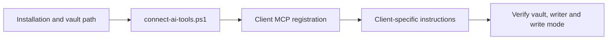

# Client connections

A client needs the server command, a vault path, a writer identity and a write mode.
It also needs instructions explaining when to search or propose memory.

[Installation](INSTALLATION.md) · [Configuration](CONFIGURATION.md) · [Usage](USAGE.md)

## Windows connection helper

After setup, run from the repository directory:

~~~powershell
$memoryVault = Join-Path $env:USERPROFILE "Documents\Obsidian\AI-Memory"
.\connect-ai-tools.ps1 -VaultPath $memoryVault -WriteMode review
~~~

The helper attempts each detected client independently. These are the paths implemented
by the script, not a guarantee about every version of the third-party clients.

| Client | Registration path in this project | Behavioral instructions |
| --- | --- | --- |
| Claude Code | Client mcp add command | User-home .claude/CLAUDE.md |
| Codex CLI | Client mcp add with explicit environment | User-home .codex/AGENTS.md |
| Gemini CLI | Client mcp add command | User-home .gemini/GEMINI.md |
| Qwen Code | Client mcp add command | User-home .qwen/QWEN.md |
| Kimi Code | Edits .kimi-code/mcp.json, or KIMI_CODE_HOME | AGENTS.md in that directory |
| Hermes Agent | Client mcp add under ai_memory_hub | Skill under the home resolved by hermes config path |

The source of truth for this behavior is [connect-ai-tools.ps1](../connect-ai-tools.ps1).
A client reporting an existing registration may keep old environment values; verify
the actual registered vault/mode after changing them.

### Claude Code, Gemini and Qwen

The helper installs a managed block from [client-prompts](../client-prompts/).
Check the client’s MCP status and workspace trust if the server is not visible.
Do not bypass trust prompts automatically.

### Codex

The helper finds a Windows executable and passes the vault, writer and mode explicitly.
It currently targets user-home .codex paths; do not assume custom configuration roots
are handled. Inspect your client's registered configuration when using a non-default root.

### Kimi

The helper edits MCP JSON and uses a separate TOML hook location. If existing MCP JSON
is malformed, it creates a backup and rebuilds the configuration; unrelated entries may
need restoring from that backup. Review the result rather than treating every rerun as
a no-change operation.

### Hermes

The server name is ai_memory_hub, and the writer is hermes. The helper installs
[the repository's Hermes skill](../hermes/skills/ai-memory-hub/SKILL.md) into the resolved
Hermes home. It does not use the ordinary prompt file as its installation mechanism.
Existing registrations are left in place; the skill is refreshed.

## Configure another stdio MCP host

Use your host's supported configuration UI or file. This is a generic example; replace
both absolute paths and use a supported writer identity. Do not overwrite the host's
other server entries.

~~~json
{
  "mcpServers": {
    "ai-memory-hub": {
      "command": "C:\\Tools\\ai-memory-hub\\.venv\\Scripts\\python.exe",
      "args": ["-m", "memory_hub.mcp_server"],
      "env": {
        "AI_MEMORY_VAULT": "C:\\Memory\\AI-Memory",
        "MEMORY_WRITER": "other",
        "MEMORY_WRITE_MODE": "review"
      }
    }
  }
}
~~~

On Linux/macOS, use the environment's absolute .venv/bin/python path.
Give the client [generic instructions](../client-prompts/generic.md), or the matching
client-specific file. The prompt's writer label should agree with MEMORY_WRITER.

The [example JSON file](../examples/mcp-host-config.example.json) is a starting shape;
it currently omits write mode. Add MEMORY_WRITE_MODE explicitly rather than relying on
the server's auto fallback.

## Optional ChatGPT tunnel helper

[connect-chatgpt-tunnel.ps1](../connect-chatgpt-tunnel.ps1) configures and runs a
tunnel-client profile pointing to the local stdio server. It requires a vault,
a tunnel ID, tunnel-client on PATH and account credentials supplied outside documentation.

Follow the current [official Secure MCP Tunnel guide](https://developers.openai.com/api/docs/guides/secure-mcp-tunnels)
for account eligibility, credential handling and connection setup. UI paths and permissions
may change; this rewrite does not repeat old UI steps as a fresh verification.

Once the prerequisite account setup is complete and CONTROL_PLANE_API_KEY is securely
provided to the process:

~~~powershell
.\connect-chatgpt-tunnel.ps1 -VaultPath $memoryVault -TunnelId $memoryTunnelId -WriteMode review
~~~

Set memoryTunnelId to your actual ID first. The helper initializes a profile, runs
doctor and then keeps the tunnel running. Closing that process disconnects the bridge.
It uses an external service: local vault storage does not mean retrieved content stays
off the connected AI provider.

Install [the ChatGPT prompt](../client-prompts/chatgpt.md) through the client's supported
instruction mechanism. Do not place credentials in prompts, the vault or GitHub.

## Capture hooks and startup handoff

The helper keeps three permissions separate: `-InstallHooks`/`-RemoveHooks` capture
provider lifecycle evidence, `-EnableSessionAuto`/`-DisableSessionAuto` controls the
local worker, and `-InstallHandoff`/`-RemoveHandoff` controls startup context injection.
For Claude Code and Codex CLI, capture installation covers session-start, prompt/tool/turn,
compaction, failure and end events, while handoff installation adds `SessionStart`.

| Client surface | Version observed on 2026-09-09 | Startup fixture | Limitation |
| --- | --- | --- | --- |
| Claude Code CLI | 2.1.263 | `tests/test_handoff.py` validates `SessionStart` JSON and bounded `additionalContext` | Desktop/cloud surfaces are not claimed |
| Codex CLI | 0.153.4 | `tests/test_handoff.py` validates the same documented `SessionStart` output shape | Interactive authenticated launch is not part of CI |
| Gemini, Qwen, Kimi, Hermes, ChatGPT | Not tested for startup injection | None | Capture/MCP support does not imply a startup hook |

> [!WARNING]
> Native payload mapping, mixed-handler preservation and process-level startup fixtures
> are covered by isolated tests. The tested client versions are Claude Code 2.1.263
> and Codex CLI 0.153.4 on this checkout. Hook delivery is still client-version
> dependent, so retain backups and verify the actual host event payload before relying
> on unattended capture.

Current capture-hook targets include Claude/Gemini/Qwen JSON settings, Kimi's marked
TOML block and Codex's hooks.json. Startup handoff is certified only for the Claude
Code and Codex CLI fixture schemas above; Gemini, Qwen, Kimi, Hermes and ChatGPT
report a limitation rather than claiming startup automation. See [automatic
continuity](automatic-session-continuity.md) for the continuity boundaries, replay
benchmark and remaining live certification work.

GitHub export is not part of MCP registration. Approve it separately with
`-EnableGitHubExport -GitHubRepo owner/name -GitHubVisibility private`; this creates
an owned hidden startup publisher and uses the `gh` credential store. Disable it with
`-DisableGitHubExport`; the durable outbox is retained for retry. No raw transcript,
pending review proposal or private path is eligible for export.

To retain a complete local transcript as well as bounded lifecycle evidence, set
`MEMORY_TRANSCRIPT_ENABLED=true` in the environment inherited by the hook receiver
and worker before starting the client. The hook adapters feed a provider-neutral
event envelope; the feature remains default-off and must be restarted after config
changes. See [full-session-transcripts](full-session-transcripts.md) for supported
fields, Markdown paths, privacy and live-client limitations. Hook configuration
tests verify schemas and managed-handler preservation; they do not certify delivery
from every installed client surface.

## Refresh or remove a connection

After a project update, the helper can refresh managed client instruction blocks and
the Hermes skill. Start a new session or use the host's supported reload mechanism.
Verify the registered vault and mode; an already-existing MCP registration may not
be replaced.

Existing vault instructions are separate. Compare vault_template/AI_INSTRUCTIONS.md
with the vault's copy and merge intentional guidance changes without replacing memories.

To disconnect, remove only this server registration and its owned instruction block
or skill. Back up settings before editing. Removing a connection does not remove
stored memories, pending proposals or the observation buffer.
