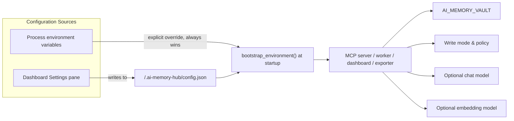
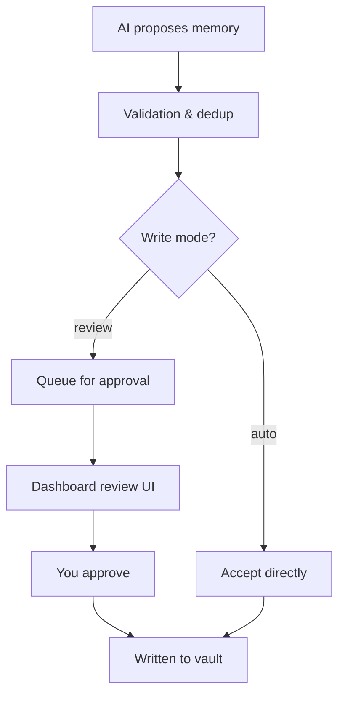
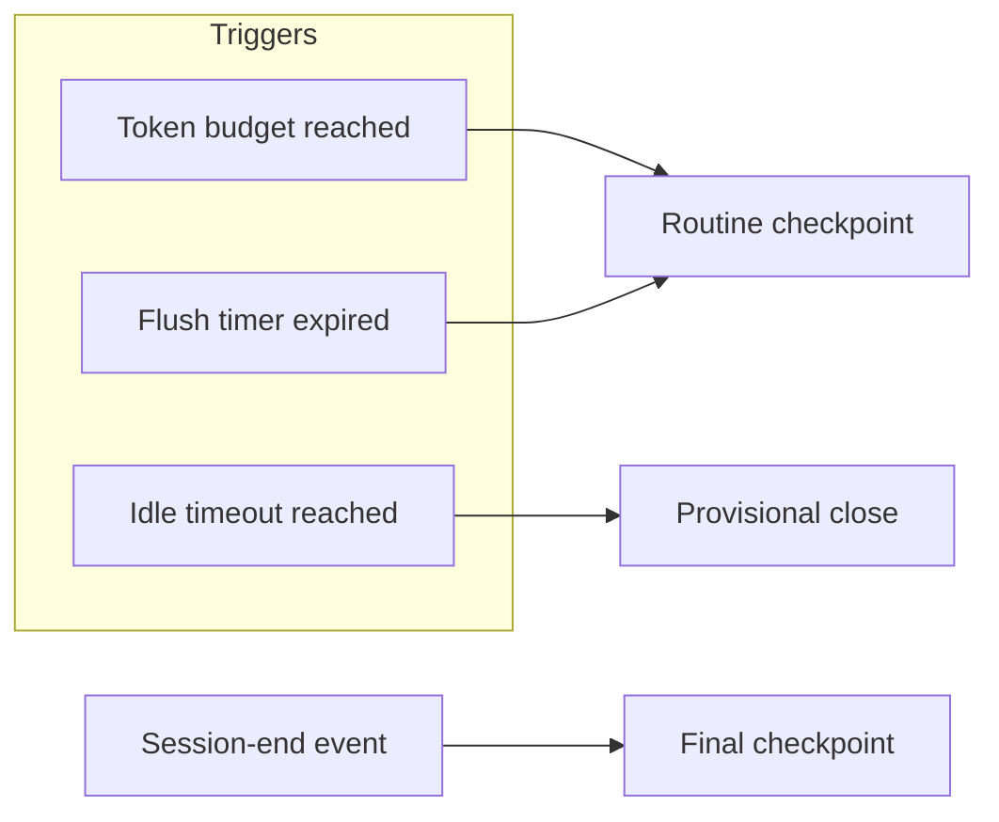
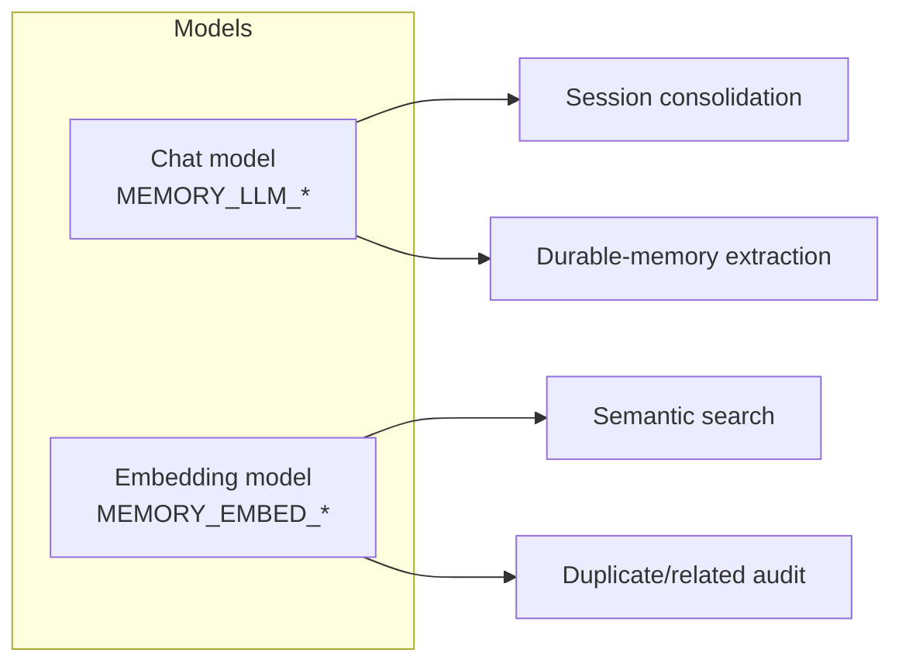
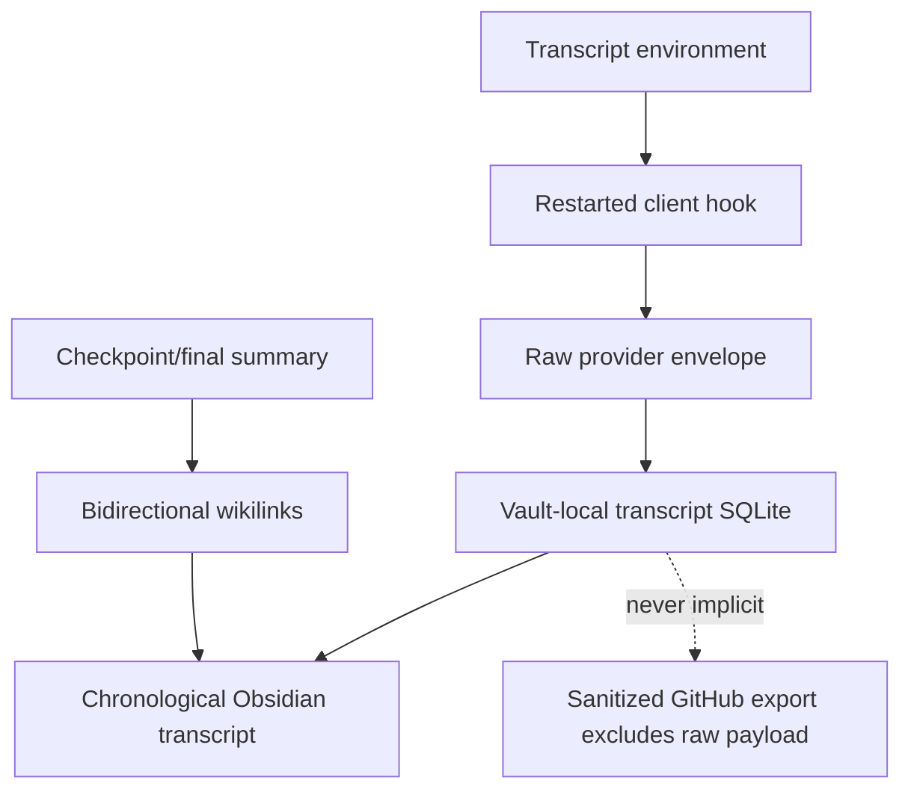

# Configuration Reference

Everything you can configure in AI Memory Hub in one place — environment variables, write modes, and worker behavior.

---

## At a Glance



**Key idea:** There are two ways to configure any setting — through the dashboard's Settings pane (which saves to `config.json`) or by setting an environment variable directly. Environment variables always take precedence over `config.json`.

---

## Two Ways to Configure

| Method | Best for | Where it lives |
|--------|----------|----------------|
| **Dashboard Settings pane** | Most settings, everyday use | `<vault>/.ai-memory-hub/config.json` |
| **Environment variables** | One-off overrides, CI/CD, client registration | Your shell / MCP client config |

**How precedence works:** Every process calls `bootstrap_environment(vault)` at startup. This function uses `setdefault` semantics — it only sets values from `config.json` for variables **not already set** in the environment. Your explicit environment variable always wins.

**When do changes take effect?** Only for processes **started after** the change. The MCP server reads its environment when the client launches it. The worker, handoff reader, dashboard, and GitHub exporter are separate processes and each reads its own environment when it starts. Restart the relevant process after changing a setting.

> 💡 `AI_MEMORY_VAULT` is set as an environment variable (or `--vault` flag) — it can't live inside the same `config.json` that it points to.

---

## Complete Environment Variable Reference

### Vault & Identity

| Variable | Default | Description |
|----------|---------|-------------|
| `AI_MEMORY_VAULT` | `memory-vault/` under working directory | Absolute path to the vault directory |
| `MEMORY_WRITER` | `claude` | Provenance tag for writes. Options: `chatgpt`, `claude`, `codex`, `gemini`, `kimi`, `qwen`, `cursor`, `hermes`, `user`, `other` |
| `VAULT_ENCRYPTION_KEY` | *(unset)* | Base64-encoded 32-byte AES-256-GCM key. When set, all vault files are encrypted at rest with `.enc` extensions. Back up this key — losing it means losing your vault data. |

### Encryption at Rest

When `VAULT_ENCRYPTION_KEY` is set (via environment variable or in `config.json`), all vault memory files are transparently encrypted at rest using AES-256-GCM. Files are written with a `.enc` extension alongside their plaintext name (e.g., `topics/ai.md` becomes `topics/ai.md.enc`).

**Key format:** a base64-encoded 32-byte (256-bit) random key.

```powershell
# Generate a fresh key (print to stdout, save it somewhere secure)
.venv\Scripts\python.exe -m memory_hub.cli vault-key

# Set the key in the environment
$env:VAULT_ENCRYPTION_KEY = "your-base64-key-here"

# Encrypt all existing .md files (writes .enc companions)
.venv\Scripts\python.exe -m memory_hub.cli --vault $memoryVault vault-encrypt

# Check status: how many files are encrypted vs plaintext
.venv\Scripts\python.exe -m memory_hub.cli --vault $memoryVault vault-status

# To decrypt everything back to plaintext (requires the same key)
.venv\Scripts\python.exe -m memory_hub.cli --vault $memoryVault vault-decrypt
```

**Migration workflow:**
1. Generate a key with `vault-key` and store it securely (password manager).
2. Export it as `VAULT_ENCRYPTION_KEY` in your shell/MCP config.
3. Run `vault-encrypt` to create `.enc` companions for all existing `.md` files.
4. Manually delete the plaintext `.md` files once you've verified decryption works (use `vault-decrypt --key ...` on a copy of the vault to test).
5. Restart your MCP server / worker / dashboard — all read/write paths now transparently decrypt/encrypt.

**On-disk format:** encrypted files start with the 8-byte magic header `AMHENC\x00\x01`, followed by a 12-byte random nonce, then the AES-256-GCM ciphertext (which includes the 16-byte authentication tag). Each file uses a unique random nonce.

### Write Mode & History

| Variable | Default | Description |
|----------|---------|-------------|
| `MEMORY_WRITE_MODE` | `review` | `review` queues proposals for approval; `auto` writes valid proposals directly |
| `MEMORY_VAULT_HISTORY` | `false` | Commit a git history entry on every successful write (enables undo) |

### Capture (Observation Buffer)

| Variable | Default | Description |
|----------|---------|-------------|
| `MEMORY_CAPTURE_DB` | Per-vault default | Path to the local observation database (SQLite) |
| `MEMORY_CAPTURE_RETENTION_DAYS` | `30` | Days to retain captured terminal rows (pending rows are always preserved) |
| `MEMORY_CAPTURE_EXCLUDE_PATHS` | *(built-in excludes)* | Comma-separated additional sensitive path globs |

### Transcript

| Variable | Default | Description |
|----------|---------|-------------|
| `MEMORY_TRANSCRIPT_ENABLED` | `false` | Persist raw provider event payloads to a local transcript companion object |
| `MEMORY_TRANSCRIPT_DB` | `<vault>/.ai-memory-hub/transcripts.sqlite3` | Operational SQLite path for opt-in transcript events |
| `MEMORY_TRANSCRIPT_RETENTION_DAYS` | `0` (keep until forgotten) | Days to retain transcript event rows |

### Worker (Checkpoint Engine)

| Variable | Default | Range | Description |
|----------|---------|-------|-------------|
| `MEMORY_WORKER_TOKEN_BUDGET` | `4000` | 100–1M | Estimated captured-evidence tokens before a checkpoint triggers |
| `MEMORY_WORKER_FLUSH_SECONDS` | `60` | 1–86400 | Maximum age of the oldest pending row before a routine checkpoint |
| `MEMORY_WORKER_IDLE_SECONDS` | `300` | 1–86400 | Age of the newest pending row at which a checkpoint closes as provisional |
| `MEMORY_WORKER_INTERVAL_SECONDS` | `15` | 1–3600 | Worker polling interval |
| `MEMORY_WORKER_BATCH_LIMIT` | `500` | 1–100K | Maximum observations claimed per worker pass |
| `MEMORY_WORKER_HEALTH` | Per-vault default | — | Explicit path for worker health JSON |
| `MEMORY_INLINE_CONSOLIDATION` | `true` | — | Spawn a detached checkpoint on session-end/stop/compaction |

### Context Handoff (Injection Packets)

| Variable | Default | Range | Description |
|----------|---------|-------|-------------|
| `MEMORY_HANDOFF_MAX_CHARS` | `6000` | 500–12K | Maximum serialized startup evidence packet size |
| `MEMORY_TURN_MAX_CHARS` | `1500` | 200–12K | Maximum per-prompt delta packet size |
| `MEMORY_HANDOFF_CATCHUP_SECONDS` | `2` | 0–30 | SessionStart catch-up budget (0 disables the pass) |

### Dashboard

| Variable | Default | Description |
|----------|---------|-------------|
| `MEMORY_DASHBOARD_HOST` | `127.0.0.1` | Bind address (loopback only — `127.0.0.1` or `localhost`) |
| `MEMORY_DASHBOARD_PORT` | `8765` | Dashboard/tray port |

### LLM & Embeddings (Optional Local Models)

| Variable | Default | Description |
|----------|---------|-------------|
| `MEMORY_LLM_BASE_URL` | Unset | Chat-completions endpoint base URL (OpenAI-compatible) |
| `MEMORY_LLM_MODEL` | Unset | Consolidation/extraction model name |
| `MEMORY_LLM_API_KEY` | Unset | Optional transcript-extractor authorization key |
| `MEMORY_EMBED_BASE_URL` | Unset | Embeddings endpoint base URL (unset = disabled) |
| `MEMORY_EMBED_MODEL` | `nomic-embed-text` | Embedding model name |

### GitHub Export

| Variable | Default | Description |
|----------|---------|-------------|
| `MEMORY_GITHUB_EXPORT_INTERVAL_SECONDS` | `30` | Exporter polling interval |
| `MEMORY_GITHUB_EXPORT_CONFIG` | Per-vault default | Export configuration path |
| `MEMORY_GITHUB_OUTBOX` | Per-vault default | SQLite outbox path |
| `MEMORY_GITHUB_HEALTH` | Per-vault default | Exporter health JSON path |

### AI Tool Paths (connect-ai-tools.ps1 only)

| Variable | Default | Description |
|----------|---------|-------------|
| `GEMINI_CONFIG_DIR` | `~/.gemini` | Override for Gemini CLI settings directory |
| `QWEN_CONFIG_DIR` | `~/.qwen` | Override for Qwen CLI settings directory |
| `KIMI_CONFIG_DIR` | `~/.kimi` | Override for Kimi Code settings directory |

> ℹ️ `GEMINI_CONFIG_DIR`, `QWEN_CONFIG_DIR`, and `KIMI_CONFIG_DIR` are read by `connect-ai-tools.ps1` directly — not by any Python process. They stay environment-only.

---

## Write Modes

The write mode controls what happens when an AI proposes a new memory.



| Mode | Behavior |
|------|----------|
| **review** | Every proposed memory enters the dashboard queue. You approve or reject it manually. |
| **auto** | Validated proposals are written directly to the vault without manual approval. |

### Example: Starting in review mode

```powershell
$env:AI_MEMORY_VAULT = Join-Path $env:USERPROFILE "Documents\Obsidian\AI-Memory"
$env:MEMORY_WRITER = "codex"
$env:MEMORY_WRITE_MODE = "review"
.\.venv\Scripts\python.exe -m memory_hub.mcp_server
```

### Example: Starting in auto mode with a local model

```powershell
$env:AI_MEMORY_VAULT = Join-Path $env:USERPROFILE "Documents\Obsidian\AI-Memory"
$env:MEMORY_WRITE_MODE = "auto"
$env:MEMORY_LLM_BASE_URL = "http://127.0.0.1:1234/v1"
$env:MEMORY_LLM_MODEL = "qwen2.5-7b-instruct"
.\.venv\Scripts\python.exe -m memory_hub.mcp_server
```

> ⚠️ The administrative CLI's `propose`, `supersede`, and `ingest` commands call manager methods directly and do **not** honor MCP review mode. Explicit deletion/linking and dashboard approval are separate actions.

**Writer identities:** `chatgpt`, `claude`, `codex`, `gemini`, `kimi`, `qwen`, `cursor`, `hermes`, `user`, `other`. A writer identifies provenance — not which clients may read the memory.

---

## Worker Configuration

The worker processes the observation buffer and turns captured evidence into memories.

### Worker Triggers



| Trigger | When | Result |
|---------|------|--------|
| **Token budget** | Accumulated evidence exceeds `MEMORY_WORKER_TOKEN_BUDGET` tokens | Routine checkpoint |
| **Flush timer** | Oldest pending row exceeds `MEMORY_WORKER_FLUSH_SECONDS` | Routine checkpoint |
| **Idle timeout** | Newest pending row is older than `MEMORY_WORKER_IDLE_SECONDS` | Provisional close |
| **Session end** | `session-end` event received | Final checkpoint |

### Worker Safety Matrix

| Condition | Result |
|-----------|--------|
| `review` mode | Proposals enter the dashboard queue for approval |
| `auto` mode | Valid proposals are accepted automatically |
| Chat model unavailable | Evidence-only fallback remains retryable; no invented success |
| Capture database unavailable | Worker reports health failure; cannot reconstruct missing observations |
| Idle or stop trigger | Provisional checkpoint; later evidence may reopen the group |
| Explicit session-end | Final entry with host finalization metadata |

### Running the Worker

Enable with the connection helper:

```powershell
.\connect-ai-tools.ps1 -EnableSessionAuto
```

Check health without changing data (one-shot pass):

```powershell
.\.venv\Scripts\python.exe -m memory_hub.worker --vault $memoryVault --once
```

The persistent health file lives at `<vault>/.ai-memory-hub/worker-health.json`. Override with `MEMORY_WORKER_HEALTH`.

### Inline Consolidation (Default On)

`MEMORY_INLINE_CONSOLIDATION=true` (default) spawns a detached checkpoint worker on terminal events (session-end, stop, compaction) so checkpoints exist even without a resident worker. Turn it off only if you run the resident worker and want it to own all consolidation.

---

## Local Models

Two independent model roles — configure one, both, or neither.



| Role | Settings | Responsibility | Safe failure behavior |
|------|----------|----------------|----------------------|
| **Chat model** | `MEMORY_LLM_BASE_URL`, `MEMORY_LLM_MODEL` | Session consolidation and durable-memory extraction | Deterministic evidence-only fallback for consolidation; extraction fails explicitly |
| **Embedding model** | `MEMORY_EMBED_BASE_URL`, `MEMORY_EMBED_MODEL` | Search, related-memory ranking, semantic audit | Keyword search and lexical duplicate/update checks continue |

### Example: Local Ollama server

```powershell
$env:MEMORY_LLM_BASE_URL = "http://127.0.0.1:1234/v1"
$env:MEMORY_LLM_MODEL = "qwen2.5-7b-instruct"
$env:MEMORY_EMBED_BASE_URL = "http://127.0.0.1:1234/v1"
$env:MEMORY_EMBED_MODEL = "nomic-embed-text"
```

> 💡 The code appends `/chat/completions` or `/embeddings` to the base URL — don't include those suffixes twice.

> ⚠️ The endpoint is expected to be OpenAI-compatible. A remote URL sends the selected text to that service. Keep API keys in the process environment or a secret store — never in Markdown, committed `.env` files, client prompts, or GitHub comments.

---

## Vault History

Enable git-backed undo for the vault:

```powershell
$memoryVault = Join-Path $env:USERPROFILE "Documents\Obsidian\AI-Memory"
.\.venv\Scripts\python.exe -m memory_hub.cli --vault $memoryVault history-init
```

Then set `MEMORY_VAULT_HISTORY=true` and restart the MCP server.

History does not automatically commit every kind of memory operation — it is not a backup of pending-review databases or the external capture buffer. See [undo and backup](USAGE.md#undo-and-backup).

---

## Full Session Transcripts

`MEMORY_TRANSCRIPT_ENABLED=true` is a separate, default-off opt-in for retaining raw user/agent/tool/system and structured provider events. Set it before starting the client hook receiver and the worker; restart both after changing it.



For full details on the envelope, retention behavior, and privacy boundary, see [full-session-transcripts.md](full-session-transcripts.md).

---

## GitHub Session Export

GitHub publication records the approved repository and visibility, starts a hidden local outbox publisher, and never stores a GitHub token in the vault or configuration. The `gh` CLI supplies credentials when the publisher runs.

### Setup

```powershell
.\connect-ai-tools.ps1 -VaultPath $memoryVault -EnableGitHubExport `
  -GitHubRepo "owner/repository" -GitHubVisibility private
.\connect-ai-tools.ps1 -VaultPath $memoryVault -DisableGitHubExport
```

### Export Rules

| Rule | Meaning |
|------|---------|
| Destination | Must be an explicit `owner/name` repository |
| Visibility | Must be explicitly approved as `public`, `private`, or `internal` |
| Source | Accepted checkpoint/final sections only |
| Excluded | Raw transcripts, pending proposals, secrets, and absolute/private paths |
| Delivery | SQLite outbox with stable markers, retries, and timeout reconciliation |
| Credentials | `gh` CLI credential store; tokens are not copied to vault/config |
| Disable behavior | Startup registration stops; queued outbox data is retained |

### Inspection & Manual Delivery

```powershell
.\.venv\Scripts\python.exe -m memory_hub.cli --vault $memoryVault github-export-config
.\.venv\Scripts\python.exe -m memory_hub.cli --vault $memoryVault github-export --once
```

---

## Startup Handoff

The local handoff reader is independent from MCP, embeddings, the chat model, and GitHub. Install it separately:

```powershell
.\connect-ai-tools.ps1 -VaultPath $memoryVault -InstallHandoff
.\connect-ai-tools.ps1 -VaultPath $memoryVault -RemoveHandoff
```

Installs a bounded context packet at startup for all six supported hosts:
- Claude Code 2.1.276+
- Codex CLI 0.155.0+
- Gemini CLI 0.58.0+
- Qwen Code 0.22.0+
- Kimi Code 2.0.1+
- Hermes Agent (shell hooks)

---

## See Also

- [Client setup](CLIENTS.md)
- [Dashboard](DASHBOARD.md)
- [Architecture](../ARCHITECTURE.md)
- [Troubleshooting](TROUBLESHOOTING.md)
- [Full session transcripts](full-session-transcripts.md)
