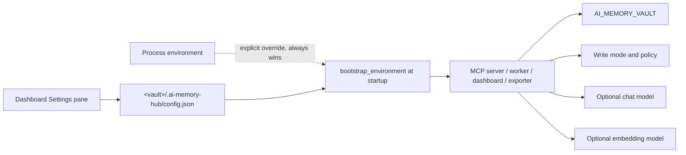
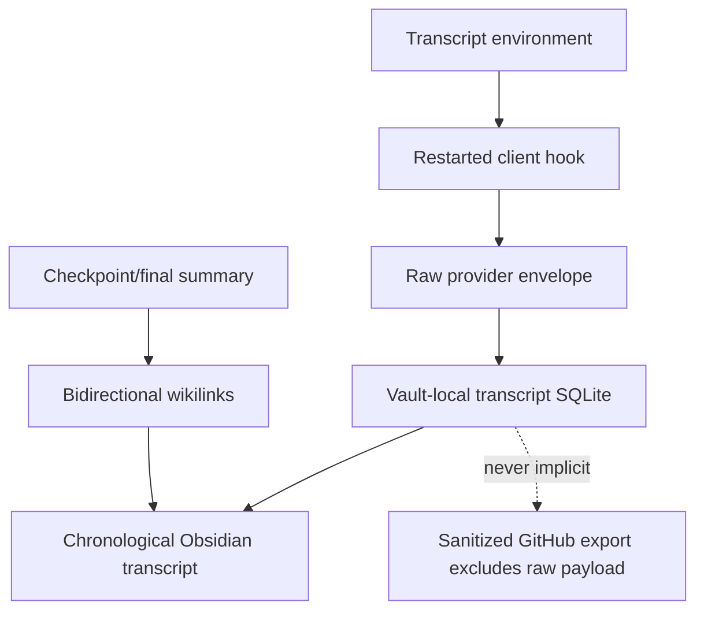

# Configuration

Every setting below has two ways to reach a process: an environment variable, or the
per-vault **Settings** pane in the dashboard (Workspace → Settings), which writes
`<vault>/.ai-memory-hub/config.json`. Neither is loaded automatically by every process on
its own — see [Two configuration paths](#two-configuration-paths) below.

[Client setup](CLIENTS.md) · [Dashboard](DASHBOARD.md) · [Architecture](../ARCHITECTURE.md) · [Troubleshooting](TROUBLESHOOTING.md)

## Two configuration paths

**The dashboard's Settings pane** is the easiest path for most settings below: open the
dashboard, choose **Settings** in the left rail, edit a field, and save. Each field shows
where its current value comes from — `FILE` (the config file), `ENV` (an environment
variable), or `DEFAULT`. Saving writes only the fields you actually changed to
`config.json`; it never touches a field just because you saved a different one.

**An environment variable** set directly (`$env:NAME` in PowerShell, or a client's own
MCP registration) always takes precedence over `config.json` for that one process — it's
the escape hatch for a one-off override without touching the file. Every process that
reads these settings calls `bootstrap_environment(vault)` once at startup, which fills in
whatever `config.json` has for a variable *not already set* in that process's
environment; it never overwrites an explicit one.

Either way, a change takes effect only for processes **started after** the change. The
MCP server reads its environment when the client launches it. The worker, handoff
reader, dashboard and GitHub exporter are separate processes and read their own
environment when they start. Restart the relevant process (or reconnect the client)
after changing a setting.

## Server settings

| Variable | Purpose | Current default |
| --- | --- | --- |
| AI_MEMORY_VAULT | Absolute vault directory | MCP server: memory-vault under its working directory |
| MEMORY_WRITER | Provenance for the connected client | other |
| MEMORY_WRITE_MODE | MCP proposal policy: review or auto | auto; invalid values also fall back to auto |
| MEMORY_VAULT_HISTORY | Commit paths from successful MCP consolidation | false |
| MEMORY_CAPTURE_DB | Local observation database | User-home .ai-memory-hub/observations.sqlite3 |
| MEMORY_CAPTURE_RETENTION_DAYS | Days to retain terminal capture rows | 30; pending rows are preserved |
| MEMORY_CAPTURE_EXCLUDE_PATHS | Comma-separated additional sensitive path globs | Built-in `.env`, key and credential paths |
| MEMORY_TRANSCRIPT_ENABLED | Persist provider event payloads in a local transcript companion path | false |
| MEMORY_TRANSCRIPT_DB | Operational SQLite path for opt-in transcript events | `<vault>/.ai-memory-hub/transcripts.sqlite3` |
| MEMORY_TRANSCRIPT_RETENTION_DAYS | Days to retain transcript event rows; zero means retain until forget | 0 |
| MEMORY_WORKER_TOKEN_BUDGET | Estimated captured-evidence tokens before a checkpoint | 4000 |
| MEMORY_WORKER_FLUSH_SECONDS | Maximum age of the oldest pending row before a routine checkpoint | 60 |
| MEMORY_WORKER_IDLE_SECONDS | Age of the newest pending row (checked before flush) at which a checkpoint closes provisional instead of routine | 300 |
| MEMORY_WORKER_INTERVAL_SECONDS | Worker polling interval | 15 |
| MEMORY_WORKER_BATCH_LIMIT | Maximum observations claimed per worker pass | 500 |
| MEMORY_WORKER_HEALTH | Optional explicit worker-health JSON path | Per-vault default |
| MEMORY_HANDOFF_MAX_CHARS | Maximum serialized startup evidence packet | 6000 |
| MEMORY_GITHUB_EXPORT_INTERVAL_SECONDS | Exporter polling interval | 30 |
| MEMORY_GITHUB_EXPORT_CONFIG | Optional GitHub export configuration path | Per-vault user-home default |
| MEMORY_GITHUB_OUTBOX | Optional GitHub export SQLite outbox path | Per-vault user-home default |
| MEMORY_GITHUB_HEALTH | Optional GitHub exporter health JSON path | Per-vault user-home default |
| MEMORY_LLM_BASE_URL | Chat-completions endpoint base | Unset |
| MEMORY_LLM_MODEL | Consolidation/extraction model name | Unset |
| MEMORY_LLM_API_KEY | Optional transcript-extractor authorization | Unset; not used by the consolidator |
| MEMORY_EMBED_BASE_URL | Embeddings endpoint base | Unset, so embeddings are disabled |
| MEMORY_EMBED_MODEL | Embedding model name | nomic-embed-text |
| MEMORY_DASHBOARD_HOST | Dashboard bind address (loopback only; `127.0.0.1` or `localhost`) | 127.0.0.1 |
| MEMORY_DASHBOARD_PORT | Dashboard/tray port, shared by `memory_hub.app`, `memory_hub.dashboard` and all three `start-*.ps1` launchers | 8765 |
| GEMINI_CONFIG_DIR | Override for the Gemini CLI settings directory | `~/.gemini` |
| QWEN_CONFIG_DIR | Override for the Qwen CLI settings directory | `~/.qwen` |
| KIMI_CONFIG_DIR | Override for the Kimi Code settings directory | `~/.kimi` |

Every variable above except the last four appears as a field in the dashboard's Settings
pane. `AI_MEMORY_VAULT` is the one exception with its own reason: it names *which*
vault's `config.json` to read, so it can't sensibly live inside that same file — set it
as an environment variable, or pass `--vault`/`-VaultPath` to whichever script you're
running. `GEMINI_CONFIG_DIR`, `QWEN_CONFIG_DIR` and `KIMI_CONFIG_DIR` are read by
`connect-ai-tools.ps1` directly, not by any Python process, so they stay environment-only
too.

See [mcp_server.py](../memory_hub/mcp_server.py),
[capture.py](../memory_hub/capture.py), [extractor.py](../memory_hub/extractor.py),
[consolidator.py](../memory_hub/consolidator.py) and [embeddings.py](../memory_hub/embeddings.py).

## Optional full session transcripts

`MEMORY_TRANSCRIPT_ENABLED=true` is a separate, default-off opt-in for retaining
raw user/agent/tool/system and structured provider events. Set it before starting
the client hook receiver and the worker; restart both after changing it. The exact
envelope, Markdown path, Obsidian links, retention behavior and privacy boundary are
documented in [full-session-transcripts.md](full-session-transcripts.md).

This option does not use `nomic-embed-text` to generate or rewrite transcript text.
Embeddings remain a separate retrieval/audit role; a configured local chat model may
still produce the compact summary. Raw transcript content remains local unless a
future separately approved export feature explicitly changes that boundary.

## Choose the write mode explicitly

~~~powershell
$env:AI_MEMORY_VAULT = Join-Path $env:USERPROFILE "Documents\Obsidian\AI-Memory"
$env:MEMORY_WRITER = "codex"
$env:MEMORY_WRITE_MODE = "review"
.\.venv\Scripts\python.exe -m memory_hub.mcp_server
~~~

This starts a stdio server waiting for an MCP client; it is not a web page.
Usually the host launches it using [registered configuration](CLIENTS.md).

Review queues proposals for approval. Auto attempts to store accepted proposals without
that approval step. Both retain validation and duplicate/update handling.

> [!WARNING]
> The administrative CLI's propose, supersede and ingest commands call manager methods
> directly and do not honor MCP review mode. Explicit deletion/linking and dashboard
> approval are also separate actions. Review is not a blanket prohibition on all writes.

Writer identities are chatgpt, claude, codex, gemini, kimi, qwen, cursor, hermes, user and
other. A writer identifies provenance, not which clients may read the memory.

## Optional local models

Set the exact model identifier exposed by your local server. For a server configured
with an OpenAI-compatible API under localhost port 1234:

~~~powershell
$env:MEMORY_LLM_BASE_URL = "http://127.0.0.1:1234/v1"
$env:MEMORY_LLM_MODEL = "<loaded-chat-model>"
$env:MEMORY_EMBED_BASE_URL = "http://127.0.0.1:1234/v1"
$env:MEMORY_EMBED_MODEL = "<loaded-embedding-model>"
~~~

The bracketed model names are placeholders, not commands to run unchanged. The code
adds /chat/completions or /embeddings to the base URL; do not include those suffixes twice.

The endpoint is expected to be OpenAI-compatible. The base URL is not a security
boundary: a remote URL sends the text selected for that operation to that service. Keep
API keys in the process environment or the host's secret store, never in Markdown,
`.env` files committed to source control, client prompts or GitHub comments.

These settings intentionally define two different model roles:

| Role | Settings | Responsibility | Safe failure behavior |
| --- | --- | --- | --- |
| Embedding model | `MEMORY_EMBED_BASE_URL`, `MEMORY_EMBED_MODEL` | Search, related-memory ranking and semantic audit candidates | Keyword search and lexical duplicate/update checks continue; it never deletes a memory by itself |
| Local chat model | `MEMORY_LLM_BASE_URL`, `MEMORY_LLM_MODEL` | Session consolidation and durable-memory extraction | Consolidation uses the deterministic evidence-only fallback; extraction fails explicitly when no model is configured |

Embedding granularity is kind-aware. Ordinary memories use one vector for the
record. A session uses one vector for each non-empty Markdown section
(`Investigated`, `Learned`, `Completed`, or `Next Steps`, plus any additional
section headings), while keyword text and the indexed `MemoryRecord` remain the
same flattened session content. Search and semantic audits resolve section
matches back to the parent session ID, so callers never need to understand the
synthetic section keys used inside the disposable SQLite vector table. Reindexing
reads those sections from the canonical Markdown file and recreates the same
vectors.

The recommended setup is a small embedding model such as `nomic-embed-text` plus a
separate local chat model such as Qwen, Llama or Mistral. The chat model writes the
four structured session sections and atomic memory candidates; the embedding model
does not generate or rewrite memory text. Similarity is advisory: exact duplicates are
blocked by deterministic checks, while close matches are surfaced as reviewable updates.

Consolidation without a configured language model uses a deterministic fallback.
Transcript extraction requires a configured language model. Embeddings are optional;
search can use keyword matching alone.

These URLs are not restricted to loopback by the provider code. Choosing a remote
endpoint sends content there. Keep credentials out of example files and memory entries.

## Supervised local worker

Enable the worker explicitly with `connect-ai-tools.ps1 -EnableSessionAuto`. It reads
`MEMORY_CAPTURE_DB`, uses `MEMORY_WRITE_MODE` (review is the worker default), and writes
health to a per-vault file shown by the dashboard's `/api/worker-health` endpoint. A
local chat model is optional: failures leave capture rows retryable and the fallback
summary records evidence-only content. The worker never turns a session checkpoint into
a durable preference automatically.

The worker's effective safety choices are easiest to understand as a matrix:

| Worker setting | Result |
| --- | --- |
| `review` | Checkpoint/final proposals enter the dashboard queue; a person approves them |
| `auto` | Validated checkpoint/final proposals can be accepted unattended |
| Chat model unavailable | Evidence-only fallback remains retryable; no invented success is written |
| Capture database unavailable | The worker reports health/failure; it cannot reconstruct missing observations |
| Idle or stop trigger | Provisional checkpoint; later evidence may reopen the group |
| Explicit session-end trigger | Final entry with host finalization metadata |

Check health without changing data:

~~~powershell
.\.venv\Scripts\python.exe -m memory_hub.worker --vault $memoryVault --once
~~~

The one-shot result is printed to the terminal. The persistent health file defaults to
the user-home `.ai-memory-hub/worker-health-<vault-hash>.json`; configure an explicit
path with `MEMORY_WORKER_HEALTH` if you need a predictable location. The dashboard's
worker-health endpoint is the better view when the launcher is already running.

## Optional vault history

Initialize history on a dedicated vault before enabling consolidation commits:

~~~powershell
$memoryVault = Join-Path $env:USERPROFILE "Documents\Obsidian\AI-Memory"
.\.venv\Scripts\python.exe -m memory_hub.cli --vault $memoryVault history-init
~~~

Then pass MEMORY_VAULT_HISTORY=true to the MCP server and restart it.
The connection helper does not expose every environment setting as a parameter;
check the host's resulting server configuration.

History does not automatically commit every kind of memory operation. It is not a
backup of ignored pending-review databases or the external capture buffer.
See [undo and backup](USAGE.md#undo-and-backup).

## Startup handoff

The local handoff reader is independent from MCP, embeddings, the chat model and
GitHub. Install it separately from capture and Windows session-auto registration:

~~~powershell
.\connect-ai-tools.ps1 -VaultPath $memoryVault -InstallHandoff
.\connect-ai-tools.ps1 -VaultPath $memoryVault -RemoveHandoff
~~~

The helper currently installs `SessionStart` for Claude Code 2.1.263 and Codex CLI
0.153.4, with managed backups and a bounded `additionalContext` packet. The packet
shows checkpoint age and a pending-evidence warning, and lists ambiguous work groups
separately. Other clients report unsupported startup automation rather than claiming
coverage. GitHub publication is a separate explicit permission.

## GitHub session export

GitHub publication records the approved repository and visibility, starts a hidden
local outbox publisher, and never stores a GitHub token in the vault or configuration.
The `gh` CLI supplies credentials when the publisher runs:

~~~powershell
.\connect-ai-tools.ps1 -VaultPath $memoryVault -EnableGitHubExport `
  -GitHubRepo "owner/repository" -GitHubVisibility private
.\connect-ai-tools.ps1 -VaultPath $memoryVault -DisableGitHubExport
~~~

Only accepted checkpoint/final Markdown sections are exported. Raw transcripts,
secrets, absolute/private paths and pending review proposals are excluded. The local
SQLite outbox and health JSON retain queued work during outages. Disabling export stops
the owned startup entry but retains the outbox for a later explicit re-enable.

Export configuration is intentionally narrower than ordinary GitHub automation:

| Export rule | Meaning |
| --- | --- |
| Destination | Must be an explicit `owner/name` repository |
| Visibility | Must be explicitly approved as `public`, `private` or `internal` |
| Source | Accepted checkpoint/final sections only |
| Excluded | Raw transcripts, pending proposals, secrets and absolute/private paths |
| Delivery | SQLite outbox with stable markers, retries and timeout reconciliation |
| Credentials | The `gh` CLI credential store; tokens are not copied to the vault/config |
| Disable behavior | Startup registration stops; queued outbox data is retained |

Inspect configuration and run one explicit delivery pass with the CLI:

~~~powershell
.\.venv\Scripts\python.exe -m memory_hub.cli --vault $memoryVault github-export-config
.\.venv\Scripts\python.exe -m memory_hub.cli --vault $memoryVault github-export --once
~~~

The hidden startup publisher uses the same configuration but does not publish anything
if export is disabled or destination approval is missing. GitHub is a delivery surface,
not the canonical memory store.
