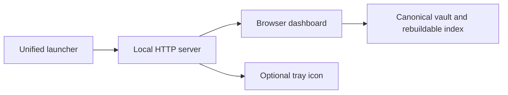

# Memory workspace

The dashboard runs on your computer. It does not need a model server, a cloud account,
Node.js or a separate frontend installation.

## Start once

From the repository folder:

~~~powershell
$memoryVault = Join-Path $env:USERPROFILE "Documents\Obsidian\AI-Memory"
.\start-memory-hub.ps1 -VaultPath $memoryVault
~~~

This opens the browser dashboard and, when supported by your desktop, its tray icon.
Keep the terminal open. Quit through the tray menu or press Ctrl+C in the terminal.
Launching again with the same vault and port reopens the running application.
A port occupied by another vault or application produces an error; it is never killed.

Both older script names, start-dashboard.ps1 and start-tray.ps1, forward to this launcher.
You do not need to run both.

For a desktop without a working tray:

~~~powershell
.\start-memory-hub.ps1 -VaultPath $memoryVault -NoTray
~~~

The portable Python entry point is:

~~~sh
ai-memory-app --vault "/path/to/vault" --no-tray
~~~

Windows setup installs the Python dependencies and bundled interface assets. Linux/macOS
may have additional native tray requirements; browser-only mode avoids the tray.
Those operating systems have not been exercised in this change.

## Read memories

The left navigation chooses Library, Review & history, Conflicts or Vault health.
The middle pane searches the entire indexed library and filters by memory type or
user-added tag. Select a result to open its full content on the right.

Sessions retain their original sections and line breaks. Writer, date, classification,
file path and memory ID remain visible. **View original Markdown** shows the exact
stored record or session block. Search previews are deliberately short; the reading
pane is not truncated. A missing source record produces an error, not invented content.

Use **Refresh data** after another tool changes the indexed library. A file changed
outside AI Memory Hub may need reindexing before its new records enter the library.

## Choose a color mode

Two header toggles provide four combinations:

| Dark mode | Colorblind | Appearance |
| --- | --- | --- |
| Off | Off | Standard light |
| On | Off | Standard dark |
| Off | On | Colorblind light |
| On | On | Colorblind dark |

The first visit follows the operating system's light/dark preference. Later visits
remember your explicit choice in this browser. This browser preference is not a memory
and does not move between AI clients.

Muted backgrounds avoid large areas of pure white or black. Automated palette checks
cover text at 4.5:1 and principal control boundaries at 3:1. Labels accompany statuses;
selected items have an inset marker and border. Colorblind modes use blue/neutral
accents and amber warning text rather than relying on red/green distinctions.
These checks are not a full accessibility certification or a medical claim about eye strain.

## Edit tags and connections

Choose **Edit tags & links** on a memory.

1. Type a tag to find an existing suggestion or add a new tag.
2. Search for a memory by subject, content or ID, then select it.
3. Remove an unwanted selection with its × button.
4. Choose **Save changes**.

Links point to stable memory IDs. **Linked from** shows reverse connections automatically.
Existing source tags are labeled **source**, and source wiki-links appear separately.
The organization editor does not rewrite those source elements or change a memory's
classification, such as preference or superseded.

User-added organization is stored in **dashboard-metadata.md** in the vault. Back up
this file alongside your other Markdown. It survives a search-index rebuild. A stale
save is refused so another tab's newer tags or links are not overwritten. If a linked
record was removed, its link is shown as unavailable; nothing is silently merged.

**Edit text** remains available for ordinary one-line records. Session content itself
is read-only here; edit its canonical Markdown with appropriate care and reindex.
**Forget** asks for confirmation and deletes the record; it is not a reversible grouping action.

## Review and health

Review/history preserves structured session and pattern proposals. Approve or reject
pending proposals; other recorded statuses remain visible as history.
Conflicts lets you explicitly choose a current fact and supersede the other conflicting
records. Vault health compares files and index without changing records.

## Verification

The tracked [redesign plan](dashboard-redesign-plan.md) and
[issue #64](https://github.com/vib28/ai-memory-hub/issues/64) record implementation,
automated checks and any outstanding verification. A temporary demo vault is not your
real memory vault.
