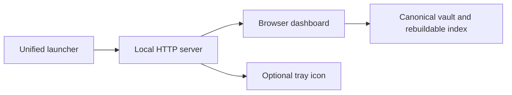

# Memory workspace dashboard

The dashboard is a local web application that reads your AI Memory Hub vault. It does not need a model server, a cloud account, Node.js, or a separate frontend install — just the repository and your vault.



---

## Start once

From the repository folder, run:

~~~powershell
$memoryVault = Join-Path $env:USERPROFILE "Documents\Obsidian\AI-Memory"
.\start-memory-hub.ps1 -VaultPath $memoryVault
~~~

This opens the browser dashboard and (when supported) the system tray icon. Keep the terminal open. Quit through the tray menu or press **Ctrl+C**.

Running the same command again with the same vault and port reopens the running application instead of starting a duplicate. If the port is occupied by another vault or app, an error is shown — the launcher never kills an unrelated process.

### Without a working tray

~~~powershell
.\start-memory-hub.ps1 -VaultPath $memoryVault -NoTray
~~~

### Portable entry point

~~~sh
ai-memory-app --vault "/path/to/vault" --no-tray
~~~

> **Note:** Older script names `start-dashboard.ps1` and `start-tray.ps1` still work and forward to the unified launcher. You only need one.

---

## Feature overview

The dashboard has five views in the left navigation rail:

| View | Purpose |
| --- | --- |
| **Library** | Search, filter, and read every memory in the vault |
| **Review & history** | Approve or reject queued session and pattern proposals |
| **Conflicts** | Resolve conflicting facts by choosing the current one |
| **Vault health** | Compare files and the search index without modifying records |
| **Settings** | Edit any vault configuration value |

---

## Library view

The Library is the main workspace. It has three regions:

```
┌──────────────────┬───────────────────────┬────────────────────┐
│ Filters & search │ Memory list           │ Reader             │
│                  │                       │                    │
│ [Search…]        │ ▾ card                │ ## Memory title    │
│ Kind: [All ▾]    │   kind · date         │ writer · date      │
│ Tag: [All ▾]    │   preview text…       │                    │
│ Date controls    │   writer · tag        │ Full memory text   │
│                  │                       │ in readable layout │
│                  │ ▾ card                │                    │
│                  │ …                     │ Tags · Links       │
│                  │                       │ Source Markdown    │
└──────────────────┴───────────────────────┴────────────────────┘
```

### Search and filters

- **Find a memory** — searches subjects, content, writers, paths, and tags.
- **Memory type** — filter by kind (profile, preference, project, person, topic, decision, session).
- **Tag** — filter by any user-added tag.
- **Date filter** — choose a single day or a date range. Stored timestamps are compared by their `YYYY-MM-DD` date portion.

Use **Refresh data** after another tool changes the indexed library. A file changed outside the dashboard may need reindexing first.

### Reading a memory

Select a card to open its full content in the reader pane:

- Writer, date, classification, file path, and memory ID are always visible.
- Session memories show their original headings and line breaks — not a flattened summary.
- **View original Markdown** shows the exact stored record.

---

## Color modes

Two header toggles provide four palette combinations:

| Dark mode | Colorblind | Appearance |
| --- | --- | --- |
| Off | Off | Standard light |
| On | Off | Standard dark |
| Off | On | Colorblind light |
| On | On | Colorblind dark |

The first visit follows the operating system's light/dark preference. Later visits remember your explicit choice in this browser. This browser preference is **not** a memory and does not move between AI clients.

Colorblind modes shift the accent from teal to blue and replace red danger text with amber, so meaning never depends on red/green discrimination. All palettes are checked to WCAG standards:

- Body text contrast: **≥ 4.5:1**
- Control boundary contrast: **≥ 3:1**

Status meaning is always shown as text labels, never by color alone.

---

## Tags and links

Choose **Edit tags & links** on any memory to open the organization editor.

```
┌──────────────────────────────────────────────────────┐
│ Organize this memory                                 │
│                                                      │
│ Find or create a tag                                 │
│ [type to filter or create]                           │
│  • #existing-tag · Select existing tag               │
│  • + Create tag #new-tag                             │
│                                                      │
│ Selected tags                                        │
│  [#tag1 ×]  [#tag2 ×]                                │
│                                                      │
│ Find a memory to link                                │
│ [type to search by subject, text, or ID]             │
│  ▾ linked memory card                                │
│  ▾ linked memory card                                │
│                                                      │
│ Selected links                                       │
│  [↗ subject · kind ×]  [↗ subject · kind ×]          │
│                                                      │
│                              [Cancel]  [Save changes]│
└──────────────────────────────────────────────────────┘
```

### How it works

1. **Find or create a tag** — type to filter existing tags or enter a new name (letters, numbers, underscores, hyphens; up to 64 characters).
2. **Find a memory to link** — search by subject, content, or ID, then select it.
3. Remove any selection with its **×** button.
4. Choose **Save changes**.

### What is saved and what is not

- **User-added** tags and links are stored in `dashboard-metadata.md` inside the vault.
- **Source tags** and **wiki-links** found in the original Markdown remain visible separately and are never rewritten.
- **Linked from** shows reverse connections automatically — no need to edit both sides.
- Links point to stable memory IDs. If a linked record was removed, its link is shown as unavailable; nothing is silently merged.
- A stale save is rejected so another tab's newer tags or links are not overwritten.

> **Edit text** is still available for ordinary one-line records. Session content itself is read-only in the dashboard — edit its canonical Markdown directly and reindex.

> **Forget** asks for confirmation and deletes the record. It is not a reversible grouping action.

---

## Review and health

**Review & history** preserves structured session and pattern proposals:

- **Approve** or **reject** pending proposals.
- Other recorded statuses remain visible as history.

**Conflicts** lets you explicitly choose a current fact and supersede the other conflicting records.

**Vault health** compares files and the search index without changing records — useful after manual edits or external tool changes.

---

## Settings

Choose **Settings** in the left rail to change any value documented in [Configuration](CONFIGURATION.md). Each field shows a small label naming where its current value comes from:

| Label | Meaning |
| --- | --- |
| `DEFAULT` | Nothing has set this yet; the built-in default is in effect. |
| `ENV` | An environment variable is currently supplying this value. |
| `FILE` | This vault's `config.json` is currently supplying this value. |

**Save changed settings** writes only the fields you actually edited to `<vault>/.ai-memory-hub/config.json`. An unrelated field showing `ENV` is never swept into the file just because you saved something else on the same page.

A saved change takes effect the next time the affected process starts — restart the worker, dashboard, exporter, or reconnect the client.

---

## Verification

The tracked [redesign plan](dashboard-redesign-plan.md) and [issue #64](https://github.com/vib28/ai-memory-hub/issues/64) record implementation details, automated checks, and any outstanding verification. A temporary demo vault is not your real memory vault.
