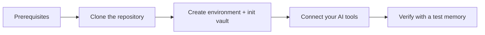

# Installation

Get AI Memory Hub up and running in five steps: **prerequisites → get the source → create the environment → connect your AI tools → verify**.

[Documentation](README.md) · [Client connections](CLIENTS.md) · [Troubleshooting](TROUBLESHOOTING.md)



---

## Before you start

| Requirement | Minimum | Notes |
| --- | --- | --- |
| **Python** | 3.10+ | Required |
| **Git** | Any recent version | Required |
| **uv** (recommended) | Latest | Faster installs, automatic lockfile. See [uv install](https://docs.astral.sh/uv/getting-started/installation/) |
| **pip** | Any | Alternative if you can't use uv |
| **Obsidian** | Optional | Can open your vault, but not required |

> [!TIP]
> Don't have Python? On Windows, install it with:
> ```powershell
> winget install Python.Python.3.12
> ```
> Then restart your terminal.

> [!IMPORTANT]
> Your vault lives **outside** the repository. Pick a dedicated folder — for example `C:\Users\YOU\Documents\Obsidian\AI-Memory` on Windows or `~/Documents/Obsidian/AI-Memory` on Linux/macOS. Keep it separate from any Git worktree.

---

## Step 1: Clone the repository

```powershell
git clone --branch enhancements/auto-context-pipeline https://github.com/vib28/ai-memory-hub.git
cd ai-memory-hub
```

> [!NOTE]
> This guide covers the `enhancements/auto-context-pipeline` branch. The default `master` branch may not include the same features. If you already have a checkout, check your branch with `git branch --show-current` before proceeding.

---

## Step 2: Create the environment and vault

### Option A: Using uv (recommended)

```powershell
$memoryVault = Join-Path $env:USERPROFILE "Documents\Obsidian\AI-Memory"
.\setup.ps1 -VaultPath $memoryVault
```

This runs `uv sync`, creates a `.venv`, and initializes your vault. Done.

### Option B: Using pip

If you can't use uv, set up the environment manually:

**Windows PowerShell:**

```powershell
$memoryVault = Join-Path $env:USERPROFILE "Documents\Obsidian\AI-Memory"

# Create virtual environment
python -m venv .venv
.\.venv\Scripts\Activate.ps1

# Install dependencies
pip install -e .

# Initialize the vault
python -m memory_hub.cli --vault $memoryVault init
```

**Linux / macOS:**

```bash
export memoryVault="$HOME/Documents/Obsidian/AI-Memory"

# Create virtual environment
python3 -m venv .venv
source .venv/bin/activate

# Install dependencies
pip install -e .

# Initialize the vault
python -m memory_hub.cli --vault "$memoryVault" init
```

### What just happened

| Action | Result |
| --- | --- |
| `uv sync` or `pip install` | Installed `mcp`, `pystray`, and `Pillow` into `.venv` |
| `init` | Created vault template files (instructions, patterns, placeholders) at your vault path |

> [!IMPORTANT]
> The setup script does **not** overwrite existing vault instructions, install dev-test dependencies, or start a background checkpoint worker. It's safe to re-run.

---

## Step 3: Connect your AI tools

The connection helper auto-detects installed AI CLIs and registers the MCP server for each one:

| Tool | Detection | Scope |
| --- | --- | --- |
| Claude Code | ✓ | Global MCP + CLAUDE.md instructions |
| Codex CLI | ✓ | Global MCP + AGENTS.md instructions |
| Gemini CLI | ✓ | Global MCP + GEMINI.md instructions |
| Qwen Code | ✓ | Global MCP + QWEN.md instructions |
| Kimi Code | ✓ | Global MCP + KIMI.md instructions |
| Hermes Agent | ✓ | Global MCP + SKILL.md |

> [!NOTE]
> ChatGPT desktop requires a separate tunnel. See [Client connections](CLIENTS.md) for the ChatGPT setup.

### Run the connection helper

```powershell
.\connect-ai-tools.ps1 -VaultPath $memoryVault -WriteMode review
```

The default `review` mode queues AI-proposed memories in the dashboard for your approval. Switch to `auto` only after you're comfortable with the review queue.

> [!TIP]
> A failure connecting one tool never blocks the others. Each is attempted independently. Skipped or failed clients are reported in the summary.

---

## Step 4: Open the dashboard

```powershell
.\start-memory-hub.ps1 -VaultPath $memoryVault
```

Your browser opens at [localhost:8765](http://127.0.0.1:8765).

| Want to... | Do this |
| --- | --- |
| Change the port | Set `$env:MEMORY_DASHBOARD_PORT=8080` before starting |
| Run without the system tray | Add `-NoTray` |

> [!NOTE]
> Keep the terminal open while using the dashboard. The tray is a launcher, not the background checkpoint worker.

---

## Step 5: Verify everything works

### 5.1 Run the vault audit

```powershell
.\.venv\Scripts\python.exe -m memory_hub.cli --vault $memoryVault audit
```

Read the findings — a zero exit code doesn't prove every integration works, but the audit confirms your vault is structurally sound.

### 5.2 Test with a harmless memory

1. Start a **fresh** session in any connected AI tool.
2. Tell it something simple like:
   ```
   For future coding questions, I prefer Python examples before JavaScript.
   ```
3. Open the dashboard → **Review Queue**. You should see the proposed memory waiting for approval.
4. Approve it.
5. Start another fresh AI conversation and ask which language it should use first.
6. If it retrieves "Python", **the loop works**.

### 5.3 Check the client sees the tools

In any connected client, verify that:
- AI Memory Hub's MCP tools are available
- `memory_policy` reports `review` mode

---

## Optional: add session continuity

Once shared memory works, you can layer on automatic session continuity. Each capability is **independent** — install only what you want:

```powershell
# Capture lifecycle events from connected clients
.\connect-ai-tools.ps1 -VaultPath $memoryVault -InstallHooks

# Turn captured evidence into checkpoint proposals (background worker)
.\connect-ai-tools.ps1 -VaultPath $memoryVault -EnableSessionAuto

# Inject a bounded local checkpoint at each supported client's SessionStart
.\connect-ai-tools.ps1 -VaultPath $memoryVault -InstallHandoff

# Approve GitHub export (optional, private repo recommended)
.\connect-ai-tools.ps1 -VaultPath $memoryVault -EnableGitHubExport `
  -GitHubRepo "owner/repository" -GitHubVisibility private
```

See [Client connections](CLIENTS.md) and [Configuration](CONFIGURATION.md) before enabling `auto` write mode or a remote model endpoint.

---

## Updating

1. Back up accepted Markdown plus pending review/capture databases.
2. Stop processes using the environment.
3. Inspect `git status` for local changes.
4. Update your branch: `git pull`.
5. Re-run setup: `.\setup.ps1 -VaultPath $memoryVault`.
6. Refresh connections: `.\connect-ai-tools.ps1 -VaultPath $memoryVault`.

---

## Uninstalling

To disconnect a client, remove the named MCP registration through the host's settings, then remove only AI Memory Hub's managed instruction block or Hermes skill. Hook removal is separate — see [Client connections](CLIENTS.md#capture-hooks-and-startup-handoff).

> [!WARNING]
> Do **not** delete the vault to uninstall. The vault is your data — removing it deletes your memories.

---

## Need help?

- [Troubleshooting](TROUBLESHOOTING.md) — common errors and fixes
- [Client connections](CLIENTS.md) — per-tool manual configuration
- [Configuration](CONFIGURATION.md) — environment variables and tuning
- [Dashboard guide](DASHBOARD.md) — full reader, color modes, editing links/tags
