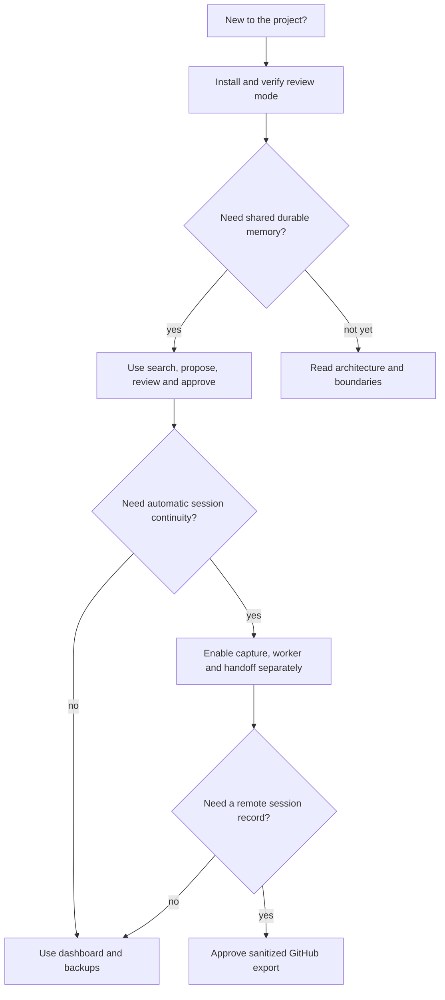
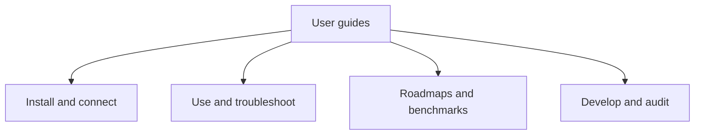

# Documentation

Use the [dashboard guide](DASHBOARD.md) for the unified launcher, full memory reader,
four color modes and editable tag/link lookups.

Start with [AI Memory Hub](../README.md) for what the project does and what is still planned.

## Choose your path

The recommended learning order is deliberately conservative: prove one harmless review
proposal first, then enable only the capability you understand. A connected MCP client
can use shared memory without capture; capture can run without startup handoff; local
handoff can run without GitHub; and GitHub is never required for local continuity.

## Capability status at a glance

| Capability | Status on this branch | Read next |
| --- | --- | --- |
| Shared MCP memory and Markdown vault | Available | [Installation](INSTALLATION.md), [Usage](USAGE.md) |
| Review queue and dashboard | Available | [Dashboard](DASHBOARD.md) |
| Optional embeddings and local chat model | Available when configured | [Configuration](CONFIGURATION.md) |
| Lifecycle capture and supervised worker | Available behind explicit setup | [Clients](CLIENTS.md), [Usage](USAGE.md) |
| Claude/Codex model-free startup handoff | Available behind explicit setup; supported fixtures only | [Clients](CLIENTS.md), [Continuity](automatic-session-continuity.md) |
| Sanitized GitHub session outbox | Available behind explicit destination approval | [Configuration](CONFIGURATION.md) |
| Live cross-tool token/cost certification | Not complete | [Benchmark protocol](session-handoff-benchmark.md), [#62](https://github.com/vib28/ai-memory-hub/issues/62) |

## Concepts used throughout the guides

- **Vault:** the ordinary Markdown directory containing accepted memory.
- **Writer:** provenance such as `claude` or `codex`; it is not an access-control list.
- **Review mode:** proposals wait for dashboard approval. It does not govern every
  administrative CLI write.
- **Auto mode:** validated proposals can be accepted without dashboard approval.
- **Capture:** bounded lifecycle evidence stored in a local queue before summarization.
- **Checkpoint:** an accepted or pending periodic session state; it may be provisional.
- **Final:** an explicit host-session end result, not merely an idle timeout.
- **Handoff:** bounded local checkpoint context injected at supported startup events.
- **Outbox:** retryable GitHub delivery state; it is separate from accepted Markdown.

If a guide uses one of these terms differently, treat that as a documentation bug and
check the configuration reference before changing a live vault.

## Install and operate

| Guide | Purpose |
| --- | --- |
| [Installation](INSTALLATION.md) | Set up the environment and vault |
| [Client connections](CLIENTS.md) | Connect an AI tool and verify its configuration |
| [Configuration](CONFIGURATION.md) | Environment variables, write modes and optional models |
| [Usage](USAGE.md) | Review, search, sessions, imports, identity and undo |
| [Troubleshooting](TROUBLESHOOTING.md) | Diagnose common failures without losing data |
| [FAQ](FAQ.md) | Short answers to common questions |

## Understand and contribute

- [Architecture](../ARCHITECTURE.md): module map, storage and boundaries.
- [Contributing](../CONTRIBUTING.md): development checks and issue workflow.
- [Quick start](../QUICK_START.md): short Windows entry point.
- [Setup guide](../INSTALLATION_GUIDE.md): guided route through the installation references.

## Plans and historical records

These retain their existing structured tracking format:

- [Implementation roadmap](local-memory-plan.md).
- [Automatic session continuity](automatic-session-continuity.md).
- [Open issue priority order](issue-priority-order.md): the canonical execution sequence
  for the current open issues.
- [Two-tool handoff benchmark](session-handoff-benchmark.md).
- [Latest no-paid-call replay report](benchmark-results/handoff-replay-v1.md): synthetic
  protocol evidence, not live provider billing or task certification.
- [Vault documentation standards](vault-documentation-standards.md).

[FIXLOG](../FIXLOG.md) and [release notes](../RELEASE_NOTES_v0.2.md) record historical work.

## Writing conventions

User guides use descriptive headings, relative repository links, language-tagged code
blocks and alerts for meaningful cautions. Commands and expected output stay separate.
Use a table for repeated comparisons, not as a replacement for every paragraph.

Follow [GitHub's writing and formatting guidance](https://docs.github.com/en/get-started/writing-on-github/getting-started-with-writing-and-formatting-on-github).
Do not change issue/roadmap templates, client prompts or vault-record formats merely
to restyle a user guide. A formatting pass is not permission to change runtime behavior.
