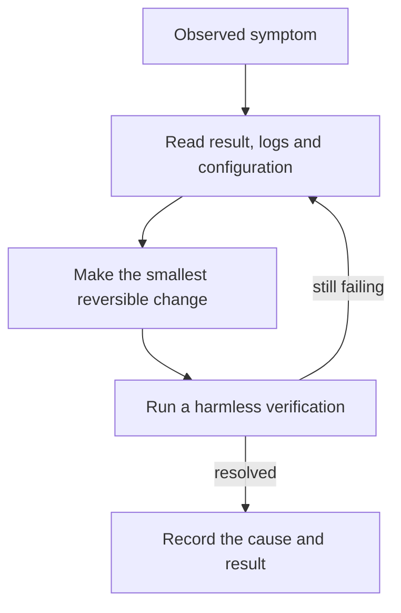

# Troubleshooting

Start with the symptom and preserve evidence before changing configuration or data.

[Installation](INSTALLATION.md) · [Client connections](CLIENTS.md) · [Configuration](CONFIGURATION.md)

## Setup cannot find uv or Python

Open a fresh terminal after installing prerequisites. Confirm uv and Python are available
before running setup. Use the repository's virtual-environment Python for later commands;
a system Python may not have this package installed.

## Environment files are locked

Close processes using the environment before updating dependencies. A running MCP
server, dashboard, editor or sync service can hold files open. Do not delete the
environment or vault as the first response to an access-denied error.

## MCP tools are missing

Check the connection summary, actual registered Python path, vault, writer and mode.
Start a fresh client session or use its supported reload. Check workspace trust through
the host's normal controls.

An already-existing registration may retain old settings. Do not assume that rerunning
the helper replaced every environment value.

## A memory does not appear in the vault

Look at the application-level result:

| Result or symptom | Check |
| --- | --- |
| queued | Review queue; content is not accepted yet |
| possible_update | Existing candidate and replacement intent; no automatic write |
| duplicate | Existing exact or same-project matched record; distinct project sessions are scoped separately |
| rejected | Validation reason, length and probable-secret checks |
| stored_without_project_link | Session file exists, but project cross-link needs attention |
| Nothing was proposed | Client instructions and whether the fact qualifies as durable |

Read the active memory_policy. A successful tool transport response alone is not
proof of storage.

## Dashboard does not open

Launch it in the foreground to see the error:

~~~powershell
$memoryVault = Join-Path $env:USERPROFILE "Documents\Obsidian\AI-Memory"
.\start-memory-hub.ps1 -VaultPath $memoryVault
~~~

Check the vault path and whether another process already uses port 8765 (the default;
`MEMORY_DASHBOARD_PORT` overrides it consistently across `app.py`, `dashboard.py` and
every `start-*.ps1` launcher — see [Configuration](CONFIGURATION.md)).
For a one-off different local port:

~~~powershell
.\.venv\Scripts\python.exe -m memory_hub.dashboard --vault $memoryVault --port 8766
~~~

Keep the default loopback binding; changing the port is not permission to expose the
dashboard publicly. `MEMORY_DASHBOARD_HOST` only accepts `127.0.0.1` or `localhost`.

## Database will not open

The message "file is not a database" can occur when a text file is written over SQLite.
Do not create fake index content inside a real vault to test ignore behavior.

1. Stop processes using the affected database.
2. Back up the database and any WAL/SHM files as a consistent set.
3. Determine whether pending review proposals or unprocessed capture evidence need recovery.
4. Only after accepting that risk, move the exact damaged search database aside and
   rebuild accepted-memory rows from Markdown.

> [!WARNING]
> Deleting .memory_index.sqlite3 can lose pending proposals. Deleting the capture
> database can lose unsummarized work. Reindex does not restore either from Markdown.

The normal reindex command helps stale indexes, but may not start if database
initialization itself fails. There is no automatic corrupt-database recovery command.

## Hooks appear installed but no useful session is saved

Capture hooks map native event/tool fields, preserve managed-hook siblings and buffer
through a bounded leased queue. Capture alone does not summarize anything: the worker
must also be enabled, and review mode intentionally leaves its checkpoint proposal in
the dashboard until approved.

Check these in order:

1. Confirm the client is writing to the expected `MEMORY_CAPTURE_DB`.
2. Inspect worker health and pending rows; a lease in progress is not an accepted
   Markdown session.
3. Run one bounded pass with `memory_hub.worker --once`.
4. Check `MEMORY_WRITE_MODE`: `review` queues a proposal, while `auto` can accept it.
5. Read the resulting `/sessions/...` Markdown and its manifest before installing
   startup handoff.

Do not repeatedly reinstall hooks into personal settings. CLI help or valid JSON alone
does not certify event delivery; the tested client/version matrix is in
[client connections](CLIENTS.md).

## Full transcript is missing or incomplete

The full transcript is a separate default-off feature. Confirm that
`MEMORY_TRANSCRIPT_ENABLED=true`, `AI_MEMORY_VAULT` and (if overridden)
`MEMORY_TRANSCRIPT_DB` were present before the hook receiver and worker started;
restart both processes after changing them. Inspect the worker health record for
`transcript_rendered`, `transcript_deleted` and any transcript error. The SQLite
event store is under the vault's `.ai-memory-hub` directory by default, while the
readable object is under `/transcripts/`.

The hook intentionally keeps the host tool non-blocking. A transcript write error
therefore appears in the hook result while bounded observation capture may still be
accepted. Check the configured path permissions and SQLite file before retrying.
Raw transcript values are not subject to bounded observation redaction; if the
feature was enabled accidentally, stop/restart the hook process and use the session
forget path after reviewing local backups.

## Startup handoff is empty or ambiguous

The handoff reader uses only the local `/sessions/session-manifest.json` and referenced
Markdown. It does not call MCP, embeddings, a chat model or GitHub. An empty result
usually means there is no accepted checkpoint, the manifest is missing/invalid, or the
startup payload does not identify the correct project/worktree. An ambiguous result is
intentional: active groups are listed separately instead of being merged.

Confirm that the handoff permission is installed separately:

~~~powershell
.\connect-ai-tools.ps1 -VaultPath $memoryVault -InstallHandoff
~~~

Claude Code and Codex CLI are the only client surfaces with current process-level
startup fixtures. A successful hook command does not certify that an installed client
version actually delivered the event; retain the managed backup and inspect the host's
event logs/settings.

## GitHub export is queued or unhealthy

Export is intentionally opt-in and independent from local handoff. Check the approved
repository/visibility, `gh auth status`, the exporter health JSON and the SQLite outbox.
Offline or timeout failures remain retryable; disabling export stops the startup entry
but does not delete queued work. Pending review proposals are never exported. Do not
delete the outbox while diagnosing a delivery failure; it contains stable markers used
to reconcile retries without duplicate issues/comments.

## Tests cannot create a temporary directory

If pytest's existing temporary root is inaccessible, use a new task-specific base path.
Never point --basetemp at a vault, repository or directory containing data you need:
pytest manages that directory.

~~~powershell
$memoryTestBase = Join-Path $env:TEMP ("ai-memory-tests-" + [guid]::NewGuid().ToString("N"))
.\.venv\Scripts\python.exe -m pytest -q --basetemp $memoryTestBase
~~~

Record an environment setup error separately from a failing test assertion.

## Report a problem

Use synthetic examples, not credentials or real vault contents. Follow the
[issue workflow](../CONTRIBUTING.md#issue-workflow), including exact reproduction,
expected behavior and actual results.

If the tray cannot run on your desktop, use start-memory-hub.ps1 with -NoTray.
If the palette is difficult to read, try the Dark mode and Colorblind toggles in the header.
See the [dashboard guide](DASHBOARD.md).
