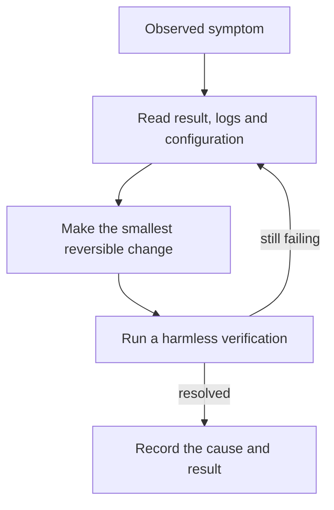

# Troubleshooting

Start with the symptom and preserve evidence before changing configuration or data.

[Installation](INSTALLATION.md) · [Client connections](CLIENTS.md) · [Configuration](CONFIGURATION.md)

## Setup cannot find uv or Python

Open a fresh terminal after installing prerequisites. Confirm uv and Python are available
before running setup. Use the repository's virtual-environment Python for later commands;
a system Python may not have this package installed.

## Environment files are locked

Close processes using the environment before updating dependencies. A running MCP
server, dashboard, editor or sync service can hold files open. Do not delete the
environment or vault as the first response to an access-denied error.

## MCP tools are missing

Check the connection summary, actual registered Python path, vault, writer and mode.
Start a fresh client session or use its supported reload. Check workspace trust through
the host's normal controls.

An already-existing registration may retain old settings. Do not assume that rerunning
the helper replaced every environment value.

## A memory does not appear in the vault

Look at the application-level result:

| Result or symptom | Check |
| --- | --- |
| queued | Review queue; content is not accepted yet |
| possible_update | Existing candidate and replacement intent; no automatic write |
| duplicate | Existing exact or same-project matched record; distinct project sessions are scoped separately |
| rejected | Validation reason, length and probable-secret checks |
| stored_without_project_link | Session file exists, but project cross-link needs attention |
| Nothing was proposed | Client instructions and whether the fact qualifies as durable |

Read the active memory_policy. A successful tool transport response alone is not
proof of storage.

## Dashboard does not open

Launch it in the foreground to see the error:

~~~powershell
$memoryVault = Join-Path $env:USERPROFILE "Documents\Obsidian\AI-Memory"
.\start-memory-hub.ps1 -VaultPath $memoryVault
~~~

Check the vault path and whether another process already uses port 8765.
For a different local port:

~~~powershell
.\.venv\Scripts\python.exe -m memory_hub.dashboard --vault $memoryVault --port 8766
~~~

Keep the default loopback binding; changing the port is not permission to expose the
dashboard publicly.

## Database will not open

The message "file is not a database" can occur when a text file is written over SQLite.
Do not create fake index content inside a real vault to test ignore behavior.

1. Stop processes using the affected database.
2. Back up the database and any WAL/SHM files as a consistent set.
3. Determine whether pending review proposals or unprocessed capture evidence need recovery.
4. Only after accepting that risk, move the exact damaged search database aside and
   rebuild accepted-memory rows from Markdown.

> [!WARNING]
> Deleting .memory_index.sqlite3 can lose pending proposals. Deleting the capture
> database can lose unsummarized work. Reindex does not restore either from Markdown.

The normal reindex command helps stale indexes, but may not start if database
initialization itself fails. There is no automatic corrupt-database recovery command.

## Hooks appear installed but no useful session is saved

Current hooks map native event/tool fields, preserve managed-hook siblings and buffer
through a bounded leased queue. There is still no supervised periodic consolidation
worker. If a session is not summarized, inspect the capture database and lease state;
do not repeatedly reinstall hooks into personal settings.

Use the [continuity plan](automatic-session-continuity.md) for worker and startup-handoff
gaps. CLI help or valid JSON alone does not certify event delivery.

## Tests cannot create a temporary directory

If pytest's existing temporary root is inaccessible, use a new task-specific base path.
Never point --basetemp at a vault, repository or directory containing data you need:
pytest manages that directory.

~~~powershell
$memoryTestBase = Join-Path $env:TEMP ("ai-memory-tests-" + [guid]::NewGuid().ToString("N"))
.\.venv\Scripts\python.exe -m pytest -q --basetemp $memoryTestBase
~~~

Record an environment setup error separately from a failing test assertion.

## Report a problem

Use synthetic examples, not credentials or real vault contents. Follow the
[issue workflow](../CONTRIBUTING.md#issue-workflow), including exact reproduction,
expected behavior and actual results.

If the tray cannot run on your desktop, use start-memory-hub.ps1 with -NoTray.
If the palette is difficult to read, try the Dark mode and Colorblind toggles in the header.
See the [dashboard guide](DASHBOARD.md).
