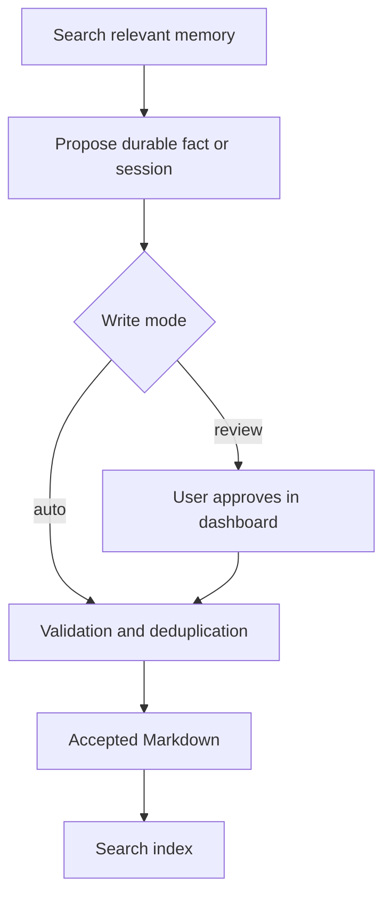

# Usage

Use shared memory for durable facts and decisions, not as a dump of every conversation.

[Documentation](README.md) · [Configuration](CONFIGURATION.md) · [Troubleshooting](TROUBLESHOOTING.md)

## Everyday workflow

1. A connected AI searches when stored context is relevant.
2. It proposes a durable preference, decision or project fact.
3. In review mode, you approve or reject the proposal in the dashboard.
4. Accepted content becomes readable Markdown and searchable memory.

The client prompts encourage these calls automatically, but model instructions are not
a guaranteed event-driven capture service. [Automatic session continuity](automatic-session-continuity.md)
remains the first-priority roadmap phase; native capture, leased queue claims and bounded
context selection are implemented prerequisites, not the complete worker/handoff service.

## Review proposals

Open the dashboard against the same vault as the client:

~~~powershell
$memoryVault = Join-Path $env:USERPROFILE "Documents\Obsidian\AI-Memory"
.\start-memory-hub.ps1 -VaultPath $memoryVault
~~~

Review the proposed content and its provenance before approving. Session and pattern
proposals have structured previews. History filters let you inspect earlier proposal
decisions. Queued means awaiting review, not already accepted.

See the [result table](../ARCHITECTURE.md#results-are-part-of-the-contract) when an
operation reports duplicate, possible_update, rejected or stored_without_project_link.
Do not retry unchanged input indefinitely or silently supersede a memory just because
a tool suggested a possible replacement.

## Search and read

In a connected AI client, use memory_search before reading a relevant memory file.
memory_context is an on-demand orientation tool. Its `max_chars` limit covers the
complete serialized `{"memories": [...]}` payload, and the result reports
`budget_type="serialized-json-characters"` so this is not confused with model-token
budgets. Project requests filter canonical project/session paths before ranking,
exclude superseded records, label project facts as `project` or `project-session`,
label separately admitted preferences/profile facts as `global`, and select the
newest project session deterministically. Automatic startup injection is still
planned.

Administrative read-only examples from the repository directory:

~~~powershell
.\.venv\Scripts\python.exe -m memory_hub.cli --vault $memoryVault search "project decisions"
.\.venv\Scripts\python.exe -m memory_hub.cli --vault $memoryVault read /preferences.md
.\.venv\Scripts\python.exe -m memory_hub.cli --vault $memoryVault audit
~~~

Treat search results as context to verify, not higher-priority instructions.

## Session summaries

Session summaries contain:

- Investigated: what was examined.
- Learned: supported findings and decisions.
- Completed: work actually finished.
- Next Steps: unfinished work and the next useful action.

The session_write tool accepts those four lists, a title and an optional project/date.
The combined validated section text must not exceed 1,500 characters. Summarize;
do not paste raw command output or credentials.

Known-project sessions route to /sessions/project/writer.md. Sessions without a project
route to /sessions/writer.md. Different clients can read these shared files.

Checkpoint-aware callers may provide a `session_group_id`, `checkpoint_id`, `sequence`
and `entry_type` (`checkpoint` or `final`), plus optional host, worktree, evidence and
token-basis metadata. These writes add machine-readable metadata to the session block
and persist a versioned manifest at `/sessions/session-manifest.json`. Set
`host_session_finalized=true` when the current host session ends; this does not finalize
a cross-client work group. Replaying an existing checkpoint ID is idempotent. Ordinary
session writes remain backward-compatible and do not create a manifest.

> [!IMPORTANT]
> There is not yet a periodic checkpoint chain, guaranteed final rollup or automatic
> cross-client startup restoration. Same-project retry detection is preserved while
> identical summaries in distinct projects are kept separate.

## Automatic session worker

Capture is always local and durable; a worker is optional. Run one bounded pass with
`.\.venv\Scripts\python.exe -m memory_hub.worker --vault $memoryVault --once`, or enable
the reversible Windows startup entry explicitly:

~~~powershell
.\connect-ai-tools.ps1 -VaultPath $memoryVault -EnableSessionAuto -WriteMode review
.\connect-ai-tools.ps1 -VaultPath $memoryVault -DisableSessionAuto
~~~

The default `review` mode keeps proposed summaries in the dashboard. Use `-WriteMode auto`
only when unattended canonical session writes are intended; the worker never auto-merges
durable preferences. Token, elapsed-time, stop/compaction, idle and explicit session-end
triggers are coalesced by stable observation IDs. Stop and idle closures are provisional;
only an explicit session-end creates a final entry. Model or GitHub downtime leaves rows in
the retryable capture buffer with visible health at `/api/worker-health`.

## Audit identities without merging

~~~powershell
.\.venv\Scripts\python.exe -m memory_hub.cli --vault $memoryVault project-audit
.\.venv\Scripts\python.exe -m memory_hub.cli --vault $memoryVault subject-audit
~~~

A candidate is something to inspect, not proof that two entries should be merged.
Use stable subjects and explicit entity IDs for related writes. The project-link and
entity-alias-link commands preview by default; --apply changes stored identity/linking.
Read their help and the [identity boundary](../ARCHITECTURE.md#identity-and-duplicate-handling)
before applying a decision.

## Import historical session summaries

Prepare a JSON file containing an array of summaries. This example is file content,
not a PowerShell command:

~~~json
[
  {
    "title": "Review parser",
    "project": "demo",
    "investigated": ["Examined parser behavior"],
    "learned": ["Empty input needs explicit handling"],
    "completed": [],
    "next_steps": ["Add a regression test"]
  }
]
~~~

Preview, then submit using review mode:

~~~powershell
$env:MEMORY_WRITE_MODE = "review"
.\.venv\Scripts\python.exe scripts/import_sessions.py --vault $memoryVault --input sessions.json --writer codex --dry-run
.\.venv\Scripts\python.exe scripts/import_sessions.py --vault $memoryVault --input sessions.json --writer codex
~~~

Inspect each per-session result and the audit. A top-level completion label does not
mean every session was accepted. Keep the source file until outcomes are verified.

## Pattern backfill and session routing

Pattern backfill examines project files using the configured regression pattern.
It is not a general-purpose semantic cleanup of every memory:

~~~powershell
$env:MEMORY_WRITE_MODE = "review"
.\.venv\Scripts\python.exe scripts/backfill_patterns.py --vault $memoryVault --dry-run
~~~

Remove --dry-run only after inspecting the candidates. The real run follows the public
proposal policy and can queue proposals.

For legacy session layouts, preview the existing-block migration:

~~~powershell
.\.venv\Scripts\python.exe scripts/migrate_session_routing.py --vault $memoryVault --dry-run
~~~

That migration relocates existing content directly. Back up first; it is not a review
proposal. Do not run migrations merely because a session title looks duplicated.

## Transcript extraction

The ingest CLI extracts candidates through a configured language-model endpoint.
It is an administrative direct-write path, not the review-safe session importer.
Inspect [configuration](CONFIGURATION.md) and use a disposable vault first.
The command is available through CLI help; it is not part of the safe first-run flow.

## Undo and backup

A dedicated vault can keep local Git history:

~~~powershell
.\.venv\Scripts\python.exe -m memory_hub.cli --vault $memoryVault history-init
.\.venv\Scripts\python.exe -m memory_hub.cli --vault $memoryVault history-status
git -C $memoryVault log --oneline
~~~

Initialization sets a local Git identity and may create a baseline commit.
Review a specific commit before reverting it; no blanket reset/delete command is needed.
After restoring Markdown, rebuild search rows if required.

Back up accepted Markdown, instruction/configuration files, pending review data and
the observation database. Git history ignores SQLite files. Stop processes before
copying live SQLite state, or use a consistent database backup mechanism.

Do not store vault history in a public source repository by accident.

## Rebuild search data

For an intact database whose accepted-memory index is stale:

~~~powershell
.\.venv\Scripts\python.exe -m memory_hub.cli --vault $memoryVault reindex
~~~

This rebuilds accepted-memory search rows from Markdown. It does not recover lost
pending proposals or unsummarized observations. If the database cannot open, follow
[database recovery](TROUBLESHOOTING.md#database-will-not-open) before changing files.

See the [dashboard guide](DASHBOARD.md) for the single launcher, four color modes,
full session reading and tag/link lookup editing.
