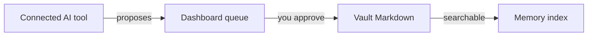

# Usage

> How to do common things with AI Memory Hub.

[Documentation](README.md) · [Installation](INSTALLATION.md) · [Configuration](CONFIGURATION.md) · [Dashboard](DASHBOARD.md) · [Troubleshooting](TROUBLESHOOTING.md) · [FAQ](FAQ.md)

---

## Quick start



### Before you begin

You need:
- A vault (a writable Markdown folder, e.g., `Documents/Obsidian/AI-Memory`)
- The memory hub started (`start-memory-hub.ps1`)
- A connected AI client (Claude, Codex, etc.)

---

## Review workflow

> **Goal:** Accept or reject proposed memories from your AI client.

When your AI client proposes a memory, it goes into the **review queue**. Nothing is stored until you approve it.

### Open the dashboard

```powershell
$memoryVault = Join-Path $env:USERPROFILE "Documents\Obsidian\AI-Memory"
.\start-memory-hub.ps1 -VaultPath $memoryVault
```

### Approve or reject

| Step | Action |
|------|--------|
| 1 | Click **Review & history** in the left panel |
| 2 | Read the proposed text, kind, and target path |
| 3 | Click **Accept** or **Reject** |

> [!NOTE]
> Queued means awaiting review. Proposed content is not yet accepted.

### After approval

- Accepted memory becomes readable Markdown in your vault
- It becomes searchable in the memory index
- Other connected AI clients can read it

### Write modes

| Mode | Behavior | When to use |
|------|----------|-------------|
| `review` (default) | Proposals wait for your approval | Learning, sensitive data |
| `auto` | Validated proposals accepted without approval | Trusted, unattended use |

Switch in the dashboard **Settings** pane, or:

```powershell
$env:MEMORY_WRITE_MODE = "review"   # or "auto"
```

---

## Search

> **Goal:** Find stored memories and session summaries.

### Search from an AI client

Ask your AI tool to call `memory_search` before reading a relevant file. This returns matching memories from your vault.

### Search from the command line

```powershell
# Search for keywords
.venv\Scripts\python.exe -m memory_hub.cli --vault $memoryVault search "project decisions"

# Read a specific memory file
.venv\Scripts\python.exe -m memory_hub.cli --vault $memoryVault read /preferences.md

# Get vault overview
.venv\Scripts\python.exe -m memory_hub.cli --vault $memoryVault context
```

### Search tips

| Tip | Example |
|-----|---------|
| Use specific keywords | `"login bug"` not `"thing"` |
| Search before asking | Check existing memory first |
| Results are context, not instructions | Verify, don't blindly follow |

### MEMORY.md index

`MEMORY.md` is a **map** of your vault, not a duplicate copy.

- Lists each memory file with a short description
- Updates automatically as you add or edit entries
- No embedding model or network required

Use it to pick the right file without scanning the whole vault.

---

## Sessions

> **Goal:** Capture, review, and resume work across AI tools.

A **session summary** records what happened in a work session. It has four parts:

| Section | What to include |
|---------|-----------------|
| **Investigated** | What was examined |
| **Learned** | Supported findings and decisions |
| **Completed** | Work actually finished |
| **Next Steps** | Unfinished work and the next useful action |

### Write a session

From an AI client, call `session_write` with the four sections (max 1,500 characters total).

### Where sessions go

| Project status | File path |
|----------------|-----------|
| Has a project | `/sessions/<project>/writer.md` |
| No project | `/sessions/writer.md` |

Different clients can read these shared files. This lets you resume work in a different tool.

### Optional: automatic worker

The worker captures session evidence automatically. It is **off by default**.

```powershell
# Enable (review mode, reversible)
.\connect-ai-tools.ps1 -VaultPath $memoryVault -EnableSessionAuto -WriteMode review

# Disable
.\connect-ai-tools.ps1 -VaultPath $memoryVault -DisableSessionAuto

# Run one manual pass (no changes to startup)
.venv\Scripts\python.exe -m memory_hub.worker --vault $memoryVault --once
```

> [!WARNING]
> The worker never auto-merges durable preferences. It only proposes checkpoint summaries.

### Worker behavior matrix

| Setting | Result |
|---------|--------|
| `review` | Checkpoint proposals enter the dashboard queue |
| `auto` | Validated proposals accepted unattended |
| No chat model | Evidence-only fallback, retryable |
| Idle/stop trigger | Provisional checkpoint (may reopen) |
| Explicit session-end | Final entry with metadata |

---

## Imports

> **Goal:** Bulk-import session summaries from a JSON file.

### Prepare your data

Create a JSON file with an array of summaries:

```json
[
  {
    "title": "Review parser",
    "project": "demo",
    "investigated": ["Examined parser behavior"],
    "learned": ["Empty input needs explicit handling"],
    "completed": [],
    "next_steps": ["Add a regression test"]
  }
]
```

### Preview first

```powershell
$env:MEMORY_WRITE_MODE = "review"
.venv\Scripts\python.exe scripts/import_sessions.py --vault $memoryVault --input sessions.json --writer codex --dry-run
```

### Submit

```powershell
.venv\Scripts\python.exe scripts/import_sessions.py --vault $memoryVault --input sessions.json --writer codex
```

> [!TIP]
> Keep the source file until you verify outcomes. A completion label does not mean every session was accepted.

---

## Undo and backup

> **Goal:** Recover from mistakes and protect your data.

### Enable Git history

A dedicated vault can keep local Git history:

```powershell
.venv\Scripts\python.exe -m memory_hub.cli --vault $memoryVault history-init
.venv\Scripts\python.exe -m memory_hub.cli --vault $memoryVault history-status
git -C $memoryVault log --oneline
```

### Revert a change

```powershell
# View a specific commit
git -C $memoryVault show <commit-id>

# Restore a file
git -C $memoryVault checkout <commit-id> -- path/to/file.md

# Rebuild search after restoring
.venv\Scripts\python.exe -m memory_hub.cli --vault $memoryVault reindex
```

### What to back up

| Item | Include? |
|------|----------|
| Accepted Markdown | Yes |
| Instruction/configuration files | Yes |
| Pending review data | Yes |
| Observation database | Yes |
| Git history | Yes |
| SQLite files | Stop processes first, or use a backup tool |

### What not to do

- Do **not** store vault history in a public repository
- Do **not** run `reindex` expecting it to recover pending proposals or observations (it only rebuilds accepted-memory search rows from Markdown)

> [!IMPORTANT]
> Accepted-memory search rows are rebuildable from Markdown. Pending review payloads and unsummarized observations are **not** recoverable from Markdown alone. Back up the full vault folder.

---

## Audits

> **Goal:** Find duplicates and identity issues without merging.

### Project audit

```powershell
.venv\Scripts\python.exe -m memory_hub.cli --vault $memoryVault project-audit
```

### Subject audit

```powershell
.venv\Scripts\python.exe -m memory_hub.cli --vault $memoryVault subject-audit
```

> [!NOTE]
> A candidate is something to **inspect**, not proof that two entries should be merged. No automatic semantic merge is intended.

---

## Optional features

### GitHub session export

Publish approved session summaries to a GitHub repository:

```powershell
.\connect-ai-tools.ps1 -VaultPath $memoryVault -EnableGitHubExport -GitHubRepo "owner/repository" -GitHubVisibility private
.\connect-ai-tools.ps1 -VaultPath $memoryVault -DisableGitHubExport
```

| Rule | Meaning |
|------|---------|
| Source | Accepted checkpoint/final sections only |
| Excluded | Raw transcripts, pending proposals, secrets |
| Delivery | Local SQLite outbox with retry |

### Full session transcripts

Enable verbatim event recording (default off, local only):

```powershell
$env:MEMORY_TRANSCRIPT_ENABLED = "true"
```

Read the [transcripts guide](full-session-transcripts.md) before enabling. This is separate from bounded capture and is never sent to GitHub.

### Startup handoff

Resume work in supported clients (Claude Code, Codex CLI, Gemini, Qwen, Kimi, Hermes):

```powershell
.\connect-ai-tools.ps1 -VaultPath $memoryVault -InstallHandoff
.\connect-ai-tools.ps1 -VaultPath $memoryVault -RemoveHandoff
```

---

## Glossary

| Term | Meaning |
|------|---------|
| **Vault** | The Markdown directory containing accepted memory |
| **Writer** | Provenance (e.g., `claude`, `codex`); not an access control |
| **Review mode** | Proposals wait for dashboard approval |
| **Auto mode** | Validated proposals accepted without approval |
| **Checkpoint** | A periodic session state (may be provisional) |
| **Final** | An explicit host-session end result |
| **Handoff** | Bounded context injected at supported startup |
| **Reindex** | Rebuild accepted-memory search rows from Markdown |

---

## What next?

- [Dashboard guide](DASHBOARD.md) for the visual interface
- [Configuration](CONFIGURATION.md) for environment variables
- [Troubleshooting](TROUBLESHOOTING.md) for common issues
- [FAQ](FAQ.md) for short answers
