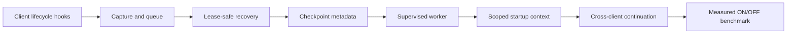
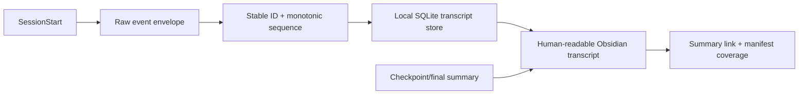

# Automatic session continuity

Status: **partially implemented and tracked**. Reviewed 2026-09-09 against
`enhancements/roadmap`. Native hook mapping, managed-handler preservation, bounded
leased capture claims, project-scoped context and separate local-model roles are
implemented. The #54 queue-correctness gate now includes bounded pagination, live leases,
crash-idempotent batch identity and bounded retry backoff. Opt-in checkpoint metadata and
manifest persistence and the supervised worker are implemented behind explicit
session-auto setup. A model-free SessionStart handoff is available for the tested
Claude Code and Codex CLI surfaces, and sanitized GitHub publication is available
behind explicit destination/visibility approval. Parent:
[#61](https://github.com/vib28/ai-memory-hub/issues/61).



## Where the problem exists

The capture-to-handoff path spans client installation, observation buffering,
consolidation, session persistence, retrieval and dashboard presentation. Current
components now form an optional unattended local checkpoint, tested Claude/Codex
startup handoff and sanitized GitHub publication service, but do not yet form the
complete all-client startup or measured benchmark service.

Review coverage: capture.py, hooks.py, session_capture.py, consolidator.py,
manager.py session/context paths, vault.py routing/parsing/deletion, models.py,
index.py retrieval and pending records, mcp_server.py, CLI/setup/connection entrypoints,
tray responsibilities, security/history boundaries, client prompts, relevant tests,
CI configuration, README, architecture and roadmap/usage/installation documentation.
This is a cross-component architecture review, not a claim that every code path was
exercised or that every installed client was certified.

## Why it matters

The user's **first priority** is automatic periodic state saving and automatic
cross-client handoff, linked through metadata, forward/backward navigation and tags.
No routine save, summarize, restore or publish commands should be needed.

This should reduce repeated explanations and unnecessary context replay. It does not
guarantee a token-saving percentage, exact conversation replay, or recovery of words
the source client never emitted. Local continuity comes before optional GitHub publishing.

## How the fix works

### Reuse the existing foundation

| Existing component | Reuse | Missing work |
|---|---|---|
| Generic stdin receiver / SQLite buffer | Fast, local evidence capture | Native adapters, privacy filtering, stable event identity |
| Local SLM / deterministic fallback | Summarize without remaining cloud quota | Supervised scheduling, bounded batches and useful fallback state |
| Four-section session blocks | Human-readable checkpoint and final template | Group/batch metadata, navigation, rollup and parser roundtrip |
| Public MCP write policy / review queue | Govern accepted durable memory | Idempotent batch submission and explicit session-auto scope |
| Git history | Reversible accepted changes | Publication has a separate SQLite outbox and health record |
| FTS / optional vectors | Related-memory retrieval | Deterministic active-session selection and strict context scope |
| Hook installers | Backups, managed installation and tested SessionStart output | Version-specific support outside Claude Code/Codex and GitHub publication |

### Separate model roles

The continuity pipeline uses two independent local-model roles. The embedding model
(`MEMORY_EMBED_MODEL`, default name `nomic-embed-text`) is limited to retrieval,
related-memory ranking and semantic audit candidates. It never authors, rewrites or
silently deletes durable memory. Exact duplicate and near-update decisions remain
deterministic and reviewable.

The local chat model (`MEMORY_LLM_MODEL`) is used by consolidation and transcript
extraction. It produces conservative JSON which is rendered into the four session
sections and atomic durable-memory candidates. A missing or unavailable chat model
falls back to evidence-only session capture where possible; it must not invent
completion, decisions or facts. These roles may use the same OpenAI-compatible local
server, but they must remain separately configured so model replacement cannot change
the duplicate-safety boundary.

The capture database is **durable operational state**, not a disposable search index.
Unsummarized evidence cannot be reconstructed from the Markdown vault. Pending review
payloads also currently live in SQLite and are not recoverable from accepted Markdown
alone. Do not delete either while assuming reindex restores everything.

### Automatic flow

```text
client event -> sanitize and persist local evidence
                         |
              supervised local worker
                         |
          ordered checkpoint + session manifest
                  /                  \
    bounded local handoff packet     accepted session-write policy
               |                           |
 next client's start hook          Markdown / review queue
                                           |
                               approved GitHub export outbox
```

Heavy summarization and network publication never run inside the synchronous capture
hook. Start hooks read a ready local packet with a short deadline; they must not wait
for a local model or GitHub. If new evidence is still being summarized, show checkpoint
age and a bounded, sanitized pending-evidence delta rather than pretending it is current.

### Lifecycle and client capability

The connection helper separates capture hooks (`-InstallHooks`) from the model-free
startup handoff (`-InstallHandoff`). Claude Code and Codex CLI receive a SessionStart
handoff plus the supported capture lifecycle events; Gemini, Qwen, Kimi, Hermes and
other MCP clients retain their existing provider-specific capture limits and are not
claimed to have startup automation here. The receiver's event aliases do not by
themselves establish native event delivery.

The current [Claude hook reference](https://code.claude.com/docs/en/hooks) documents
start, prompt, tool, stop, compaction and end events, plus StopFailure with rate_limit.
Start-hook output can add context. The helper installs the SessionStart adapter for
the tested Claude Code CLI surface. Failure notification is not advance warning of quota
exhaustion; abrupt termination may emit nothing.

The current [Codex hook guide](https://learn.chatgpt.com/docs/hooks) documents
SessionStart context output and lifecycle events. MCP may not be ready at start;
SessionEnd does not support MCP hooks. Background hooks may be cancelled when a
session ends. The helper installs the SessionStart adapter for the tested Codex CLI
surface; use a quick command hook and a separately supervised worker.
Transcript format is not a stable hook interface: any optional tail reader must be
versioned, bounded and allowlisted rather than silently scanning all histories.

Implementation must record tested versions and capabilities for each actual client
surface. Claude/Codex CLI support must not be assumed for desktop, cloud, Gemini,
Qwen, Kimi or Hermes. If a host cannot emit events or accept startup context, an
explicitly configured wrapper or supported log adapter may provide automation;
otherwise report that host as unsupported. Prompt instructions alone are best effort.

Capture user submissions, tool outcomes and completed assistant-turn evidence where
the host exposes them. Keep source-client identity separate from event source
(startup/resume/compact). Stop finishes a turn, not necessarily a session.
Quota errors, normal exit and expired heartbeat all request a flush, but an idle
timeout produces a provisional/incomplete final, not a claim the work was completed.

### Token and time checkpoints

No native every-N-token hook is required: local code can count incoming evidence and
schedule a checkpoint when a threshold is reached.

Maintain separate values for:

- host-reported model usage, including whether it is cumulative, a delta or context size;
- tokens in the sanitized captured evidence, counted by a named tokenizer when possible;
- estimated evidence tokens when a tokenizer/host count is unavailable;
- tokens in the outgoing handoff packet.

Never call an evidence estimate a billed-token count or subtract cached/repeated
context usage without a documented accounting rule. Suggested starting settings for
evaluation: 4,000 estimated evidence tokens, or 60 seconds with new evidence, whichever
comes first. These are tunable design defaults, not measured optimum values.
Additional turn/compaction/failure/end triggers coalesce with scheduled flushes.
Split oversized events safely and preserve evidence offsets without double-counting.

The worker starts automatically after explicit one-time session-auto setup, survives client termination,
uses leases to avoid concurrent claims and retries failed operations with bounded
backoff. A missing local SLM uses an honest evidence-only checkpoint; do not infer
decisions or successful tests from a command merely having been issued.
Benchmark fallback usefulness separately from SLM summaries.

### Optional full transcript companion (#66)

The bounded queue and four-section summary are still the default continuity path.
When `MEMORY_TRANSCRIPT_ENABLED=true`, the same supported lifecycle hooks also append
provider-neutral raw envelopes to the vault-local transcript store. SessionStart is
installed with the Claude/Codex capture events so recording can begin before the
first user turn. A transcript worker pass renders unattached events, and summary
writes refresh bidirectional Obsidian links plus manifest coverage.



This feature is off by default, deliberately excluded from the ordinary search
index and sanitized GitHub export, and governed by its own retention/deletion policy.
It records received values rather than using a model summary as a substitute. The
full contract and warning are in [full-session-transcripts.md](full-session-transcripts.md).

### Session identity, metadata and real navigation

Use two identities: a host session belonging to one client and a work group that can
continue across Claude and Codex. Resolve project identity from configured repository
mapping plus canonical workspace/worktree scope, not embeddings, title prefixes,
raw credential-bearing remote URLs or the consolidating client's writer name.

Proposed versioned metadata:

| Field | Meaning |
|---|---|
| schema_version, project_id, workspace_id | Stable scope and migration version |
| session_group_id, host_session_id, host_session_finalized, source_client | Work group and host-session provenance; a host can end while the group continues |
| checkpoint_id, sequence, entry_type | Unique batch and checkpoint/final role |
| previous_id, next_id, final_id | Machine-readable chain, explicit null at endpoints |
| evidence_start, evidence_end, idempotency_key | Exactly which evidence this batch owns |
| token_count, token_basis, tokenizer | Count and its honest interpretation |
| created_at, checkpoint_at, state, revision | Age, provisional/final state and recovery |
| previous_url, next_url, final_url, tags | Human navigation and export identity |

Keep the existing Investigated / Learned / Completed / Next Steps headings for every
checkpoint and final entry. Put metadata outside the narrative sections so counting,
hashing and reindexing do not mistake it for a new fact. Preserve old session blocks.

A canonical, versioned group manifest lists all checkpoint IDs, file/heading anchors
and final revisions. SQLite can index this manifest but must not be its only surviving
copy after accepted publication. The operational pre-approval manifest stays outside
the vault and is labeled unreviewed.

When B2 is published, set B1.next=B2 and B2.previous=B1 automatically; when a final
rollup is published, link it to all batches and update the final pointer. Use actual
`[[sessions/project/writer#heading]]` links, not a bare title that has no file target.
Shared tags include the group, project, source client and checkpoint/final role.
Tags supplement IDs; they are not identity themselves.

Several Markdown files cannot be assumed to update atomically. Use a durable operation
journal, fixed IDs and recoverable manifest revisions; audit and repair incomplete
navigation after restart. Git commits give undo but do not replace a write transaction.
Never silently overwrite human edits while repairing an owned metadata block.

A host-session final can coexist with an active work group. On continuation, append
a new checkpoint/final revision with provenance rather than erasing the old final.
The final rollup covers every batch and retains unresolved questions and next steps.
If several active tasks share a workspace, automatically present separate compact
candidates without guessing they are the same session.

### Handoff content and trust

The start hook loads, in order: the active work group's latest checkpoint/final state,
explicit goal and constraints, decisions, files/branch/commit references, verified
results, unresolved work and next action. Supplement only with scoped durable memories.
Read the local checkpoint without needing embeddings. Follow links on demand instead
of replaying the whole transcript.

Treat summaries and captured text as evidence, not executable instructions. Separate
user-stated constraints, model claims and verified outcomes; flag stale branch/worktree
information. Revalidate repository state before the next agent acts on a checkpoint.
Do not inject another project's records merely because words match.

### One-time setup, then unattended operation

Setup separately configures capture, session-auto persistence, startup integration,
vault undo and GitHub export destination/visibility. Defaults must be explicit and
consistent: the current connection script selects review, but the MCP module's
unset/invalid environment fallback is auto. Do not describe review as a universal
runtime default before resolving that difference for the new service.

Automatic local checkpointing and handoff must not depend on approving each summary.
Operational unreviewed state may be supplied as clearly labeled evidence; accepted
durable-memory writes still follow their configured policy. Explicit session-auto
enables fully unattended canonical session saving. This does not authorize automatic
merging/deleting preferences or exporting the whole vault.

Set retention, sensitive-file exclusions, payload limits and access permissions before
persisting evidence. Sanitization is defense in depth, not a guarantee that arbitrary
private text is safe to publish. Installation/startup registration must be reversible,
hidden on Windows and preserve unrelated settings. Surface worker health and backlog
automatically in the dashboard.

### GitHub session entries

Implemented layout: one session issue per work group, ordered checkpoint comments,
and a final-summary comment. Every batch/final uses the same four headings; metadata
includes group/checkpoint IDs, previous/next/final URLs, source and state. The issue
body carries an automatically maintained index with owned markers and tags. User issue
body text and comments outside those markers are preserved.

An explicitly configured export policy publishes only sanitized permitted summaries.
The SQLite outbox reconciles stable markers after uncertain timeouts, retries offline/
rate-limit failures with health reporting and updates only owned blocks. Never close
bug issues merely because a session final exists. GitHub is a publication mirror, not
required for local handoff.

The existing seven-section issue/roadmap format remains unchanged. Session artifacts
use the four-section session template; engineering work tracking uses where/why/how,
reproduction, acceptance, implementation and verification.

## Reproduction steps

Historical disposable checks on the pre-fix baseline produced:

| Issue | Reproduction | Observed result |
|---|---|---|
| #52 | Native PostToolUse payload with tool_name=Edit | event=observation, tool=unknown, files empty; retry ID changed |
| #53 | Add sibling user-hook, reinstall nested/Codex hook | Sibling missing in both formats |
| #54 | 501 ordered rows, first 500 completed | Consolidation empty although session still pending |
| #54 | Recover a freshly claimed processing row | Reclaimed immediately, no lease/owner check |
| #55 | Same writer/title/sections in alpha then beta | First stored, second duplicate |
| #56 | Stub one 2,000-character foreign-project result, budget=500 | 2,101 characters and foreign path returned; fixed and covered now |

Those rows document the original defects, not current behavior. Current regression
coverage verifies pre-ranking project filtering, complete serialized packet bounds,
global scope labels, superseded exclusion, deterministic newest-session selection,
live lease protection, concurrent claim isolation, bounded retry backoff,
crash-boundary batch identity and process-level Claude/Codex SessionStart fixtures.
Installed-client launch certification, all-client support and live paired benchmark
certification remain open acceptance gates. The no-paid-call replay is documented in
[`handoff-replay-v1`](benchmark-results/handoff-replay-v1.md). Export fixture coverage
does not claim a live session was published to the repository.

## Acceptance criteria

- Required gate [#62](https://github.com/vib28/ai-memory-hub/issues/62): run matched
  Claude→Codex and Codex→Claude sessions with context passing ON/OFF using the
  [prescribed seven-section benchmark protocol](session-handoff-benchmark.md).
  Include both tools, local summarization overhead and re-explanation, and report task
  correctness alongside token savings. Replay evidence exists, but no live provider
  usage result is available yet.
- No routine user-triggered save, consolidation, finalization, restore or posting.
- Three or more token/time checkpoints and a final rollup retain valid links, tags
  and metadata across approval, restart and reindex.
- Bidirectional Claude/Codex handoff restores the useful task state without
  depending on paid quota, embeddings or GitHub.
- Long sessions, duplicate delivery, concurrent workers and interruption at each
  write/ack/link/export boundary preserve accepted evidence without duplicate batches.
- Strict context budget, project isolation, pending/stale labels and secret filtering.
- Test actual supported-client event delivery and startup injection, including spaces
  in executable paths and normal shutdown versus forced termination.
- Measure handoff token size against full transcript and current memory_context
  baselines on the same tasks, alongside recall of decisions/next steps, checkpoint
  age, latency and repeated explanation. Do not improve savings by silently losing
  essential information.
- Run native-fixture and end-to-end automated tests in CI; real-client checks must
  name versions, required credentials and skipped cases. Ruff cannot test behavior.

## Implementation details

The canonical execution sequence is maintained in
[`docs/issue-priority-order.md`](issue-priority-order.md). The continuity dependency
chain is `#54/#56/#57/#58/#59/#60 completed → #61 → #62`; #40 is complete, while
#64/#65 can proceed independently. #41 is now complete documentation foundation;
#50 is complete and #51 records the session-only multiline decision. #46/#47/#48 are
complete vault-quality work, including adaptive audit detection in #49; #66's
optional full-transcript capture implementation is complete, with live client
delivery remaining an explicit operational verification boundary.

Do not copy a second numbered priority list into this document. Keep issue acceptance
criteria and implementation status here, while the linked priority file owns ordering.
Closed prerequisites #52, #53 and #55 remain historical evidence for the capture,
hook and session-identity fixes; they are not current open work.

## Verification results

Current repository verification: **231 passed** with a workspace-local pytest base
directory; Ruff and `git diff --check` passed. Tests cover native payload mapping,
managed hook preservation, concurrent queue claims, live leases, project-scoped context,
separate embedding/chat-model configuration, process-level handoff and sanitized export.

No personal hook configuration, startup service or real memory vault was changed by
automated verification. Native host event delivery across every supported client, live
quota interruption and provider-backed cross-client benchmark certification remain
acceptance work. Linked checkpoint metadata, local worker processing, supported handoff
fixtures and the optional GitHub outbox are implemented; no live GitHub session content
was published during verification.
