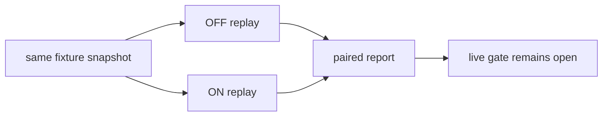

# Handoff benchmark replay (handoff-replay-v1)

Status: **replay complete; live two-tool certification not run**.

This report uses synthetic fixtures, a deterministic clarification responder and the named common tokenizer `unicode-wordpunct-v1`. Provider usage is unavailable and is never treated as zero. No live vault or paid call was used.

## Coverage

- Matched pairs: **30**; destination sessions: **60**.
- Directions: Claude→Codex and Codex→Claude.
- Task types: feature, debugging with correction, interrupted multi-step work.
- ON/OFF order alternates by repetition; each pair shares a snapshot hash and continuation request.

## Aggregate replay metrics

| Metric | OFF median | ON median | Savings (OFF − ON) | Percent |
|---|---:|---:|---:|---:|
| Destination-stage common tokens | 189.0 | 159.0 | 30.0 | 15.873% |
| Whole-workflow common tokens | 527.0 | 497.0 | 30.0 | 5.6926% |

Destination-stage spread (min–max): OFF 188–191; ON 158–161.
Whole-workflow spread (min–max): OFF 524–533; ON 494–503.
Replay latency spread (min–max ms): OFF 0.0617–0.11; ON 0.0586–0.0798.

Completion rate: OFF 1.0; ON 1.0. Essential-fact retention: OFF 1.0; ON 1.0.
These are deterministic replay estimates, not a demonstrated provider-token saving.

## Limits and gate

- Source and destination provider counters are marked unavailable; local checkpoint/summarization estimates are reported separately.
- Live Claude/Codex adapters, model versions, billing counters, cache state and authorized cost ceiling were not supplied.
- The #62 gate remains open. The replay is CI-safe regression evidence and does not certify live cross-tool behavior or advertise a universal percentage.

Generated at `2026-09-08T20:18:02.140454+00:00`.
