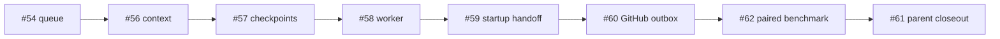

# Automatic continuity closeout

Status: **local implementation complete; measured cross-tool benefit pending**.
This closeout records the evidence for parent issue [#61](https://github.com/vib28/ai-memory-hub/issues/61)
without claiming the paired token-saving result in [#62](https://github.com/vib28/ai-memory-hub/issues/62).

## Where

The completed path is the client lifecycle → durable capture queue → linked local
checkpoint → supervised worker → bounded Claude/Codex startup packet → optional
sanitized GitHub outbox path.

## Why

The user requested unattended continuity without silently widening durable-memory
permissions, exporting raw transcripts, or claiming token savings from a smaller
packet alone.

## How

Issues #54, #56, #57, #58, #59 and #60 are individually closed with implementation
comments and pushed commits. The local worker and handoff do not require GitHub; the
exporter is a separate explicit permission and only consumes accepted checkpoint data.

## Reproduction

The current fixture suite creates linked checkpoints/finals, exercises bounded scoped
handoff in both directions, simulates retry/crash/concurrency boundaries, runs the
export outbox through offline and timeout transports, and runs the no-paid-call #62
replay with identical task state. The remaining gap is live provider usage and
outcome certification with the same matched Claude/Codex task.

## Acceptance criteria

- [x] The local continuity chain #54 → #56 → #57 → #58 → #59 → #60 is implemented,
  tested and documented.
- [x] Three checkpoint batches and a final share the four-section template, stable IDs,
  manifest links, tags and owned export markers.
- [x] Claude/Codex startup fixtures restore task state, decisions, changed files,
  verified results and next action without an explicit memory call.
- [x] Interrupt, crash, retry, long-session and concurrent-worker safeguards preserve
  accepted evidence or leave it retryable without duplicate batches.
- [x] Unsupported client/version limitations are named rather than inferred away.
- [x] GitHub publication is optional, sanitized, durable and independent from local
  handoff/review mode.
- [ ] #62's live 30-pair ON/OFF benchmark has not yet established provider-backed
  positive median savings with no lower completion or essential-fact retention;
  the replay result is explicitly estimated and non-live.

## Implementation details

Use the canonical [issue priority order](issue-priority-order.md). Do not close this
parent until #62 reports the prescribed benchmark result or a clearly documented
incomplete/blocked result is reviewed and the parent acceptance is intentionally
reconciled. The existing component benchmarks remain useful regression checks but are
not a substitute for live two-tool measurement.

## Verification results

The branch currently has **211 passing tests**, Ruff, PowerShell parser checks, diff
checks and successful wheel builds. Live authenticated Claude/Codex runs were not
started automatically because they may incur external usage; #62 owns that explicit
opt-in run and its predeclared ceiling. The replay artifact is available at
`docs/benchmark-results/handoff-replay-v1.{json,md}`.
