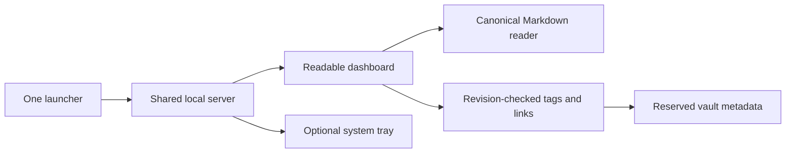

# Dashboard redesign and one-launch desktop app

## Where the problem exists

The current dashboard compresses stored sessions into search-result paragraphs, limits the visible library, and puts too much information into small cards. The tray and dashboard have separate launch scripts. The tray creates its own HTTP server without the dashboard's host/token initialization.

## Why it matters

People need to read what memory actually contains, distinguish sources and status, and navigate relationships without deciphering raw JSON. Starting two processes is confusing and can cause port conflicts. A dashboard must not change or merge memories merely to organize their display.

## How the fix works

Use the existing Python backend and bundled HTML, CSS and JavaScript. Keep pystray optional at runtime. Dependencies remain part of the initial PowerShell installation; no Node, hosted service, model server or CDN is needed.

A midnight-blue navigation rail, quiet list pane and spacious light reading pane separate navigation from content. Main reading text is at least 16px. Sessions show their original headings and line breaks. Search/filter controls are immediately available. Review/history, conflicts and vault checks remain accessible.

One Python application owns the HTTP server and optional tray. A single PowerShell launcher starts it; older launcher names remain compatibility aliases. Without a supported tray backend, the browser dashboard remains available. Windows is tested here; Linux/macOS compatibility is architectural, not a claim of platform testing.

Tags and links have search-based selectors. Record classification (stated, preference, superseded) remains distinct from user organization tags. Explicit user-added tags and memory-ID links live in a reserved Markdown metadata file in the vault, survive reindexing, and never silently merge records. Existing source tags and wiki-links remain visible separately.

## Reproduction steps

1. Open a stored session with several sections in the current dashboard: compare the flattened card to its Markdown source.
2. Start the current tray alone: its server has an empty allowed-host set, so requests are rejected.
3. Look for tag/link lookup editing or a single documented app launcher.

## Acceptance criteria

- Visible Dark mode and Colorblind toggles provide standard light/dark and colorblind light/dark palettes. Remember the preference only in the browser, without storing memory there.
- Check palette text contrast at 4.5:1 and essential control boundaries at 3:1. Status meaning also appears as text. Softer backgrounds are a design choice, not a medical claim.

- Full stored session sections and ordinary memory contents are readable without clipping; source text is available.
- Search and kind filters cover the whole indexed library, not only the first 200 records.
- Review/history retains structured session and pattern payloads, approve/reject, conflict resolution and audit.
- Tags and memory links can be selected through lookup, saved, reopened and retained after reindexing; backlinks are visible.
- Metadata saves reject stale revisions, invalid IDs and malformed payloads. No automatic merge or deletion.
- Host, origin and launch-token protections apply to both launch paths.
- One launch command provides browser plus optional tray. Unsupported tray platforms fall back to browser operation.
- Setup installs all required Python packages and packaged UI assets ship with the application.
- Automated tests use temporary vaults. Actual tests and untested platform/browser behavior are reported separately.

## Implementation details

Implemented modules: packaged static UI, dashboard read/metadata helpers, shared server factory, unified app launcher, launcher aliases, tests and focused documentation updates.

The reader loads complete canonical session blocks. Organization metadata is stored
in dashboard-metadata.md under stable memory IDs with revision-checked saves.
Tags and memory lookups now show choices immediately, filter on typing, and retain
selected chips. Existing source relationships remain separately visible.

The four palettes use visible Dark mode and Colorblind switches. Browser storage
holds only this appearance choice. All launch paths share security initialization;
reopening the unified app recognizes the same vault and port.

### Plan review before implementation

- Retain the existing stack instead of introducing a build toolchain.
- Preserve Markdown as canonical storage; SQLite stays rebuildable.
- Read session bodies from their canonical blocks, not flattened embeddings.
- Render user content as text, never trusted HTML.
- Metadata editing is a separate save from memory-content editing to avoid pretending a multi-file save is atomic.
- Existing structured session content is read-only in this scope; user-added links/tags remain editable. Ordinary memory text keeps its existing edit action.
- Preserve security and existing review capabilities throughout the redesign.
- No claim of automatic token savings from a visual redesign; continuity benchmark remains tracked separately in #62.
- Do not open or modify the real vault for test fixtures.

## Verification results

Plan reviewed against dashboard.py, tray.py, vault.py, manager.py and existing dashboard tests before implementation.

- Full automated suite: **190 passed** on Windows, using a fresh disposable test directory.
- Ruff: passed. JavaScript syntax check and dependency-free interaction tests: passed.
- Interaction tests cover immediate lookup choices, filtering, selection, tag creation,
  invalid tag names, non-submitting lookup buttons, escaping and all four theme combinations.
- Four palette tests check text contrast at 4.5:1 and principal input borders at 3:1.
- HTTP tests cover host/origin/token rejection, metadata saves, stale revision rejection,
  invalid input, isolated server tokens and reopening an existing instance.
- Metadata tests cover retained source content, backlinks and persistence through reindexing.
- Tray-unavailable fallback and cleanup are tested with mocks, not on Linux/macOS desktops.
- Wheel build passed and includes all three UI assets and the new app modules.
  Setuptools reported an existing license-table deprecation warning; the build succeeded.
- All four affected PowerShell scripts passed syntax parsing.
- User reported the preview sanity test seemed okay and requested a later full check.
- No automated real-browser interaction or Linux/macOS desktop certification is claimed.

### Action item: user verification on the next visit

Tracked in [issue #64](https://github.com/vib28/ai-memory-hub/issues/64). Keep this
issue open until the following review is complete:

- [ ] Open the running dashboard against the configured real vault, not the demo.
- [ ] Check standard light/dark and colorblind light/dark, including editor contrast.
- [ ] Read several real session and ordinary memory records against their source.
- [ ] Select existing tags, create a tag, find a memory link and verify saved backlinks.
- [ ] Check review/history, conflicts and vault-health results.
- [ ] Verify one-launch tray/browser behavior and reopening the same app.
- [ ] Record any failures as tracked follow-ups; close only after verification.
