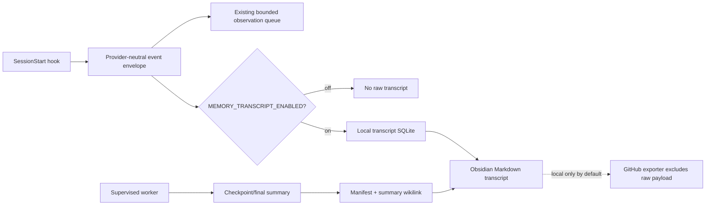

# Full session transcripts (opt-in)

AI Memory Hub keeps ordinary capture bounded and sanitized. A separate transcript
path can be enabled when an operator needs an exact, human-readable record of a
session. It is disabled by default because prompts, model responses, tool inputs,
tool outputs and structured chat objects can contain sensitive data.

## Enablement and storage

Set these variables before starting the client hook receiver and worker, then
restart those processes:

```powershell
$env:AI_MEMORY_VAULT = "C:\Users\you\Documents\Obsidian\AI-Memory"
$env:MEMORY_TRANSCRIPT_ENABLED = "true"
# Optional; the default is <vault>/.ai-memory-hub/transcripts.sqlite3.
$env:MEMORY_TRANSCRIPT_DB = "C:\Users\you\Documents\Obsidian\AI-Memory\.ai-memory-hub\transcripts.sqlite3"
# Zero retains event rows until the associated session is forgotten.
$env:MEMORY_TRANSCRIPT_RETENTION_DAYS = "0"
```

The canonical Markdown object is written at:

- `/transcripts/<project-slug>/<session-group-slug>.md` when a project is known;
- `/transcripts/<session-group-slug>.md` otherwise.

The SQLite file is operational state, not a second memory index. Transcript events
are not included in ordinary search, embeddings, context packets or the sanitized
GitHub exporter. The Markdown object is the readable local record; the SQLite file
allows idempotent delivery, deterministic ordering and crash recovery before and
between summary writes.



## Event envelope and fidelity

The provider-neutral hook accepts `event_id`, `session_id`, `session_group_id`,
`sequence`, `author`, `object_type`, `client`, `model`, `project`, `topic`,
`generated_at`, `captured_at` and `payload`. Claude, Codex and generic hook fields
are normalized into those fields. A missing provider field is recorded as unknown
or null; the implementation does not infer a speaker, model or topic from a
summary.

Structured payload values are stored as UTF-8 JSON and string payloads as UTF-8
text. The Markdown renderer places the stored representation in a delimited
`json` or `text` block. This preserves the received values without replacing them
with the four-section model summary. Generated timestamps are timezone-aware
whether the provider supplied one or the local capture time was substituted — but
the two are never presented as equivalent. Each event records a
`generated_at_source` of `provider` or `capture`, and the rendered Markdown adds
an explicit "not supplied by provider — capture time recorded" line on a
substituted event only, so a reader can tell a real provider timestamp from a
local fallback without inspecting the SQLite row.

Every event has a stable ID and a session-local monotonic sequence. A provider ID
is preferred. If it is absent, a deterministic fallback is derived from the
session identity, supplied source sequence/timestamp, envelope metadata and
payload. SQLite write transactions allocate generated sequence numbers, so
concurrent hook processes cannot acknowledge the same event twice or create a
duplicate sequence.

## Markdown shape and links

Each transcript has frontmatter for `type`, `version`, `session_group_id`, project,
topic, start/end timestamps, event count and Obsidian tags. Tags include
`transcript`, `session`, each observed author, each object type, and the known
project. Chronological headings show the generated time, speaker and object type;
each event also shows sequence, ID, client/model, capture time and verbatim payload.

Checkpoint and final summaries contain a link such as:

```text
**Transcript:** [[transcripts/demo-app/capture-1234abcd.md]]
```

The transcript lists real links back to the summary blocks, while
`/sessions/session-manifest.json` records the transcript path and event coverage.
Retries reuse the same checkpoint identity and re-render the same transcript rather
than appending a second copy. The worker's routine poll-driven re-render of
unattached events resolves the same path/project/links from the manifest before
rendering, so it reproduces the existing file rather than overwriting it with a
copy that has lost its summary links or landed at a different path.

## Lifecycle, retention and privacy

`SessionStart` is installed alongside the existing capture lifecycle hooks for the
supported Claude/Codex configuration helpers. The worker renders unattached events,
reports transcript rendering/retention health, and refreshes summary links after a
checkpoint or final entry is written. A worker or hook failure remains visible and
retryable; the synchronous hook does not wait for a model or remote service.

`MEMORY_TRANSCRIPT_RETENTION_DAYS` controls operational event-row retention. The
default `0` keeps rows until explicit deletion. Forgetting the last canonical
summary in a session group removes its transcript rows and every Markdown object
the group's rows ever used — the unscoped default path and any project-scoped
path a row's project resolved to — not only whichever single path the caller
happened to pass; if other checkpoints remain, the transcript is re-rendered
with only their links. Deletion is local and does not publish a raw transcript.

This option is deliberately separate from `MEMORY_CAPTURE_EXCLUDE_PATHS` and the
bounded observation redaction rules: enabling it means the operator accepts that
the provider payload is being retained locally as received. Do not enable it in a
shared or unencrypted vault without reviewing the host's data handling and backup
policy. Changing the environment affects only newly started hook/worker processes.
