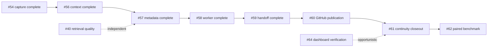

# Open issue priority order

This is the recommended execution order for the open GitHub issues on the
`enhancements/roadmap` branch. It balances user impact, data-safety risk,
prerequisites, and the amount of change each item introduces. GitHub remains
the source for issue acceptance criteria; this file records the order and the
reasoning so work can resume without reconstructing the dependency graph.

## Completed prerequisite

[#54](https://github.com/vib28/ai-memory-hub/issues/54) — long-session queue
pagination, live-lease protection, crash-idempotent batch identity, and bounded
retry backoff — was completed before this open-issue order was refreshed.

[#56](https://github.com/vib28/ai-memory-hub/issues/56) — serialized context
budgeting, pre-ranking project isolation, global scope labels, superseded-record
exclusion, and deterministic newest-session selection — is also complete. The
remaining open order starts at #60.

[#57](https://github.com/vib28/ai-memory-hub/issues/57) — versioned checkpoint
manifest, stable IDs, navigation links, provenance, host-session finalization, and
crash-repair coverage — is complete. Its worker dependency was delivered in #58;
automatic handoff was delivered in #59.

[#58](https://github.com/vib28/ai-memory-hub/issues/58) — supervised local
checkpoint processing, trigger coalescing, provisional/final state handling,
privacy filtering, terminal retention, health reporting, and reversible startup
registration — is complete. The supported Claude/Codex handoff was delivered in #59;
interactive client-launch certification remains an explicit limitation in its record.

[#59](https://github.com/vib28/ai-memory-hub/issues/59) — provider-specific lifecycle
capture, model-free SessionStart handoff, bounded quoted-evidence packets, age and
pending-evidence warnings, ambiguity-safe group selection, capability reporting, and
separate reversible setup permissions — is complete. Its final-rollup and publication
dependencies continue in #60–#62.

## Continuity and handoff first

| Order | Issue | Work | Reason for position |
|---:|---|---|---|
| 1 | [#60](https://github.com/vib28/ai-memory-hub/issues/60) | Publish linked batches and final summaries to GitHub | External publication should follow proven local checkpoint integrity. |
| 2 | [#61](https://github.com/vib28/ai-memory-hub/issues/61) | Close out the first-priority continuity roadmap | Integration and acceptance tracking for the component work above. |
| 3 | [#62](https://github.com/vib28/ai-memory-hub/issues/62) | Benchmark Claude/Codex handoff with ON/OFF arms | Meaningful only after automatic handoff exists; measures tokens and task quality. |

## Retrieval, product verification, and vault quality

| Order | Issue | Work | Reason for position |
|---:|---|---|---|
| 4 | [#40](https://github.com/vib28/ai-memory-hub/issues/40) | Embed session sections separately | Independent retrieval-quality improvement after continuity correctness. |
| 5 | [#64](https://github.com/vib28/ai-memory-hub/issues/64) | Complete real-vault dashboard verification | Implementation is largely complete; remaining work is user/browser validation and follow-ups. |
| 6 | [#41](https://github.com/vib28/ai-memory-hub/issues/41) | Document per-kind entry templates | Foundation for the remaining vault-content quality work. |
| 7 | [#50](https://github.com/vib28/ai-memory-hub/issues/50) | Make companion-block deletion safe | Small correctness improvement needed before relying on richer templates. |
| 8 | [#51](https://github.com/vib28/ai-memory-hub/issues/51) | Decide on multiline formats beyond sessions | Architectural decision best made after template and deletion semantics are clear. |
| 9 | [#48](https://github.com/vib28/ai-memory-hub/issues/48) | Improve `MEMORY.md` index descriptions | Readability improvement, but not an operational blocker. |
| 10 | [#46](https://github.com/vib28/ai-memory-hub/issues/46) | Consolidate duplicated preference rules | Vault-content cleanup that benefits from #41's template shape. |
| 11 | [#47](https://github.com/vib28/ai-memory-hub/issues/47) | Resolve the recurring project/plan split finding | Depends on the related project-link/status decision. |
| 12 | [#49](https://github.com/vib28/ai-memory-hub/issues/49) | Broaden conceptual duplicate detection | Most invasive matching change and therefore last among the current issues. |

## Dependency chain

The critical implementation path is:

`#54/#56/#57/#58/#59 completed → #60 → #61 → #62`

The remaining items do not block the first-priority continuity phase. #40 is
independent and can move earlier if retrieval quality becomes the immediate
product concern. #64's manual verification can also be performed opportunistically
without changing the runtime dependency chain.

This ordering was recorded on 2026-09-09 after reviewing the open issue bodies,
their stated dependencies, and the current branch state.
