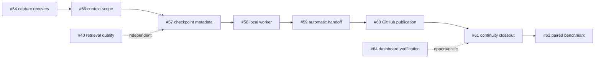

# Open issue priority order

This is the recommended execution order for the open GitHub issues on the
`enhancements/roadmap` branch. It balances user impact, data-safety risk,
prerequisites, and the amount of change each item introduces. GitHub remains
the source for issue acceptance criteria; this file records the order and the
reasoning so work can resume without reconstructing the dependency graph.

## Continuity and handoff first

| Order | Issue | Work | Reason for position |
|---:|---|---|---|
| 1 | [#54](https://github.com/vib28/ai-memory-hub/issues/54) | Fix long capture stalls and retry recovery | Data-loss and queue-reliability risk; prerequisite for unattended work. |
| 2 | [#56](https://github.com/vib28/ai-memory-hub/issues/56) | Enforce context budget and project isolation | Prevents oversized or cross-project context from contaminating handoff. |
| 3 | [#57](https://github.com/vib28/ai-memory-hub/issues/57) | Add stable checkpoint and final-summary metadata | Foundational schema, links, tags, and manifest for the continuity chain. |
| 4 | [#58](https://github.com/vib28/ai-memory-hub/issues/58) | Add the supervised local checkpoint worker | Depends on reliable capture, bounded context, and stable batch metadata. |
| 5 | [#59](https://github.com/vib28/ai-memory-hub/issues/59) | Install lifecycle hooks and restore active work | User-facing cross-client automation; depends on the lower-level safeguards. |
| 6 | [#60](https://github.com/vib28/ai-memory-hub/issues/60) | Publish linked batches and final summaries to GitHub | External publication should follow proven local checkpoint integrity. |
| 7 | [#61](https://github.com/vib28/ai-memory-hub/issues/61) | Close out the first-priority continuity roadmap | Integration and acceptance tracking for the component work above. |
| 8 | [#62](https://github.com/vib28/ai-memory-hub/issues/62) | Benchmark Claude/Codex handoff with ON/OFF arms | Meaningful only after automatic handoff exists; measures tokens and task quality. |

## Retrieval, product verification, and vault quality

| Order | Issue | Work | Reason for position |
|---:|---|---|---|
| 9 | [#40](https://github.com/vib28/ai-memory-hub/issues/40) | Embed session sections separately | Independent retrieval-quality improvement after continuity correctness. |
| 10 | [#64](https://github.com/vib28/ai-memory-hub/issues/64) | Complete real-vault dashboard verification | Implementation is largely complete; remaining work is user/browser validation and follow-ups. |
| 11 | [#41](https://github.com/vib28/ai-memory-hub/issues/41) | Document per-kind entry templates | Foundation for the remaining vault-content quality work. |
| 12 | [#50](https://github.com/vib28/ai-memory-hub/issues/50) | Make companion-block deletion safe | Small correctness improvement needed before relying on richer templates. |
| 13 | [#51](https://github.com/vib28/ai-memory-hub/issues/51) | Decide on multiline formats beyond sessions | Architectural decision best made after template and deletion semantics are clear. |
| 14 | [#48](https://github.com/vib28/ai-memory-hub/issues/48) | Improve `MEMORY.md` index descriptions | Readability improvement, but not an operational blocker. |
| 15 | [#46](https://github.com/vib28/ai-memory-hub/issues/46) | Consolidate duplicated preference rules | Vault-content cleanup that benefits from #41's template shape. |
| 16 | [#47](https://github.com/vib28/ai-memory-hub/issues/47) | Resolve the recurring project/plan split finding | Depends on the related project-link/status decision. |
| 17 | [#49](https://github.com/vib28/ai-memory-hub/issues/49) | Broaden conceptual duplicate detection | Most invasive matching change and therefore last among the current issues. |

## Dependency chain

The critical implementation path is:

`#54 → #56/#57 → #58 → #59 → #60 → #61 → #62`

The remaining items do not block the first-priority continuity phase. #40 is
independent and can move earlier if retrieval quality becomes the immediate
product concern. #64's manual verification can also be performed opportunistically
without changing the runtime dependency chain.

This ordering was recorded on 2026-09-08 after reviewing the open issue bodies,
their stated dependencies, and the current branch state.
