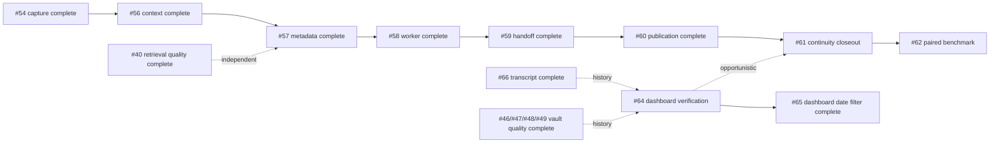

# Open issue priority order

This is the recommended execution order for the open GitHub issues on the
`enhancements/roadmap` branch. It balances user impact, data-safety risk,
prerequisites, and the amount of change each item introduces. GitHub remains
the source for issue acceptance criteria; this file records the order and the
reasoning so work can resume without reconstructing the dependency graph.

## Completed prerequisite

[#54](https://github.com/vib28/ai-memory-hub/issues/54) — long-session queue
pagination, live-lease protection, crash-idempotent batch identity, and bounded
retry backoff — was completed before this open-issue order was refreshed.

[#56](https://github.com/vib28/ai-memory-hub/issues/56) — serialized context
budgeting, pre-ranking project isolation, global scope labels, superseded-record
exclusion, and deterministic newest-session selection — is also complete. The
remaining open order starts at #61.

[#57](https://github.com/vib28/ai-memory-hub/issues/57) — versioned checkpoint
manifest, stable IDs, navigation links, provenance, host-session finalization, and
crash-repair coverage — is complete. Its worker dependency was delivered in #58;
automatic handoff was delivered in #59.

[#58](https://github.com/vib28/ai-memory-hub/issues/58) — supervised local
checkpoint processing, trigger coalescing, provisional/final state handling,
privacy filtering, terminal retention, health reporting, and reversible startup
registration — is complete. The supported Claude/Codex handoff was delivered in #59;
interactive client-launch certification remains an explicit limitation in its record.
A 2026-09-09 acceptance-criteria audit found the idle-closure trigger unreachable at
the shipped defaults (`flush_seconds=60 < idle_seconds=300` meant the flush trigger
always claimed pending rows first); fixed and verified in #71.

[#59](https://github.com/vib28/ai-memory-hub/issues/59) — provider-specific lifecycle
capture, model-free SessionStart handoff, bounded quoted-evidence packets, age and
pending-evidence warnings, ambiguity-safe group selection, capability reporting, and
separate reversible setup permissions — is complete. Its final-rollup and publication
path was delivered in #60; continuity closeout and benchmarking continue in #61–#62.

[#60](https://github.com/vib28/ai-memory-hub/issues/60) — explicit destination/visibility
approval, accepted-only sanitization, durable outbox retries, timeout reconciliation,
owned issue/comment updates, bidirectional links, health reporting, and reversible
startup registration — is complete. Live repository publication remains an opt-in
operator action; #61 and #62 track closeout and measurement.
A 2026-09-09 acceptance-criteria audit found "retries do not create duplicate
issues/comments" held only within the first 100 issues/comments (unpaginated lookup),
and that a publish pass rewrote the whole group's already-`sent` comments instead of
only the newly claimed batch; both fixed and verified in #73 and #74.

[#40](https://github.com/vib28/ai-memory-hub/issues/40) - per-section session
embeddings with section-aware retrieval, bounded chunking, and backward-compatible
fallback for legacy session records - is complete. Its focused tests, full suite,
lint, and wheel build passed; the implementation was pushed in commit `fe5ec37`.

[#41](https://github.com/vib28/ai-memory-hub/issues/41) — per-kind entry templates
are complete. The eight client instruction files now explain the target shape for
each kind and include a plain-language interpretation without changing the
canonical one-line entry format.

[#50](https://github.com/vib28/ai-memory-hub/issues/50) — companion-block deletion is
complete. `Vault.delete_entry()` removes only contiguous blockquote lines after the
forgotten entry and preserves later content; supersede behavior remains unchanged.

[#51](https://github.com/vib28/ai-memory-hub/issues/51) — the multiline-format decision
is complete: `session` remains the only true multi-line kind. The #41 inline templates
and #50 companion-block behavior are sufficient for the current design; a future block
format requires a separate migration proposal.

[#65](https://github.com/vib28/ai-memory-hub/issues/65) — the dashboard Library date
filter is complete, including inclusive single-day/range filtering, composition with
existing filters, clear behavior, validation, tests, and documentation.

[#48](https://github.com/vib28/ai-memory-hub/issues/48) — `MEMORY.md` now receives
deterministic content-derived `Covers` descriptions for active project/topic/
decision/person/session files, while profile and preference scopes retain fixed
descriptions. The implementation and its refresh behavior are covered by tests.

[#46](https://github.com/vib28/ai-memory-hub/issues/46) — the duplicated preference
rule was consolidated in the canonical vault after approval. The surviving rule
explicitly applies to both `[[automaton]]` and `[[ai-memory-hub]]`; the duplicate was
forgotten and the superseded history remains auditable.

[#47](https://github.com/vib28/ai-memory-hub/issues/47) — the recurring project/plan
split was resolved with the reviewed, reversible `project_link` operation. The plan
entity is now an alias of the canonical project, with a timestamped merge backup;
the targeted `subject_audit()` `possible_file_splits` finding is gone.

[#49](https://github.com/vib28/ai-memory-hub/issues/49) — `subject_audit()` now adds
an adaptive, read-only lexical candidate tier for singleton facts with non-prefix
subjects. Per-kind document frequency derives token salience automatically, while
the optional Nomic embedding path remains available as a semantic signal; no
automatic linking or rewriting was added.

[#66](https://github.com/vib28/ai-memory-hub/issues/66) — the default-off,
vault-local full transcript companion is complete. It stores provider-neutral raw
events with stable IDs/sequences, renders linked Obsidian Markdown, reports worker
health, honors retention/forget cleanup, and remains outside ordinary retrieval and
sanitized GitHub export. Live delivery from an installed external client remains an
operational boundary rather than an unverified repository claim.
A 2026-09-09 acceptance-criteria audit found three gaps against the closed criteria:
the worker's routine re-render silently stripped the required summary↔transcript
back-links and could land a second orphaned file at a different path (#68); an
absent provider `generated_at` was invented rather than recorded as absent (#77);
and `delete_group` left project-scoped transcript Markdown on disk when the caller
omitted an explicit path (#76). All three are fixed and verified; #70 fixed a
related transcript-path divergence in the capture bridge that fed #68.

## Current execution status

A 2026-09-18 audit of the live install found that the continuity components above
exist but do not form an automatic pipeline: 1,257 observations were pending with no
worker registered, no checkpoint manifest existed, no context had ever been injected
into a Claude/Codex session, Gemini/Qwen/Kimi/Hermes had no injection path, captured
rows held no prompt or assistant text, and categorization existed only as prompt
instructions to the connected model. [#91](https://github.com/vib28/ai-memory-hub/issues/91)
is the parent for closing that gap on branch `enhancements/auto-context-pipeline`;
its children take precedence over #61/#62 because #62's benchmark cannot measure a
pipeline that never runs.

#64 remains the next open product-verification item; its real-vault Chrome
interaction pass and one-owner launcher checks are complete, while native tray-menu
interaction remains open. #66 is closed and retained above as completed history.

## Zero-touch pipeline first (#91)

| Order | Issue | Work | Reason for position |
|---:|---|---|---|
| 1 | [#88](https://github.com/vib28/ai-memory-hub/issues/88) | Suite independent of ambient `MEMORY_*` env; per-vault worker health path | Nothing else is verifiable on an installed machine until the suite runs there. |
| 2 | [#84](https://github.com/vib28/ai-memory-hub/issues/84) | Deterministic project resolver (cwd/worktree/git root -> stable slug) | Prerequisite for routing, checkpoints, categorization and injection. |
| 3 | [#82](https://github.com/vib28/ai-memory-hub/issues/82) | Receiver keeps prompts, assistant text, transcript_path, source/reason | Without this there is nothing to categorize or hand off. |
| 4 | [#83](https://github.com/vib28/ai-memory-hub/issues/83) | Detached consolidation on terminal events + SessionStart catch-up; drain backlog | Makes the pipeline run without a separate opt-in worker. |
| 5 | [#86](https://github.com/vib28/ai-memory-hub/issues/86) | Start + per-turn context injection for Claude, Codex, Gemini, Qwen, Kimi, Hermes | The user-visible deliverable. |
| 6 | [#85](https://github.com/vib28/ai-memory-hub/issues/85) | Deterministic, evidence-linked categorizer through the existing review policy | Automatic categorization without a model dependency. |
| 7 | [#87](https://github.com/vib28/ai-memory-hub/issues/87) | StopFailure/Interrupt/heartbeat triggers | Covers the usage-limit hand-over case. |
| 8 | [#89](https://github.com/vib28/ai-memory-hub/issues/89) | `memory_context(cwd=)` parity with the hook packet | MCP-only clients get the same context. |
| 9 | [#90](https://github.com/vib28/ai-memory-hub/issues/90) | README/ARCHITECTURE/CLIENTS/prompts/skill rewrite | Documents shipped behavior, so it ships last. |

## Continuity and handoff (after #91)

| Order | Issue | Work | Reason for position |
|---:|---|---|---|
| 1 | [#61](https://github.com/vib28/ai-memory-hub/issues/61) | Close out the first-priority continuity roadmap | Integration and acceptance tracking for the component work above. |
| 2 | [#62](https://github.com/vib28/ai-memory-hub/issues/62) | Benchmark Claude/Codex handoff with ON/OFF arms | Meaningful only after automatic handoff and export exist; measures tokens and task quality. |

## Retrieval, product verification, and vault quality

| Order | Issue | Work | Reason for position |
|---:|---|---|---|
| 3 | [#64](https://github.com/vib28/ai-memory-hub/issues/64) | Complete native tray-menu verification | Real-vault Chrome interaction and one-owner launcher checks are complete; only the OS tray-menu surface remains. |

## Dependency chain

The critical implementation path is:

`#54/#56/#57/#58/#59/#60 completed → #61 → #62`

The remaining items do not block the first-priority continuity phase. #40 is
complete and remains an independent retrieval-quality change. #41, #46, #47, #48, #50,
#51, #49, #65, and #66 are complete. #64's native tray-menu verification can be
performed opportunistically; #61 and #62 retain their explicit live gates.

This ordering was refreshed on 2026-09-09 after reviewing the open issue bodies,
their historical comments, stated dependencies, and the current branch state.
