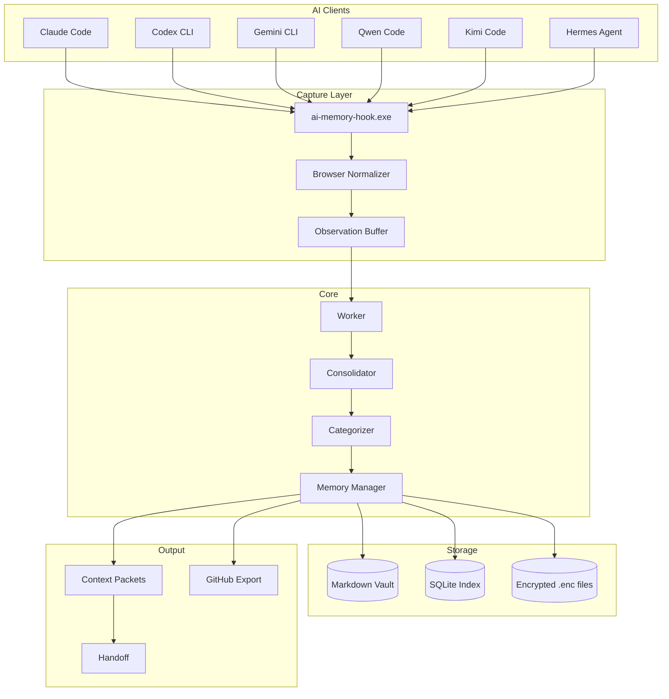

# Project Restart Guide

## Quick Start

```powershell
# Clone and setup
git clone https://github.com/vib28/ai-memory-hub.git
cd ai-memory-hub
git checkout enhancements/no-promises

# Python environment
python -m venv .venv
.venv\Scripts\activate
pip install -e ".[dev]"

# Build Rust extensions (optional, for performance)
cd native
cargo build --release
cp target/release/ai_memory_hub_native.dll ../memory_hub/ai_memory_hub_native.pyd
cd ..

# Run tests
.venv\Scripts\python.exe -m pytest -q --basetemp=.pytest-baseline -p no:cacheprovider

# Connect AI tools
.\connect-ai-tools.ps1 -VaultPath "C:\Users\vibm\OneDrive\Documents\Memory" -WriteMode review

# Start dashboard
.\start-memory-hub.ps1 -VaultPath "C:\Users\vibm\OneDrive\Documents\Memory"
```

## Architecture



## Feature Matrix

| Feature | Status | Hosts | Description |
|---------|--------|-------|-------------|
| MCP Memory | ✅ All 6 | Claude, Codex, Gemini, Qwen, Kimi, Hermes | Shared Markdown vault |
| Lifecycle Capture | ✅ All 6 | Same | Session evidence buffering |
| Startup Handoff | ✅ All 6 | Same | Context injection at SessionStart |
| Semantic Search | ✅ Configurable | All with embeddings | Local vector search |
| Auto Categorizer | ✅ Model-free | Same | Evidence → preference/decision/project |
| Context Packets | ✅ All 6 | Same | Bounded per-turn injection |
| GitHub Export | ✅ Opt-in | All with approval | Sanitized outbox |
| Encryption | ✅ AES-256-GMT | All vaults | At-rest encryption |
| Manual Hooks | ✅ Generic | Any stdio MCP client | Unsupervised clients |
| Rust Acceleration | ✅ Optional | All | Native hot paths |

## Documentation

| Document | Purpose |
|----------|---------|
| `docs/INSTALLATION.md` | Step-by-step setup |
| `docs/CLIENTS.md` | Client compatibility matrix |
| `docs/CONFIGURATION.md` | All settings |
| `docs/USAGE.md` | Daily operations |
| `docs/DASHBOARD.md` | UI guide |
| `docs/ARCHITECTURE.md` | Module diagrams |
| `docs/TROUBLESHOOTING.md` | Symptom → fix |
| `docs/FAQ.md` | Common questions |
| `FIXLOG.md` | Fix history |
| `RELEASE_NOTES_v0.2.md` | Feature list |

## Testing

```powershell
# Full suite
.venv\Scripts\python.exe -m pytest -q --basetemp=.pytest-baseline -p no:cacheprovider

# Specific module
.venv\Scripts\python.exe -m pytest tests/test_capture.py -q

# With coverage
.venv\Scripts\python.exe -m pytest --cov=memory_hub --cov-report=html
```

## Linting

```powershell
# Check all rules
ruff check .

# Auto-fix
ruff check . --fix --unsafe-fixes
```
