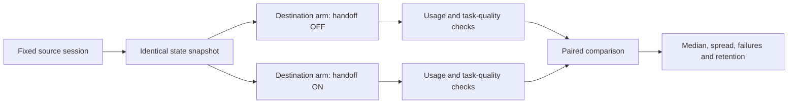

# Two-tool handoff benchmark protocol

Required acceptance gate for #61; tracked in #62. The deterministic replay is
implemented; live two-tool certification remains a separate opt-in gate.

## Where the problem exists

The evaluation section of docs/local-memory-plan.md and the automatic-continuity phase #61. Existing scripts/benchmark_context.py compares context packet sizes; it does not perform matched work across two different AI tools or measure re-explanation after switching.

## Why it matters

The user requires evidence of how many tokens automatic context passing saves for a similar session across two tools, compared with leaving context passing disabled. A smaller prompt is not a win if the second tool loses decisions, repeats completed work or fails the task.

## How the fix works

Build an automated, paired benchmark for Claude→Codex and Codex→Claude. Use the same source transcript/evidence, repository snapshot, task, handoff point, destination model/settings and final acceptance checks in each pair. Change only automatic context passing. Measure actual exposed usage separately from estimates and include summarization and re-explanation costs.

## Reproduction steps

To establish the current gap, inspect scripts/benchmark_context.py: synthetic stored records and packet-size measurements are not a two-tool session experiment.

Prescribed test procedure:

1. Create disposable worktrees/vaults and a synthetic task fixture containing a goal, decisions, a correction, completed work, changed files, a failing test and unfinished next steps. Define answerable fact checks and executable completion tests before running either arm. Never use the real vault or personal sessions.
2. Run a source-tool session to a fixed handoff point and snapshot its changed files, conversation/evidence and usage. Reuse this exact source state for both arms. Simulate the source becoming unavailable; do not wait for a real quota limit.
3. Arm OFF: launch a fresh destination session with the source's resulting files but no automatic handoff packet or shared memory access. Give the same minimal continuation request.
4. Arm ON: launch the same destination tool/model/settings from an identical snapshot and fresh session, with automatic checkpoint/context passing enabled. Give the identical continuation request. Do not paste a summary manually.
5. In both arms, use the same deterministic responder with the fixture's factual answer bank if the tool asks for clarification. Count every clarification/re-explanation token. Mark an unanswered/failed task as failure rather than giving one arm a secret advantage.
6. Collect per-request usage when exposed: source input/output, destination input/output, cached input, compaction, local summarization, injected packet and clarification text. Keep host-reported usage, named-tokenizer counts and character-based estimates in separate columns. Unavailable counters remain unavailable, not zero.
7. Run executable task tests and a predeclared checklist of retained decisions, constraints, corrections and next steps. Record repeated work, completion, latency and checkpoint freshness. Use deterministic scoring where possible; disclose any human/LLM judging and its cost.
8. Repeat at least five paired runs for each of three task types (feature work, debugging with a correction, interrupted multi-step work) in both directions: 30 pairs / 60 destination sessions. Alternate or randomize ON/OFF ordering; isolate caches where supported, otherwise record cache status. Pin tool/model versions, task seeds and settings.
9. Generate a machine-readable results file and human-readable report automatically. Report each direction/task plus aggregate median and spread; do not cherry-pick the best run. Save sanitized fixtures, configuration and commands so the benchmark is repeatable.

## Acceptance criteria

- [x] The replay command runs both cross-tool directions and both ON/OFF arms without manual session saving, restoring or re-explanation; live adapters remain unverified.
- [x] The replay produces 30 matched pairs / 60 destination sessions and explicitly records live access as incomplete; replay is not called live two-tool verification.
- [x] The report includes absolute and percentage savings for destination-stage tokens and the whole workflow, including checkpoint/summary generation estimates, with local-model tokens separate from provider usage.
- [x] Formula: savings = OFF - ON; savings percent = 100 * (OFF - ON) / OFF. Negative values are retained and N/A is used when comparable usage is unavailable.
- [x] Provider counters remain unavailable rather than zero; the report names a common tokenizer and does not combine unlike provider tokenizers.
- [x] Both replay arms use identical task state and checks and publish completion, fact retention, repeated work and failures; live task correctness remains unverified.
- [ ] Evidence supports positive median end-to-end savings without a lower completion or essential-fact retention rate in the measured suite before claiming demonstrated token savings. Otherwise report no demonstrated benefit and keep this gate open.
- [x] CI runs no-paid-call replay/regression tests; live runs remain opt-in and require already authorized clients/accounts plus a predeclared run/token ceiling. No live private-vault data is used.
- [x] The versioned report includes configuration, estimated/unavailable counter flags, repeated work, checkpoint age, latency spread and uncertainty. It advertises no universal saving percentage.

## Implementation details

Implemented in `memory_hub/benchmark_handoff.py`, exposed as
`ai-memory-handoff-benchmark` and wrapped by `scripts/benchmark_handoff.py`.
It depends on linked checkpoints #57, worker #58, scoped context #56 and the
supported automatic handoff in #59. The existing context-size benchmark remains
a quick component check, not a substitute for this experiment.

The replay uses a synthetic fixture, identical snapshot hash per pair, a
deterministic clarification answer bank and alternating ON/OFF order. It writes
the machine-readable [JSON report](benchmark-results/handoff-replay-v1.json) and
[human report](benchmark-results/handoff-replay-v1.md). Actual-client paired runs
still require adapters, authorized accounts and a predeclared ceiling; no
per-session manual triggers are required. The common source prefix is included
in whole-workflow measurements.

## Verification results

Replay implementation and report generated on 2026-09-09. The report contains
estimated common-tokenizer results and provider counters marked unavailable; it
does not claim live token savings. Existing unit-test and packet-size results do
not satisfy the remaining live gate.
