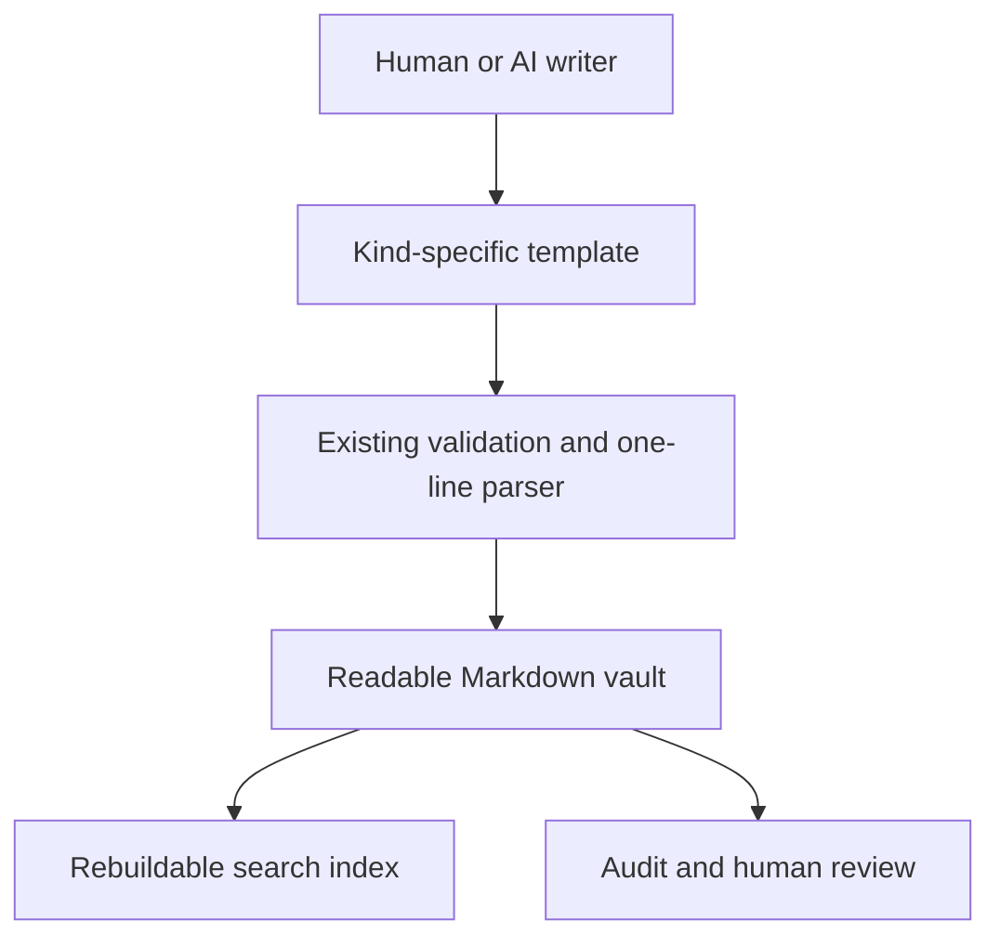

# Vault documentation standards

Tracked plan for bringing the *content and structure* of a memory vault up to the same
documentation standard the project's own GitHub issues use (where/why/how/repro/acceptance
criteria). This is a companion to [`local-memory-plan.md`](local-memory-plan.md), which
tracks the *capture pipeline*; this document tracks the *quality of what ends up written*.

Raised from a review of a real, in-use vault (49+ records across every kind). Findings and
priority order below; each has its own GitHub issue.



## Where the template lives

`vault_template/AI_INSTRUCTIONS.md` is the "generation structure" file: it is copied into
every new vault by `Vault.initialize()` and is what a direct-file-reading client (no MCP
access) reads to learn the entry format. `client-prompts/generic.md` documents overlapping
ground for MCP-connected clients but is a **separate file** — `scripts/sync_client_prompts.py`
only synchronizes the eight `client-prompts/*.md` files with each other; it does not touch
`AI_INSTRUCTIONS.md`. Issue #41 now keeps the two surfaces aligned by documenting the
same per-kind templates and the same inline plain-language rule; rerun the sync script
after changing `generic.md`.

## Implementation status

The #41 template work is complete. New vaults receive per-kind guidance from
`AI_INSTRUCTIONS.md`, and all eight client prompts receive matching guidance from
`generic.md`. Existing entries are not rewritten because these templates are authoring
conventions, not a new validation rule.

## Hard constraint that shaped every template below

`vault.parse_records()` matches `ENTRY_RE` against `body.splitlines()` — **one line per
entry**. `preference`, `project`, `person`, `topic`, `decision`, and `profile` entries must
therefore stay a single logical line; there is no way to embed a real line break inside one
without a parser change (out of scope here — that's a bigger, riskier change touching
`replace_entry_line()`'s line-based supersede/edit logic across every existing entry in
every vault). `session` is the one kind that already escapes this: it is parsed by
`SESSION_RE`/`SESSION_ID_RE` as a `##` heading block with real `###` sub-headings, which is
exactly why it already reads well.

Every template below uses **bold inline labels** as the visual separator instead of line
breaks — Obsidian renders bold text with enough visual weight to break up the line without
needing an actual newline.

## Per-kind templates

Modeled on an established documentation pattern per kind, not one universal shape — a
`profile` fact and a `decision` record are different genres and shouldn't be forced into
the same structure.

| Kind | Modeled on | Technical clause (inside the one tracked line) |
|---|---|---|
| `decision` | Architecture Decision Records (Nygard) | `**Decision:** ... **Context:** ... **Alternatives considered:** ... **Consequences:** ...` |
| `preference` | Style-guide rule + rationale | `**Rule:** ... **Reason:** ... **Applies to:** global \| [[project-a]], [[project-b]]` |
| `topic` | Troubleshooting runbook (Symptom → Cause → Fix) | `**Finding:** ... **Cause:** ... **Fix:** ...` |
| `person` | CRM/contact note | `**Who:** ... **Fact:** ... **Context:** ...` |
| `project` | Changelog + decision log, shaped by tag | `[decided]` → Decision/Why/Impact; `[constraint]` → Constraint/Reason; `[stated]` → Fact/Context; `[open]` → Question/Why it matters/Next step |
| `profile` | Atomic fact, deliberately minimal | Plain statement; no forced structure. A one-line identity fact ("Uses Windows as primary OS") doesn't need Why/Status, and forcing labels onto it adds noise, not clarity |
| `session` | Already correct — the reference model | Investigated / Learned / Completed / Next Steps, in real `###` sub-headings. The only kind with genuine multi-line structure, because it bypasses `ENTRY_RE` entirely |

None of this requires a parser change. It is a convention change to the instruction files
plus, for existing content, a one-time content pass.

## Layman section: every entry should be understandable without domain context

The technical clauses above are precise but written the way an engineer writes for another
engineer — dense, jargon-heavy, tuned for a reader who already has context. The vault is
read by the user, not only by AI tools, and often long after the original context has faded.
Every substantial entry should carry a short plain-language explanation alongside its
technical content, not instead of it.

**Where it lives, and why that's a real design decision, not a formatting choice.** The
technical clause must stay on the one tracked line (the hard constraint above). Two ways to
attach a layman explanation, with a genuine tradeoff between them:

1. **Inline, same line, same tracked entry.** Append a final `**In plain terms:** ...`
   clause before the `<!-- mem:... -->` comment. Fully safe: `memory_supersede`,
   `memory_forget`, and edit all operate on the whole line by `memory_id`, so the
   plain-language clause is deleted, replaced, or edited automatically along with
   everything else — there is no way for it to go stale or orphaned. Cost: one longer line,
   and no room for real sub-structure (still one line).

2. **A companion block directly under the entry** (an indented `>` blockquote, optionally
   with its own short sub-headings for a genuinely complex entry — e.g. a multi-part
   decision). Reads better for anything long. **The real cost:** `Vault.delete_entry()` and
   `Vault.replace_entry_line()` (`memory_hub/vault.py`) find and act on the single line
   whose `<!-- mem:id -->` matches — confirmed by reading both functions. Neither one knows
   the next line is "part of" the entry above it.

   **Refined after checking both functions individually, not just "the mutators" as a
   group.** `replace_entry_line()` (supersede) rewrites only the one matched line via a
   targeted substitution — a companion block underneath is never touched, and staying
   attached to a now-`[superseded]` entry is *correct*, the same way the technical line
   itself is kept as history rather than deleted. **Supersede was never actually at risk.**
   `delete_entry()` (forget) now removes the matched line and the contiguous run of
   immediately-following `>`-prefixed lines, so the companion block cannot outlive it.

   This fix uses no new marker syntax: a blank line or the first non-`>` line ends the
   positional sweep, preserving unrelated content. Issue #50 implements the delete side;
   `replace_entry_line()` remains unchanged because supersede correctly keeps the block
   attached to historical content.

**Recommendation:** use (1), the inline clause, as the default and the one the templates
above assume — it is simplest and enough for the one- or two-sentence explanation most
entries need, and it needs no dependency on #50. Use (2), the companion block with real
sub-structure, for the entry that is genuinely too long or too multi-part to compress into
one sentence (a substantial `decision` record is the most likely candidate) — **now
lands**, this carries no more integrity risk than (1) for deletion or supersede. The
instructions describe the positional sweep and the fact that a companion block is
presentation, not provenance.

A larger, related question — should any kind beyond `session` get *real* multi-line
structure (a heading block, like `session` already has) instead of a companion block under
a one-line entry — is now decided by #51: **no kind moves to a true block format for the
current design**. The inline templates plus safe companion deletion are sufficient for
the present vault content. A future block-format proposal would need a separate migration
plan and explicit answers for deduplication, FTS, and embedding text before implementation.

**Example, `decision` kind, inline (option 1):**

```markdown
- [decided] **Decision:** Route Claude Code hooks through settings.json instead of a
  separate config file. **Context:** two config surfaces would drift the way
  AI_INSTRUCTIONS.md and generic.md already had. **Alternatives considered:** a dedicated
  hooks.json, rejected for the same drift reason. **Consequences:** one file to check when
  debugging hook behavior. **In plain terms:** this means enabling a hook is one flag in
  the normal settings, not a separate file to remember exists. <!-- mem:... -->
```

**Example, `topic` kind, inline (option 1):**

```markdown
- [stated] **Finding:** a backgrounded Bash process on Windows/git-bash can outlive the
  `kill` call. **Cause:** the shell job PID and the real Windows process PID differ under
  MSYS. **Fix:** confirm with `netstat -ano | grep <port>` and `taskkill //F //PID <pid>`
  using the real PID. **In plain terms:** killing a background process from git-bash
  doesn't always actually stop it — check with netstat before assuming it's dead.
  <!-- mem:... -->
```

## Historical findings and priority order

The table below preserves the original design-review sequence for context. It is
not the active queue; [`docs/issue-priority-order.md`](issue-priority-order.md) is
the single current ordering and records the remaining open work.

| # | Issue | Category / status | Why this position |
|---|---|---|---|
| 1 | #41 — Document per-kind entry templates | Foundation — complete | Nothing else was worth doing consistently until writers knew the target shape |
| 2 | #42 — Session-to-project cross-links lose structure | Code — closed | Every new session naming a project made this worse at the time |
| 3 | #40 — Section embedding vectors for improved retrieval | Code — complete | Section vectors improve later retrieval but do not capture missing events or establish session identity |
| 4 | #50 — Make the companion block safe on forget | Code — complete | Unlocked safe use of #41's companion-block option |
| 5 | #43 — Migrate legacy writer-major session files | Vault hygiene — closed | Tooling handled the deferred migration |
| 6 | #44 — Remove empty test/throwaway vault files | Vault hygiene — closed | Removed the historical clutter |
| 7 | #45 — Refresh stale "not yet implemented" plan status | Vault hygiene — closed | Removed the misleading status line |
| 8 | #46 — Consolidate duplicated preference rule via "Applies to" | Content decision — complete | The approved surviving rule now names both applicable entities |
| 9 | #47 — Resolve flagged project/plan file-split | Content decision — complete | `project_link` merged the completed plan entity with a reversible backup; the targeted audit finding is gone |
| 10 | #48 — MEMORY.md index descriptions are structurally uninformative | Code, discoverability — complete | Active content now supplies deterministic, readable descriptions |
| 11 | #49 — Variant/duplicate detection misses non-prefix-related overlaps | Code, detection breadth — complete | Adaptive lexical candidates now complement optional embeddings without changing write-time decisions |
| 12 | #51 — Decide whether any kind beyond `session` should get real multi-line structure | Decision — complete: keep session-only blocks | The current inline templates plus safe companion deletion are sufficient; any future block format needs a separate migration proposal |

The table above records the original design-review sequence. #40, #41, and #46–#49
are now complete; current execution order, including the remaining dashboard
verification #64, the completed date-filter follow-up #65, and transcript enhancement
#66, is maintained in [`docs/issue-priority-order.md`](issue-priority-order.md).

See each issue for the full where/why/how/repro/acceptance-criteria/verification detail —
this document is the historical index and rationale, not a duplicate of each issue's
current content or status.

## Non-goals

- No change to `ENTRY_RE` or the one-line-per-entry constraint. If that changes later, it
  is its own decision with its own migration story, not a side effect of this work.
- No automatic rewriting of historical entries into the new templates. Existing entries stay
  readable as-is (`ENTRY_RE` doesn't care about content shape); only new entries and the
  explicitly reviewed vault decisions in #46/#47 were touched.
- No enforcement mechanism (e.g. rejecting a proposal that doesn't match the template) is in
  scope here. This is an authoring convention communicated through the instruction files, not
  a new validation rule in `memory_hub/security.py` or `_validate()`.
